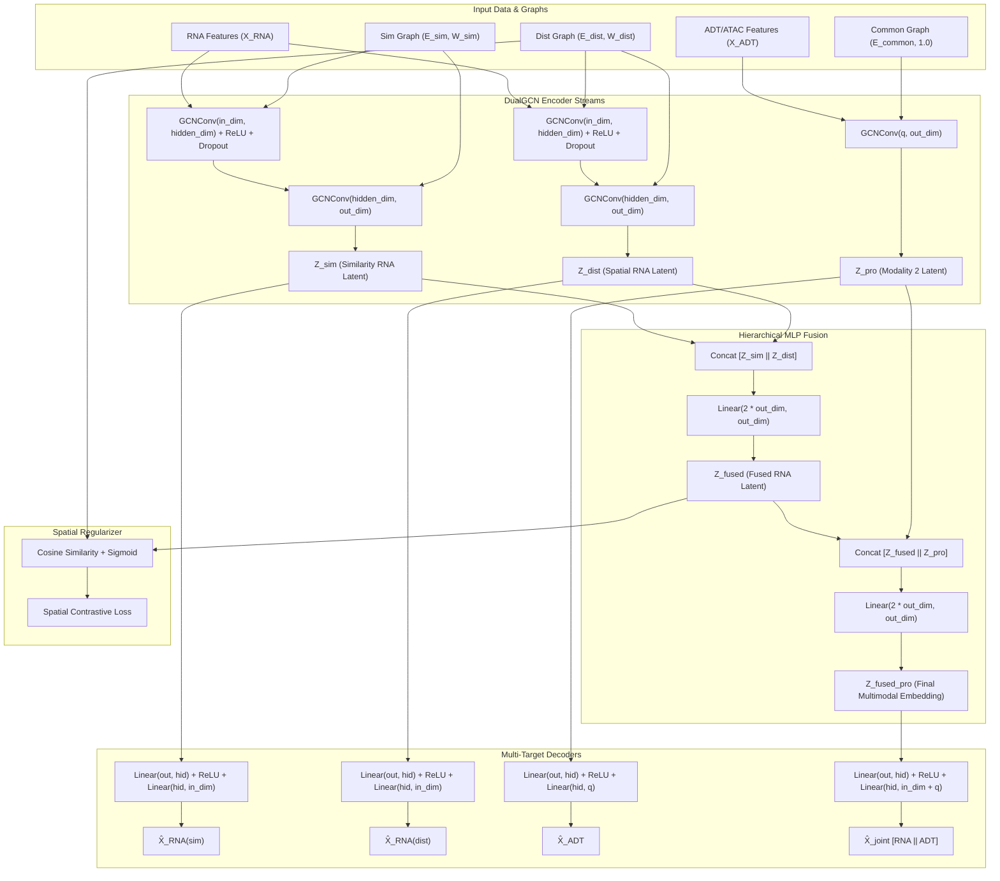
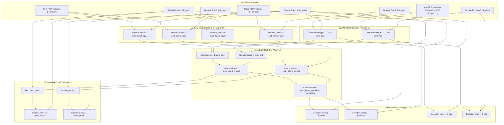
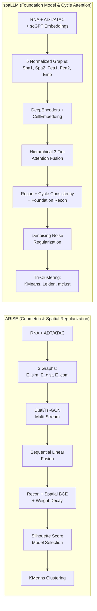

# Comprehensive Architectural Analysis: ARISE vs. spaLLM for Spatial Multi-Omics Representation Learning

This document provides an in-depth mathematical, architectural, and workflow analysis of **ARISE** (`arise_pipeline_v2.py`) and **spaLLM** (`spallmpipeline.py`). Both pipelines tackle the challenge of spatial multi-omics integration (specifically Transcriptomics coupled with Proteomics or Epigenomics), but they employ distinct inductive biases, graph topologies, loss formulations, and representation paradigms.

---

## 1. Executive Summary & Architectural Paradigms

| Dimension | ARISE (`arise_pipeline_v2.py`) | spaLLM (`spallmpipeline.py`) |
| :--- | :--- | :--- |
| **Core Paradigm** | Dual/Tri-stream Spatially Regularized Graph Autoencoder with Common-Edge Intersection Graph | Foundation-Model Augmented Cross-Modal Graph Autoencoder with Hierarchical Attention & Cycle Consistency |
| **Foundation Model** | None (purely self-supervised graph representation learning) | **scGPT** (generative pre-trained single-cell transformer providing 512-dim cell embeddings) |
| **Input Modalities** | Modality 1: RNA (HVG, 3000 genes)<br>Modality 2: ADT (Protein) or ATAC (Epigenome) | Modality 1: RNA (HVG, PCA-reduced)<br>Modality 2: ADT or ATAC (PCA-reduced)<br>Modality 3: scGPT Cell Embedding (512-dim) |
| **Graph Topologies** | **3 Graph Topologies:**<br>1. RNA Expression Cosine Similarity KNN Graph ($\mathcal{E}_{sim}$)<br>2. Spatial Euclidean Distance KNN Graph ($\mathcal{E}_{dist}$)<br>3. Intersection Graph ($\mathcal{E}_{common} = \mathcal{E}_{sim} \cap \mathcal{E}_{dist}$) | **5 Graph Topologies:**<br>1. Spatial Graph Mod 1 ($A_{spa1}$)<br>2. Spatial Graph Mod 2 ($A_{spa2}$)<br>3. Feature Graph Mod 1 ($A_{fea1}$)<br>4. Feature Graph Mod 2 ($A_{fea2}$)<br>5. scGPT Feature Embedding Graph ($A_{emb}$) |
| **Fusion Mechanism** | Concatenation followed by sequential MLP projection layers | Hierarchical, Multi-Tier Softmax Attention Layers (`AttentionLayer`) |
| **Loss Objectives** | 1. Joint & modality-specific MSE reconstruction<br>2. Contrastive spatial neighborhood regularization (BCE on sigmoid cosine similarity)<br>3. $L_1$ and $L_2$ parameter regularization | 1. Modality 1 & 2 feature reconstruction (MSE)<br>2. scGPT spatial & feature embedding reconstruction (MSE)<br>3. Cross-modal cycle translation consistency (MSE)<br>4. Denoising noise-injection regularization |
| **Downstream Clustering** | Unsupervised Silhouette-driven KMeans model selection | Tri-algorithm benchmarking: KMeans, Leiden community detection, and mclust (Gaussian Mixture Models) |

---

## 2. ARISE Architecture Deep Dive (`arise_pipeline_v2.py`)

### 2.1 Preprocessing Pipeline

ARISE handles two modality configurations:
1. **10x Visium / Genomics (RNA + ADT/Protein):**
   - **RNA:** Filters genes present in $<10$ cells, selects top $3000$ highly variable genes (HVGs) using the Seurat v3 dispersion method, performs total count normalization to $10^4$, log1p transform ($\ln(1+x)$), and standard scaling.
   - **ADT (Protein):** Normalized per cell using **Centered Log-Ratio (CLR)**:
     $$\text{CLR}(x_i) = \ln\left(1 + \frac{x_i}{\exp\left(\frac{1}{D}\sum_{j: x_j > 0} \ln(1 + x_j)\right)}\right)$$
     followed by feature scaling.

2. **Spatial-epigenome-transcriptome (RNA + ATAC):**
   - **RNA:** Same Seurat v3 HVG pipeline as above.
   - **ATAC (Chromatin Accessibility):** Term Frequency-Inverse Document Frequency (**TF-IDF**):
     $$\text{TF}_{ij} = \frac{X_{ij}}{\sum_k X_{ik}}, \quad \text{IDF}_j = \frac{N}{\sum_i X_{ij}}, \quad \mathbf{X}_{ATAC} = \text{TF} \odot \text{IDF}$$
     followed by per-cell normalization to $10^4$, log1p transformation, and PCA reduction to $d \le 60$ components.

---

### 2.2 Dual/Common Graph Construction

Let $N$ be the number of spots/cells, $\mathbf{X}_{RNA} \in \mathbb{R}^{N \times d_{RNA}}$ be the preprocessed RNA matrix, and $\mathbf{P} \in \mathbb{R}^{N \times 2}$ be the 2D spatial coordinates.

```
       RNA Expression Matrix (X_RNA)                Spatial Coordinates (P)
                    │                                          │
        Cosine Similarity + KNN                     Euclidean Distance + KNN
                 (k=15)                                     (k=15)
                    │                                          │
                    ▼                                          ▼
            Similarity Graph                            Distance Graph
           (E_sim, W_sim)                             (E_dist, W_dist)
                    │                                          │
                    └───────────────────┬──────────────────────┘
                                        │
                               Intersection (∩)
                                        ▼
                                  Common Graph
                                (E_common, 1.0)
```

1. **RNA Similarity Graph ($\mathcal{G}_{sim} = (\mathcal{V}, \mathcal{E}_{sim}, \mathbf{W}_{sim})$):**
   - Computed via cosine similarity on $\mathbf{X}_{RNA}$:
     $$S_{ij}^{cos} = \frac{\mathbf{x}_i \cdot \mathbf{x}_j}{\|\mathbf{x}_i\|_2 \|\mathbf{x}_j\|_2}$$
   - For each node $i$, edges are established to its $k=15$ nearest neighbors.
   - Adjacency is symmetrized: $\mathbf{A}_{sim} = \max(\mathbf{A}_{knn}, \mathbf{A}_{knn}^T)$.
   - Edge weights $\mathbf{W}_{sim}$ store the cosine similarities for the connected pairs.

2. **Spatial Distance Graph ($\mathcal{G}_{dist} = (\mathcal{V}, \mathcal{E}_{dist}, \mathbf{W}_{dist})$):**
   - Pairwise Euclidean distance matrix: $D_{ij} = \|\mathbf{p}_i - \mathbf{p}_j\|_2$.
   - A $k=15$ nearest-neighbors graph is constructed using spatial distances and symmetrized:
     $$\mathbf{A}_{dist} = \max(\mathbf{A}_{dist\_knn}, \mathbf{A}_{dist\_knn}^T)$$
   - Edge weights $\mathbf{W}_{dist}$ preserve the spatial distances between connected spots.

3. **Common Intersection Graph ($\mathcal{G}_{common} = (\mathcal{V}, \mathcal{E}_{common}, \mathbf{W}_{common})$):**
   - Identifies cell pairs that are **both** spatially adjacent and transcriptomically concordant:
     $$\mathcal{E}_{common} = \mathcal{E}_{sim} \cap \mathcal{E}_{dist}$$
   - Common edge weights are initialized as uniform binary weights: $\mathbf{W}_{common} = \mathbf{1}$.

---

### 2.3 Neural Network Architecture: `DualGCN` / `TriGCN`

ARISE processes the RNA modality through two separate GCN streams (one for expression similarity, one for spatial proximity) and processes the secondary modality (ADT/ATAC) through the intersection graph.



#### Graph Convolution Operations
Each GCN layer applies spectral graph convolutions with symmetric normalization:
$$\mathbf{H}^{(l+1)} = \sigma\left( \mathbf{\tilde{D}}^{-\frac{1}{2}} \mathbf{\tilde{A}} \mathbf{\tilde{D}}^{-\frac{1}{2}} \mathbf{H}^{(l)} \mathbf{W}^{(l)} \right)$$
where $\mathbf{\tilde{A}} = \mathbf{A} + \mathbf{I}_N$ and $\mathbf{\tilde{D}}_{ii} = \sum_j \mathbf{\tilde{A}}_{ij}$.

1. **RNA Similarity Branch:**
   $$\mathbf{H}_s^{(1)} = \text{Dropout}\left(\text{ReLU}\left(\text{GCNConv}(\mathbf{X}_{RNA}, \mathcal{E}_{sim}, \mathbf{W}_{sim})\right)\right)$$
   $$\mathbf{Z}_{sim} = \text{GCNConv}(\mathbf{H}_s^{(1)}, \mathcal{E}_{sim}, \mathbf{W}_{sim}) \in \mathbb{R}^{N \times d_{out}}$$

2. **RNA Spatial Distance Branch:**
   $$\mathbf{H}_d^{(1)} = \text{Dropout}\left(\text{ReLU}\left(\text{GCNConv}(\mathbf{X}_{RNA}, \mathcal{E}_{dist}, \mathbf{W}_{dist})\right)\right)$$
   $$\mathbf{Z}_{dist} = \text{GCNConv}(\mathbf{H}_d^{(1)}, \mathcal{E}_{dist}, \mathbf{W}_{dist}) \in \mathbb{R}^{N \times d_{out}}$$

3. **Modality 2 (ADT/ATAC) Branch:**
   $$\mathbf{Z}_{pro} = \text{GCNConv}(\mathbf{X}_{ADT}, \mathcal{E}_{common}, \mathbf{W}_{common}) \in \mathbb{R}^{N \times d_{out}}$$

4. **Two-Stage MLP Feature Fusion:**
   - **Stage 1 (RNA Intra-Modality Fusion):**
     $$\mathbf{Z}_{fused} = \mathbf{W}_{f1} [\mathbf{Z}_{sim} \,\|\, \mathbf{Z}_{dist}] + \mathbf{b}_{f1}, \quad \mathbf{Z}_{fused} \in \mathbb{R}^{N \times d_{out}}$$
   - **Stage 2 (Cross-Modality Fusion):**
     $$\mathbf{Z}_{fused\_pro} = \mathbf{W}_{f2} [\mathbf{Z}_{fused} \,\|\, \mathbf{Z}_{pro}] + \mathbf{b}_{f2}, \quad \mathbf{Z}_{fused\_pro} \in \mathbb{R}^{N \times d_{out}}$$

---

### 2.4 Reconstruction & Decoders

ARISE utilizes shared MLP decoder backbones with individual output heads:
$$\mathbf{H}_{dec}(\mathbf{Z}) = \text{ReLU}(\mathbf{W}_{dec1} \mathbf{Z} + \mathbf{b}_{dec1}), \quad \mathbf{H}_{dec} \in \mathbb{R}^{N \times hidden\_dim}$$

1. **RNA Reconstruction Head:**
   $$\mathbf{\hat{X}}_{sim} = \mathbf{W}_{dec2} \mathbf{H}_{dec}(\mathbf{Z}_{sim}) + \mathbf{b}_{dec2}, \quad \mathbf{\hat{X}}_{dist} = \mathbf{W}_{dec2} \mathbf{H}_{dec}(\mathbf{Z}_{dist}) + \mathbf{b}_{dec2}$$
2. **ADT/ATAC Reconstruction Head:**
   $$\mathbf{\hat{X}}_{pro} = \mathbf{W}_{dec4} \mathbf{H}_{dec}(\mathbf{Z}_{pro}) + \mathbf{b}_{dec4}$$
3. **Joint Multimodal Reconstruction Head:**
   $$\mathbf{\hat{X}}_{joint} = \mathbf{W}_{dec5} \mathbf{H}_{dec}(\mathbf{Z}_{fused\_pro}) + \mathbf{b}_{dec5} \in \mathbb{R}^{N \times (d_{RNA} + d_{ADT})}$$

---

### 2.5 Comprehensive Loss Formulations

ARISE optimizes a compound loss function balancing four reconstruction targets, a spatial contrastive boundary regularizer, and network weight decay:

$$\mathcal{L}_{total} = \beta \cdot \mathcal{L}_{recon\_total} + \gamma \cdot \mathcal{L}_{spatial} + \delta \cdot \mathcal{L}_{reg}$$

#### 1. Reconstruction Loss ($\mathcal{L}_{recon\_total}$):
$$\mathcal{L}_{sim} = \frac{1}{N \cdot d_{RNA}} \|\mathbf{X}_{RNA} - \mathbf{\hat{X}}_{sim}\|_F^2$$
$$\mathcal{L}_{dist} = \frac{1}{N \cdot d_{RNA}} \|\mathbf{X}_{RNA} - \mathbf{\hat{X}}_{dist}\|_F^2$$
$$\mathcal{L}_{adt} = \frac{1}{N \cdot d_{ADT}} \|\mathbf{X}_{ADT} - \mathbf{\hat{X}}_{pro}\|_F^2$$
$$\mathcal{L}_{rec} = \frac{1}{N \cdot (d_{RNA} + d_{ADT})} \|[\mathbf{X}_{RNA} \,\|\, \mathbf{X}_{ADT}] - \mathbf{\hat{X}}_{joint}\|_F^2$$
$$\mathcal{L}_{recon\_total} = \mathcal{L}_{rec} + \mathcal{L}_{sim} + \mathcal{L}_{dist} + \mathcal{L}_{adt}$$

#### 2. Spatial Regularization Loss ($\mathcal{L}_{spatial}$):
This objective enforces spatial smoothness (homophily among physical neighbors) while enforcing contrastive separation between non-neighboring spots.

Let $\mathbf{Z} = \mathbf{Z}_{fused}$. First, normalized pairwise cosine similarity without diagonal self-similarity is computed:
$$\mathbf{\tilde{Z}} = \frac{\mathbf{Z}}{\|\mathbf{Z}\|_2 + \epsilon}, \quad \mathbf{M}_{cos} = \mathbf{\tilde{Z}} \mathbf{\tilde{Z}}^T - \text{diag}(\mathbf{\tilde{Z}} \mathbf{\tilde{Z}}^T)$$
The similarity is mapped through a sigmoid function:
$$\mathbf{S}_{ij} = \sigma(\mathbf{M}_{cos, ij}) = \frac{1}{1 + \exp(-\mathbf{M}_{cos, ij})}$$

Let $\mathbf{G}_{nei} \in \{0, 1\}^{N \times N}$ be the binarized spatial neighborhood adjacency matrix derived from $\mathcal{E}_{dist}$, and $\mathbf{G}_{neg} = \mathbf{1}_{N \times N} - \mathbf{G}_{nei}$ be the non-neighbor mask.
The loss optimizes a symmetric binary cross-entropy:
$$\mathcal{L}_{nei} = \frac{1}{N^2} \sum_{i,j} \mathbf{G}_{nei, ij} \cdot \ln(\mathbf{S}_{ij} + 10^{-10})$$
$$\mathcal{L}_{neg} = \frac{1}{N^2} \sum_{i,j} \mathbf{G}_{neg, ij} \cdot \ln(1 - \mathbf{S}_{ij} + 10^{-10})$$
$$\mathcal{L}_{spatial} = -\frac{1}{2} (\mathcal{L}_{nei} + \mathcal{L}_{neg})$$

#### 3. Parameter Regularization ($\mathcal{L}_{reg}$):
$$\mathcal{L}_{reg} = \lambda_1 \sum_{\theta \in \Theta} \|\theta\|_1 + \lambda_2 \sum_{\theta \in \Theta} \|\theta\|_2^2$$
*(Default values in ARISE: $\lambda_1 = 10^{-4}$, $\lambda_2 = 10^{-3}$, $\beta = 25$, $\gamma = 10$, $\delta = 1$)*.

---

### 2.6 Checkpoint Selection & Evaluation

Unlike standard supervised pipelines, ARISE incorporates an **unsupervised model selection mechanism** during training:
- In every training epoch, the fused embeddings $\mathbf{Z}_{fused\_pro}$ are extracted.
- KMeans clustering is fitted with $K = \text{ground\_truth\_classes}$.
- The **Silhouette Score** of the embedding space with respect to the predicted cluster assignments is calculated:
  $$s(i) = \frac{b(i) - a(i)}{\max(a(i), b(i))}, \quad \text{Silhouette} = \frac{1}{N}\sum_{i=1}^N s(i)$$
- The model weights and cluster assignments corresponding to the **highest Silhouette score** are stored and used as the final checkpoint for ARI, NMI, and AMI evaluation.

---

## 3. spaLLM Architecture Deep Dive (`spallmpipeline.py`)

### 3.1 Foundation Model Integration & Preprocessing

spaLLM integrates biological priors from **scGPT** (a generative pretrained transformer foundation model for single-cell biology) alongside multi-omics graph neural networks:

```
                    Raw RNA Counts (adata_RNA)
                                │
        ┌───────────────────────┴────────────────────────┐
        │                                                │
   Gene Tokenization                               Seurat v3 HVG (3000)
        │                                                │
Pretrained scGPT Transformer (GPU)                Total Count Norm + log1p + Scale
        │                                                │
Cell Embeddings (E ∈ ℝ^(N × 512))                  PCA (RNA components)
                                                         │
                                                  Features (feat_RNA)
```

1. **scGPT Pretrained Cell Embeddings:**
   - RNA counts are tokenized by uppercase gene names.
   - Forward pass through pretrained `scGPT_human` model with sequence length cap ($1200$) and batch size $64$.
   - Yields a foundational semantic cell embedding $\mathbf{E} \in \mathbb{R}^{N \times 512}$.

2. **Omics 1 (RNA) Modality:**
   - Seurat v3 HVG selection (3000 genes), $10^4$ library count normalization, log1p transformation, and scaling.
   - Dimensionality reduction via PCA:
     - For Human Lymph Node: $n_{comps} = n_{vars(ADT)} - 1$.
     - For Mouse Brain: $n_{comps} = \min(50, N-1, \text{HVG}-1)$.

3. **Omics 2 (ADT or ATAC) Modality:**
   - **Protein (ADT):** CLR normalization per cell, scaling, and PCA reduction.
   - **Chromatin (ATAC):** Library count normalization to $10^4$, log1p transform, scaling, and PCA reduction to $\min(50, N-1, \text{peaks}-1)$.

---

### 3.2 5-Graph Topology Construction

spaLLM constructs five distinct graphs to capture physical proximity, unimodal expression manifolds, and foundation-model semantic similarities:

| Graph Identifier | Variable Name | Construction Metric | Formula / Properties |
| :--- | :--- | :--- | :--- |
| **Spatial Graph 1** | `adj_spatial_omics1` | Euclidean distance on coordinates $\mathbf{P}$ | $k$-NN ($k=3$ for 10x, $k=6$ for Epigenome), symmetrized |
| **Spatial Graph 2** | `adj_spatial_omics2` | Euclidean distance on coordinates $\mathbf{P}$ | Identical coordinate graph matching Modality 2 spots |
| **Feature Graph 1** | `adj_feature_omics1` | Correlation metric on RNA PCA features | $k$-NN ($k=20$, connectivity mode) |
| **Feature Graph 2** | `adj_feature_omics2` | Correlation metric on Modality 2 PCA features | $k$-NN ($k=20$, connectivity mode) |
| **Foundation Graph**| `adj_emb` | Correlation metric on scGPT embeddings $\mathbf{E}$| $k$-NN ($k=20$, connectivity mode) |

#### Graph Normalization
Every graph adjacency $\mathbf{A}$ undergoes self-loop addition and symmetric Laplacian normalization:
$$\mathbf{\tilde{A}} = \mathbf{A} + \mathbf{I}_N, \quad \mathbf{\hat{A}} = \mathbf{\tilde{D}}^{-\frac{1}{2}} \mathbf{\tilde{A}} \mathbf{\tilde{D}}^{-\frac{1}{2}} \quad \text{where } \mathbf{\tilde{D}}_{ii} = \sum_j \mathbf{\tilde{A}}_{ij}$$
The resulting matrices are represented as PyTorch sparse tensors for memory efficiency.

---

### 3.3 Neural Network Architecture: `EncodingNetwork`

spaLLM decomposes the integration task across modular components: `CellEmbedding`, `DeepEncoder`, and `AttentionLayer`.



#### Module 1: `CellEmbedding`
A 1-layer linear graph filter projecting the 512-dimensional foundation embedding into the shared hidden space:
$$\mathbf{Z}_{emb} = \mathbf{\hat{A}} \cdot (\mathbf{E} \mathbf{W}_{emb}), \quad \mathbf{W}_{emb} \in \mathbb{R}^{512 \times 64}$$

#### Module 2: `DeepEncoder`
A 3-layer GCN architecture with width progression: $\text{in\_feat} \to 2 \cdot \text{out\_feat} \to 2 \cdot \text{out\_feat} \to \text{out\_feat}$.
$$\mathbf{H}^{(1)} = \text{Dropout}\left(\text{ReLU}\left(\mathbf{\hat{A}} \cdot (\mathbf{X} \mathbf{W}^{(0)})\right)\right)$$
$$\mathbf{H}^{(2)} = \text{Dropout}\left(\text{ReLU}\left(\mathbf{\hat{A}} \cdot (\mathbf{H}^{(1)} \mathbf{W}^{(1)})\right)\right)$$
$$\mathbf{Z} = \mathbf{\hat{A}} \cdot (\mathbf{H}^{(2)} \mathbf{W}^{(2)})$$

#### Module 3: `AttentionLayer`
A generalized multi-embedding attention fusion module. Given $M$ candidate embeddings $\{\mathbf{Z}_1, \mathbf{Z}_2, \dots, \mathbf{Z}_M\}$, each $\mathbf{Z}_m \in \mathbb{R}^{N \times d}$:
1. Stack embeddings into a tensor $\mathbf{\bar{Z}} \in \mathbb{R}^{N \times M \times d}$.
2. Project into attention key space:
   $$\mathbf{V} = \tanh(\mathbf{\bar{Z}} \mathbf{W}_\Omega), \quad \mathbf{W}_\Omega \in \mathbb{R}^{d \times d_{attn}}$$
3. Score against context vector $\mathbf{u}_\Omega \in \mathbb{R}^{d_{attn} \times 1}$:
   $$\mathbf{U} = \mathbf{V} \mathbf{u}_\Omega \in \mathbb{R}^{N \times M \times 1}$$
4. Softmax over the modality/branch axis $M$:
   $$\boldsymbol{\alpha}_m = \frac{\exp(\mathbf{U}_{:, m} + \epsilon)}{\sum_{j=1}^M \exp(\mathbf{U}_{:, j} + \epsilon)}$$
5. Compute weighted linear combination:
   $$\mathbf{Z}_{fused} = \sum_{m=1}^M \boldsymbol{\alpha}_m \odot \mathbf{Z}_m$$

---

### 3.4 Hierarchical Multi-Tier Attention Workflow

spaLLM fuses representations in three distinct stages:

1. **Tier 1 (scGPT + RNA Spatial & Feature Integration):**
   $$\mathbf{Z}_{att1}, \boldsymbol{\alpha}_{att1} = \text{Attention}\left(\mathbf{Z}_{spa}^{scGPT}, \mathbf{Z}_{spa1}^{RNA}\right)$$
   $$\mathbf{Z}_{att2}, \boldsymbol{\alpha}_{att2} = \text{Attention}\left(\mathbf{Z}_{fea}^{scGPT}, \mathbf{Z}_{fea1}^{RNA}\right)$$
   $$\mathbf{Z}_{omics1}, \boldsymbol{\alpha}_{omics1} = \text{Attention}\left(\mathbf{Z}_{att1}, \mathbf{Z}_{att2}\right)$$

2. **Tier 2 (Modality 2 Spatial & Feature Integration):**
   $$\mathbf{Z}_{omics2}, \boldsymbol{\alpha}_{omics2} = \text{Attention}\left(\mathbf{Z}_{spa2}^{Mod2}, \mathbf{Z}_{fea2}^{Mod2}\right)$$

3. **Tier 3 (Cross-Modal Global Fusion):**
   $$\mathbf{Z}_{combined}, \boldsymbol{\alpha}_{cross} = \text{Attention}\left(\mathbf{Z}_{omics1}, \mathbf{Z}_{omics2}\right)$$
   Here, $\mathbf{Z}_{combined}$ is the final output representation labeled as `spaLLM`.

---

### 3.5 Cross-Modal Cycle Translation & Decoders

To prevent modality collapse and preserve modality-to-modality translatability, spaLLM incorporates **bidirectional pseudo-cycle consistency**:

1. **RNA to Modality 2 Cycle Translation:**
   The RNA latent representation $\mathbf{Z}_{omics1}$ is decoded into Modality 2 feature space using $\text{Decoder}_2$, and immediately re-encoded by $\text{Encoder}_2$:
   $$\mathbf{Z}_{cross1} = \text{Encoder}_2\left(\text{Decoder}_2(\mathbf{Z}_{omics1}, \mathbf{\hat{A}}_{spa2}), \mathbf{\hat{A}}_{spa2}\right)$$
2. **Modality 2 to RNA Cycle Translation:**
   $$\mathbf{Z}_{cross2} = \text{Encoder}_1\left(\text{Decoder}_1(\mathbf{Z}_{omics2}, \mathbf{\hat{A}}_{spa1}), \mathbf{\hat{A}}_{spa1}\right)$$

3. **Reconstruction Pathways:**
   - Primary features:
     $$\mathbf{\hat{X}}_{omics1} = \text{Decoder}_1(\mathbf{Z}_{combined}, \mathbf{\hat{A}}_{spa1}), \quad \mathbf{\hat{X}}_{omics2} = \text{Decoder}_2(\mathbf{Z}_{combined}, \mathbf{\hat{A}}_{spa2})$$
   - Foundation embeddings:
     $$\mathbf{\hat{E}}_{spa} = \text{Decoder}_{emb}(\mathbf{Z}_{spa}^{scGPT}, \mathbf{\hat{A}}_{spa1}), \quad \mathbf{\hat{E}}_{fea} = \text{Decoder}_{emb}(\mathbf{Z}_{fea}^{scGPT}, \mathbf{\hat{A}}_{emb})$$

---

### 3.6 Loss Function & Training Dynamics

$$\mathcal{L}_{spaLLM} = w_0 \mathcal{L}_{rec1} + w_1 \mathcal{L}_{rec2} + w_2 \mathcal{L}_{corr1} + w_3 \mathcal{L}_{corr2} + w_4 \mathcal{L}_{rec\_es} + w_5 \mathcal{L}_{rec\_ef}$$

where:
1. **Omics 1 Feature Reconstruction:**
   $$\mathcal{L}_{rec1} = \frac{1}{N \cdot d_1} \|\mathbf{X}_{omics1} - \mathbf{\hat{X}}_{omics1}\|_F^2$$
2. **Omics 2 Feature Reconstruction:**
   $$\mathcal{L}_{rec2} = \frac{1}{N \cdot d_2} \|\mathbf{X}_{omics2} - \mathbf{\hat{X}}_{omics2}\|_F^2$$
3. **Cross-Modal Cycle Translation Consistency:**
   $$\mathcal{L}_{corr1} = \frac{1}{N \cdot d_{out}} \|\mathbf{Z}_{omics1} - \mathbf{Z}_{cross1}\|_F^2, \quad \mathcal{L}_{corr2} = \frac{1}{N \cdot d_{out}} \|\mathbf{Z}_{omics2} - \mathbf{Z}_{cross2}\|_F^2$$
4. **scGPT Foundation Embedding Reconstruction:**
   $$\mathcal{L}_{rec\_es} = \frac{1}{N \cdot 512} \|\mathbf{E} - \mathbf{\hat{E}}_{spa}\|_F^2, \quad \mathcal{L}_{rec\_ef} = \frac{1}{N \cdot 512} \|\mathbf{E} - \mathbf{\hat{E}}_{fea}\|_F^2$$

#### Modality Weight Factor Schedules
The weight vector $\mathbf{w} = [w_0, w_1, w_2, w_3, w_4, w_5]$ adapts dynamically to the biological platform:
- **10x Visium (RNA + ADT):** $\mathbf{w} = [5, 5, 1, 10, 10, 10]$, $\text{epochs} = 200$.
- **Spatial-epigenome-transcriptome (RNA + ATAC):** $\mathbf{w} = [1, 5, 1, 1, 10, 10]$, $\text{epochs} = 1600$.
- **SPOTS:** $\mathbf{w} = [1, 5, 1, 1, 5, 5]$, $\text{epochs} = 600$.

#### Denoising Training Mechanism
During training, with $50\%$ probability at each epoch, Gaussian noise is injected into the inputs:
$$\mathbf{\tilde{X}}_{omics1} = \mathbf{X}_{omics1} + \mathcal{N}(0, 0.1^2 \cdot \mathbf{I})$$
$$\mathbf{\tilde{E}} = \mathbf{E} + \mathcal{N}(0, 0.01^2 \cdot \mathbf{I})$$
This forces the autoencoder and cross-modal translation modules to learn robust, noise-tolerant manifold representations.

---

### 3.7 Clustering & Evaluation Suite

After convergence, spaLLM normalizes the final combined embedding using $L_2$ norm:
$$\mathbf{Z}_{norm} = \frac{\mathbf{Z}_{combined}}{\|\mathbf{Z}_{combined}\|_2}$$
and executes a **tri-algorithm clustering benchmark**:
1. **KMeans:** Direct centroid partitioning on $\mathbf{Z}_{norm}$.
2. **Leiden Community Detection:** Builds a neighbor graph on $\mathbf{Z}_{norm}$ and performs a grid search over resolution values $\rho \in [0.1, 3.0]$ (increment $0.01$) until the number of detected clusters matches the target ground-truth count.
3. **mclust:** Fits Gaussian Mixture Models (parameterized by the `"EEE"` ellipsoidal, equal volume, shape, and orientation model) via native R integration using `rpy2`.

Clustering quality is evaluated using 8 standardized metrics:
- Adjusted Rand Index (**ARI**)
- Normalized Mutual Information (**NMI**)
- Adjusted Mutual Information (**AMI**)
- Homogeneity Score
- V-measure Score
- Silhouette Coefficient
- Calinski-Harabasz Index (**CHI**)
- Davies-Bouldin Index (**DBI**)

---

## 4. In-Depth Comparison: ARISE vs. spaLLM



### Detailed Structural Matrix

| Component | ARISE (`arise_pipeline_v2.py`) | spaLLM (`spallmpipeline.py`) |
| :--- | :--- | :--- |
| **Foundation Prior** | None. Relies purely on input counts and graph topology. | Strong prior via pre-trained **scGPT** transformer embedding ($512$-dim). |
| **Modality 2 Embedding Graph** | Operates over the **common intersection graph** $\mathcal{E}_{common} = \mathcal{E}_{sim} \cap \mathcal{E}_{dist}$. Only cells that share expression and spatial proximity are connected. | Operates over dedicated spatial graphs ($\mathbf{A}_{spa2}$) and feature correlation graphs ($\mathbf{A}_{fea2}$). |
| **Graph Normalization** | PyTorch Geometric standard symmetric GCN conv normalization. | Scipy sparse Laplacian: $\mathbf{\hat{A}} = \mathbf{\tilde{D}}^{-1/2}(\mathbf{A} + \mathbf{I})\mathbf{\tilde{D}}^{-1/2}$ converted to `torch.sparse`. |
| **Fusion Type** | Concatenation followed by feedforward linear transformations: $\text{Linear}([\mathbf{z}_1 \,\|\, \mathbf{z}_2])$. | Parametric soft attention with learned key-context vectors: $\sum \boldsymbol{\alpha}_i \mathbf{z}_i$, where $\boldsymbol{\alpha} = \text{softmax}(\tanh(\mathbf{Z} \mathbf{W}) \mathbf{u})$. |
| **Spatial Regularization** | Explicit **contrastive loss** on pairwise sigmoid cosine similarities, pulling spatial neighbors closer and pushing non-neighbors apart. | Implicit spatial regularization through spatial GCN message passing ($\mathbf{A}_{spa1}, \mathbf{A}_{spa2}$) and scGPT spatial projection. |
| **Cross-Modal Consistency** | Joint decoder reconstructing the concatenated raw vector $[\mathbf{X}_{RNA} \,\|\, \mathbf{X}_{ADT}]$. | **Bidirectional pseudo-cycle consistency**: Translates $\mathbf{Z}_1 \to \hat{\mathbf{X}}_2 \to \mathbf{Z}_{cross1} \approx \mathbf{Z}_1$. |
| **Model Selection / Stopping** | Unsupervised validation: Track Silhouette score of KMeans clusters per epoch, keeping best state. | Fixed epoch schedules (200, 600, or 1600 epochs depending on dataset type) with loss logging. |
| **Downstream Evaluation** | Evaluates final embeddings exclusively using KMeans clustering. | Evaluates final embeddings across three distinct clustering paradigms: KMeans, Leiden, and mclust. |

---

## 5. Summary & Recommendations

1. **When to leverage ARISE:**
   - When computational constraints preclude running large transformer foundation models (such as scGPT) on single-cell data.
   - When explicit spatial boundary delineation is critical: ARISE's explicit spatial contrastive loss ($\mathcal{L}_{spatial}$) provides strong repulsion between spatially distant tissue regions.
   - When unsupervised model selection is mandatory: ARISE's Silhouette-guided checkpoint selection avoids overfitting when ground truth labels are missing.

2. **When to leverage spaLLM:**
   - When single-cell foundation model priors (scGPT) are available to enrich noisy or sparse spatial RNA-seq measurements.
   - When bidirectional cross-modal alignment is required: spaLLM's cycle translation loss guarantees that representations between transcriptomics and proteomics/epigenomics remain mutually decodable.
   - When analyzing complex tissue architecture requiring multiple clustering algorithms (such as density-based community detection via Leiden or parametric mixture models via `mclust`).
