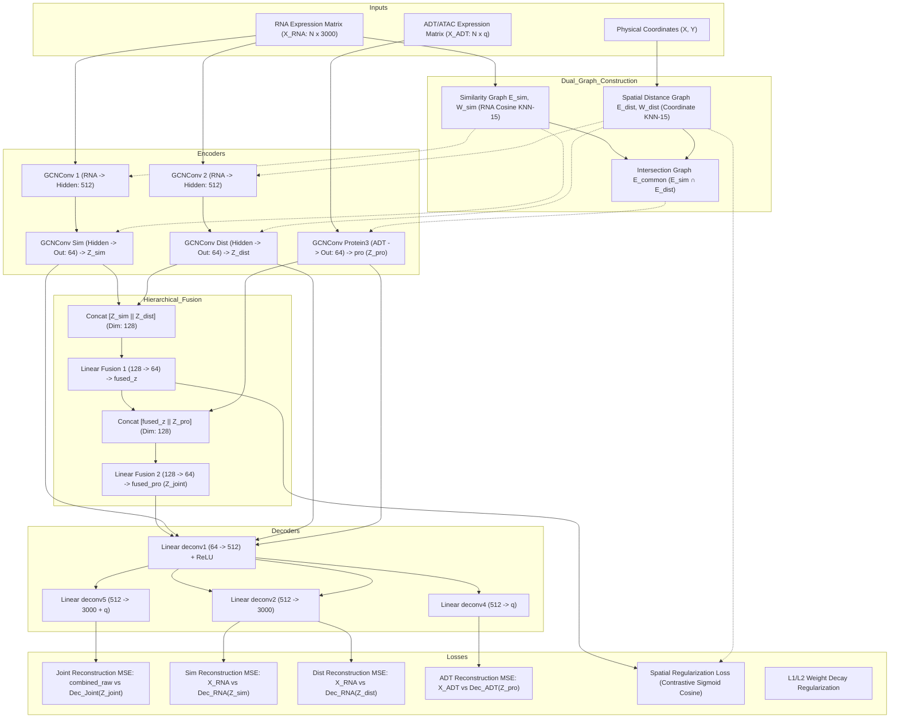
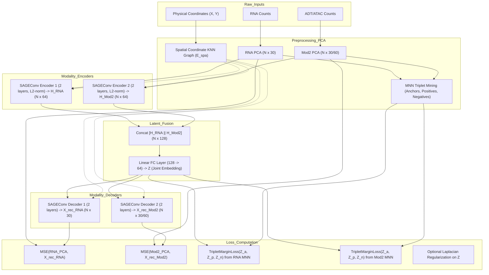

# Detailed Architectural Analysis & Comparison: ARISE vs. SMART

This document provides a comprehensive technical, mathematical, and structural analysis of two spatial multi-omics integration architectures implemented in:
1. **ARISE** ([`arise_kaggle_10_seed_pipeline_v2.py`](file:///d:/FYDP/GATCON/d1_test/arise_kaggle_10_seed_pipeline_v2.py))
2. **SMART** ([`smartpipeline.py`](file:///d:/FYDP/GATCON/d1_test/smartpipeline.py))

---

## 1. Executive Summary & Core Paradigms

| Architectural Dimension | **ARISE** (`arise_kaggle_10_seed_pipeline_v2.py`) | **SMART** (`smartpipeline.py`) |
| :--- | :--- | :--- |
| **Foundational Paradigm** | Dual-Graph Feature & Spatial Contrastive Autoencoder | GraphSAGE Dual-Autoencoder with MNN Triplet Mining |
| **Input Feature Domain** | High-Dimensional Filtered Features (3000 HVGs, CLR ADT, TF-IDF/PCA ATAC) | Low-Dimensional PCA Embeddings (30 PCs RNA, 30/60 PCs ADT/ATAC) |
| **Graph Topologies** | **Dual Graph System**: Feature Cosine KNN ($\mathcal{E}_{sim}$) + Physical Euclidean KNN ($\mathcal{E}_{dist}$) + Intersection Graph ($\mathcal{E}_{common}$) | **Spatial-Only Graph**: Physical Spot Coordinate KNN Graph ($\mathcal{E}_{spa}$) used symmetrically across all modalities |
| **GNN Convolution Operator** | Standard Spectral Graph Convolution (`GCNConv`, Kipf & Welling) | Spatial Sample-and-Aggregate Convolution (`SAGEConv`, Hamilton et al.) with L2 Normalization |
| **Multimodal Fusion Strategy** | **Hierarchical 2-Stage Fusion**: Intra-RNA fusion ($\mathbf{Z}_{sim} + \mathbf{Z}_{dist}$) followed by Cross-Modality fusion ($\mathbf{Z}_{RNA} + \mathbf{Z}_{pro}$) | **Late Concatenation Fusion**: Direct linear projection of concatenated modality SAGE representations |
| **Reconstruction Target** | Raw High-Dimensional Expression Features (Gene/ADT space) | Low-Dimensional PCA Feature Space |
| **Contrastive / Self-Supervised Loss**| **Global Dense Spatial Contrastive Loss**: Binary Cross-Entropy on sigmoid cosine similarity of spot embeddings against spatial adjacency | **Metric Triplet Margin Loss**: Mined Mutual Nearest Neighbors (MNN) as positive anchors and farthest spatial/feature spots as negative samples |
| **Clustering Protocol** | Post-hoc **K-Means** on joint fused embedding ($\mathbf{Z}_{joint}$) selected by peak silhouette score across 350 epochs | Multi-Algorithm Suite: **`mclust`** (Gaussian Mixture Models - primary), **Leiden** (with dynamic resolution search), and **K-Means** |
| **Optimization Stopping Rule** | Fixed 350 epochs with silhouette checkpoint tracking | Sliding-window linear regression slope thresholding ($\le 10^{-4}$) for early exit |

---

## 2. ARISE Architecture Breakdown

ARISE integrates gene expression (RNA) with a secondary modality (ADT protein or ATAC chromatin accessibility) by constructing **complementary relational topologies**: one derived from expression similarity and one from physical coordinate proximity.

### 2.1 Graph Construction Formulation

Let $N$ denote the total number of sequenced spots/cells:
- $\mathbf{X}_{RNA} \in \mathbb{R}^{N \times D_{RNA}}$ represents normalized, scaled highly variable gene expression ($D_{RNA} = 3000$).
- $\mathbf{X}_{ADT} \in \mathbb{R}^{N \times D_{ADT}}$ represents CLR-normalized protein expression or TF-IDF/PCA ATAC features.
- $\mathbf{S}_{pos} \in \mathbb{R}^{N \times 2}$ represents spatial 2D coordinates $(x_i, y_i)$.

ARISE constructs three graphs:

1. **Similarity Graph $\mathcal{G}_{sim} = (\mathcal{V}, \mathcal{E}_{sim}, \mathbf{W}_{sim})$**:
   Computed using cosine similarity in RNA expression space:
   $$S_{ij}^{\cos} = \frac{\mathbf{x}_i^{RNA} \cdot \mathbf{x}_j^{RNA}}{\|\mathbf{x}_i^{RNA}\|_2 \|\mathbf{x}_j^{RNA}\|_2}$$
   An undirected $K$-nearest neighbor graph ($K=15$) is constructed:
   $$\mathcal{E}_{sim} = \{(i,j) \mid j \in \text{KNN}_K(i; S^{\cos}) \lor i \in \text{KNN}_K(j; S^{\cos})\}$$
   Edge weights are assigned as:
   $$W_{ij}^{sim} = S_{ij}^{\cos} \quad \forall (i,j) \in \mathcal{E}_{sim}$$

2. **Distance Graph $\mathcal{G}_{dist} = (\mathcal{V}, \mathcal{E}_{dist}, \mathbf{W}_{dist})$**:
   Computed using Euclidean distance on physical coordinates $\mathbf{S}_{pos}$:
   $$D_{ij}^{euc} = \|\mathbf{s}_i - \mathbf{s}_j\|_2$$
   $$\mathcal{E}_{dist} = \{(i,j) \mid j \in \text{KNN}_K(i; D^{euc}) \lor i \in \text{KNN}_K(j; D^{euc})\}$$
   Edge weights $W_{ij}^{dist} = D_{ij}^{euc}$.

3. **Common (Intersection) Graph $\mathcal{G}_{common} = (\mathcal{V}, \mathcal{E}_{common}, \mathbf{W}_{common})$**:
   Represents spot pairs that are both transcriptionally similar and physically adjacent:
   $$\mathcal{E}_{common} = \mathcal{E}_{sim} \cap \mathcal{E}_{dist}, \quad W_{ij}^{common} = 1.0$$

---

### 2.2 Neural Architecture & Flow Diagram

---

### 2.3 Mathematical Forward Formulation

1. **RNA Stream Encoding**:
   $$\mathbf{H}_s^{(1)} = \text{ReLU}\left(\mathbf{\tilde{D}}_{sim}^{-\frac{1}{2}} \mathbf{\tilde{A}}_{sim} \mathbf{\tilde{D}}_{sim}^{-\frac{1}{2}} \mathbf{X}_{RNA} \mathbf{\Theta}_{s1}\right)$$
   $$\mathbf{Z}_{sim} = \mathbf{\tilde{D}}_{sim}^{-\frac{1}{2}} \mathbf{\tilde{A}}_{sim} \mathbf{\tilde{D}}_{sim}^{-\frac{1}{2}} \mathbf{H}_s^{(1)} \mathbf{\Theta}_{s2}$$
   
   $$\mathbf{H}_d^{(1)} = \text{ReLU}\left(\mathbf{\tilde{D}}_{dist}^{-\frac{1}{2}} \mathbf{\tilde{A}}_{dist} \mathbf{\tilde{D}}_{dist}^{-\frac{1}{2}} \mathbf{X}_{RNA} \mathbf{\Theta}_{d1}\right)$$
   $$\mathbf{Z}_{dist} = \mathbf{\tilde{D}}_{dist}^{-\frac{1}{2}} \mathbf{\tilde{A}}_{dist} \mathbf{\tilde{D}}_{dist}^{-\frac{1}{2}} \mathbf{H}_d^{(1)} \mathbf{\Theta}_{d2}$$

2. **Second Modality (ADT/ATAC) Encoding**:
   $$\mathbf{Z}_{pro} = \mathbf{\tilde{D}}_{com}^{-\frac{1}{2}} \mathbf{\tilde{A}}_{com} \mathbf{\tilde{D}}_{com}^{-\frac{1}{2}} \mathbf{X}_{ADT} \mathbf{\Theta}_{pro}$$

3. **Hierarchical Latent Fusion**:
   $$\mathbf{Z}_{fused} = \mathbf{W}_{f1} \left[\mathbf{Z}_{sim} \,\|\, \mathbf{Z}_{dist}\right] + \mathbf{b}_{f1}, \quad \mathbf{Z}_{fused} \in \mathbb{R}^{N \times 64}$$
   $$\mathbf{Z}_{joint} = \mathbf{W}_{f2} \left[\mathbf{Z}_{fused} \,\|\, \mathbf{Z}_{pro}\right] + \mathbf{b}_{f2}, \quad \mathbf{Z}_{joint} \in \mathbb{R}^{N \times 64}$$

4. **Multi-Target Reconstruction Loss $\mathcal{L}_{recon}$**:
   $$\mathcal{L}_{rec} = \text{MSE}\left([\mathbf{X}_{RNA} \,\|\, \mathbf{X}_{ADT}], \text{Dec}_{joint}(\mathbf{Z}_{joint})\right)$$
   $$\mathcal{L}_{sim} = \text{MSE}\left(\mathbf{X}_{RNA}, \text{Dec}_{RNA}(\mathbf{Z}_{sim})\right)$$
   $$\mathcal{L}_{dist} = \text{MSE}\left(\mathbf{X}_{RNA}, \text{Dec}_{RNA}(\mathbf{Z}_{dist})\right)$$
   $$\mathcal{L}_{adt} = \text{MSE}\left(\mathbf{X}_{ADT}, \text{Dec}_{ADT}(\mathbf{Z}_{pro})\right)$$
   $$\mathcal{L}_{recon\_total} = \mathcal{L}_{rec} + \mathcal{L}_{sim} + \mathcal{L}_{dist} + \mathcal{L}_{adt}$$

5. **Dense Spatial Contrastive Regularization Loss $\mathcal{L}_{spatial}$**:
   Applied to the intermediate fused representation $\mathbf{Z}_{fused}$:
   $$\mathbf{C}_{ij} = \frac{\mathbf{z}_i \cdot \mathbf{z}_j}{\|\mathbf{z}_i\|_2 \|\mathbf{z}_j\|_2}, \quad \mathbf{S}_{ij} = \sigma(\mathbf{C}_{ij}) \quad (i \neq j)$$
   $$\mathcal{L}_{spatial} = -\frac{1}{2 N^2} \sum_{i=1}^N \sum_{j=1}^N \left[ \mathbf{A}_{ij}^{dist} \log(\mathbf{S}_{ij} + \epsilon) + (1 - \mathbf{A}_{ij}^{dist}) \log(1 - \mathbf{S}_{ij} + \epsilon) \right]$$
   where $\mathbf{A}^{dist}$ is the binary dense spatial adjacency derived from $\mathcal{E}_{dist}$.

6. **Total Loss**:
   $$\mathcal{L}_{total} = \beta \cdot \mathcal{L}_{recon\_total} + \gamma \cdot \mathcal{L}_{spatial} + \delta \cdot \left(\lambda_1 \sum_{\theta} |\theta| + \lambda_2 \sum_{\theta} \theta^2\right)$$
   *(Default hyperparameters: $\beta=25$, $\gamma=10$, $\delta=1$, $\lambda_1=10^{-4}$, $\lambda_2=10^{-3}$)*.

---

## 3. SMART Architecture Breakdown

SMART adopts a modular autoencoder design powered by **GraphSAGE (`SAGEConv`)** convolutions with internal $L_2$ normalization and explicit **Mutual Nearest Neighbor (MNN) metric learning** to align multi-omics profiles in a shared coordinate space.

### 3.1 Preprocessing & Spatial Graph Construction

1. **Dimensionality Reduction to PCA**:
   Unlike ARISE (which feeds 3000 genes directly into GCNs), SMART first projects each modality to low-dimensional PCA space:
   - $\mathbf{X}_{RNA}^{pca} \in \mathbb{R}^{N \times D_{pca1}}$ (typically 30 PCs)
   - $\mathbf{X}_{Mod2}^{pca} \in \mathbb{R}^{N \times D_{pca2}}$ (30 PCs for ADT, 60 PCs for ATAC)

2. **Spatial Coordinate Neighbor Graph**:
   SMART operates on a single spatial neighbor graph $\mathcal{G}_{spa} = (\mathcal{V}, \mathcal{E}_{spa})$ built purely from physical spot coordinates $(x_i, y_i)$ using KNN ($K=4$ or $K=6$). This identical graph topology is fed into every modality's encoder and decoder.

3. **MNN Triplet Mining (`Mutual_Nearest_Neighbors`)**:
   SMART mines geometric constraints directly from feature space:
   - **Anchor ($a$) & Positive ($p$)**: Spots that are mutual nearest neighbors:
     $$p \in \text{KNN}_k(a) \quad \text{AND} \quad a \in \text{KNN}_k(p)$$
   - **Negative ($n$)**: Sampled uniformly from the bottom portion ($1 - \text{farthest\_ratio}$, e.g. 60%) of spots ranked by distance to $a$:
     $$\text{dist}(a, n) \gg \text{dist}(a, p)$$

---

### 3.2 Neural Architecture & Flow Diagram

---

### 3.3 Mathematical Forward Formulation

1. **SAGEConv Layer Operator**:
   For node $v$ with neighbors $\mathcal{N}(v)$ in the spatial graph $\mathcal{E}_{spa}$:
   $$\mathbf{h}_{\mathcal{N}(v)}^{(l)} = \frac{1}{|\mathcal{N}(v)|} \sum_{u \in \mathcal{N}(v)} \mathbf{h}_u^{(l-1)}$$
   $$\mathbf{\tilde{h}}_v^{(l)} = \mathbf{W}_l \mathbf{h}_v^{(l-1)} + \mathbf{W}_r \mathbf{h}_{\mathcal{N}(v)}^{(l)}$$
   $$\mathbf{h}_v^{(l)} = \frac{\mathbf{\tilde{h}}_v^{(l)}}{\|\mathbf{\tilde{h}}_v^{(l)}\|_2} \quad \text{(L2 feature normalization)}$$

2. **2-Layer Modality Encoders**:
   $$\mathbf{H}_{RNA} = \text{SAGEConv}_2\left(\text{SAGEConv}_1(\mathbf{X}_{RNA}^{pca}, \mathcal{E}_{spa}), \mathcal{E}_{spa}\right)$$
   $$\mathbf{H}_{Mod2} = \text{SAGEConv}_2\left(\text{SAGEConv}_1(\mathbf{X}_{Mod2}^{pca}, \mathcal{E}_{spa}), \mathcal{E}_{spa}\right)$$

3. **Concatenation & Linear Projection**:
   $$\mathbf{Z} = \mathbf{W}_{fc} \left[\mathbf{H}_{RNA} \,\|\, \mathbf{H}_{Mod2}\right] + \mathbf{b}_{fc}, \quad \mathbf{Z} \in \mathbb{R}^{N \times 64}$$

4. **SAGEConv Decoders (Reconstruction)**:
   $$\hat{\mathbf{X}}_{RNA}^{pca} = \text{Decoder}_{RNA}(\mathbf{Z}, \mathcal{E}_{spa})$$
   $$\hat{\mathbf{X}}_{Mod2}^{pca} = \text{Decoder}_{Mod2}(\mathbf{Z}, \mathcal{E}_{spa})$$

5. **SMART Multi-Task Objective Function**:
   $$\mathcal{L}_{SMART} = \sum_{m \in \{RNA, Mod2\}} w_m^{rec} \text{MSE}\left(\mathbf{X}_m^{pca}, \hat{\mathbf{X}}_m^{pca}\right) + \sum_{m \in \{RNA, Mod2\}} w_m^{tri} \mathcal{L}_{tri}^{(m)} + \alpha_{lap} \mathcal{L}_{lap}$$
   where the triplet loss enforces distance constraints in the fused space $\mathbf{Z}$:
   $$\mathcal{L}_{tri}^{(m)} = \frac{1}{|\mathcal{T}_m|} \sum_{(a, p, n) \in \mathcal{T}_m} \max\left(0, \|\mathbf{z}_a - \mathbf{z}_p\|_2^2 - \|\mathbf{z}_a - \mathbf{z}_n\|_2^2 + \text{margin}\right)$$
   and optional Laplacian spatial smoothing is:
   $$\mathcal{L}_{lap} = \frac{1}{|\mathcal{E}_{spa}|} \sum_{(i,j) \in \mathcal{E}_{spa}} \|\mathbf{z}_i - \mathbf{z}_j\|_2^2$$
   *(Default hyperparameters: $\text{margin}=0.5$, $w=[1, 1, 1, 1]$, $\alpha_{lap}=0.0$, learning rate $=10^{-3}$ or $5 \times 10^{-3}$)*.

---

## 4. Deep Architecture Comparison

### 4.1 Side-by-Side Architectural Matrix

| Category | Parameter / Property | **ARISE** (`arise_kaggle_10_seed_pipeline_v2.py`) | **SMART** (`smartpipeline.py`) |
| :--- | :--- | :--- | :--- |
| **Input Representation** | Feature dimensionality | High ($3000$ genes + $q$ ADT/ATAC features) | Low ($30$ PCs RNA + $30/60$ PCs ADT/ATAC) |
| | Sparsity handling | Dense to dense arrays after scaling | Scaled PCA projection avoids sparse computations |
| **Graph Modeling** | Number of graphs | **3 distinct graphs** ($\mathcal{G}_{sim}$, $\mathcal{G}_{dist}$, $\mathcal{G}_{common}$) | **1 shared graph** ($\mathcal{G}_{spa}$) |
| | Graph metric basis | Cosine similarity + Euclidean spatial distance | Euclidean spatial distance only |
| | Neighborhood size | $K = 15$ | $K = 4$ (Mouse Brain) or $K = 6$ (Lymph Node) |
| | Second modality graph | Edge intersection ($\mathcal{E}_{sim} \cap \mathcal{E}_{dist}$) | Pure spatial coordinate graph ($\mathcal{E}_{spa}$) |
| **GNN Layers** | Convolution type | `GCNConv` (Kipf & Welling spectral) | `SAGEConv` (Hamilton spatial aggregation) |
| | Feature normalization | None inside convolution | Explicit $L_2$ norm ($\frac{\mathbf{x}}{\|\mathbf{x}\|_2}$) per layer |
| | Layer depth | 2 layers per encoder branch | 2 layers per encoder branch |
| **Multimodal Fusion** | Fusion architecture | **2-Stage Hierarchical MLP** | **1-Stage Concatenation Linear Projection** |
| | Stage 1 | Intra-RNA fusion: $\mathbf{Z}_{sim} + \mathbf{Z}_{dist} \rightarrow \mathbf{Z}_{fused}$ | Direct concatenation: $[\mathbf{H}_{RNA} \,\|\, \mathbf{H}_{Mod2}]$ |
| | Stage 2 | Cross-modality fusion: $\mathbf{Z}_{fused} + \mathbf{Z}_{pro} \rightarrow \mathbf{Z}_{joint}$ | $\mathbf{W}_{fc}[\cdot] \rightarrow \mathbf{Z}$ |
| **Decoding & Target** | Decoder design | Feed-Forward MLPs (`Linear` + `ReLU`) | Graph Convolutional Decoders (`SAGEConv` on $\mathcal{E}_{spa}$) |
| | Reconstruction target | Original Gene ($3000$) & Protein/ATAC ($q$) values | Low-dimensional PCA principal components ($30/60$) |
| **Contrastive Learning** | Contrastive objective | Global Dense Matrix Cosine Contrastive Loss | Sampled Metric Triplet Margin Loss |
| | Positive pairs | Direct spatial neighbors ($\mathbf{A}_{ij}^{dist} = 1$) | Mutual Nearest Neighbors in feature space (MNN) |
| | Negative pairs | Non-spatial neighbors ($\mathbf{A}_{ij}^{dist} = 0$) | Farthest neighbors in feature space |
| | Contrastive space | Applied to intermediate $\mathbf{Z}_{fused}$ | Applied to final joint latent $\mathbf{Z}$ |
| **Regularization** | Weight penalization | Explicit $L_1$ ($10^{-4}$) + $L_2$ ($10^{-3}$) loss | Optimizer weight decay ($10^{-6}$) |
| | Manifold smoothing | Contrastive separation | Optional graph Laplacian loss ($\mathcal{L}_{lap}$) |
| **Clustering Suite** | Primary clustering | **K-Means** on $\mathbf{Z}_{joint}$ | **`mclust`** (Gaussian Mixture Models via R `mclust`) |
| | Graph clustering | None | **Leiden** community detection with resolution search |
| | Model selection rule | Peak Silhouette score across 350 epochs | Early stopping via loss slope linear regression |

---

### 4.2 Key Conceptual Differences

#### 1. Where Spatial Information is Injected
- **ARISE**: Spatial coordinates are used to construct an explicit **distance graph** $\mathcal{G}_{dist}$ and as the ground-truth adjacency for a **contrastive cross-entropy loss** $\mathcal{L}_{spatial}$. Spatial coordinates never enter the second modality directly; the second modality is regularized exclusively through common edges ($\mathcal{E}_{sim} \cap \mathcal{E}_{dist}$).
- **SMART**: Spatial coordinates form the **backbone graph** $\mathcal{E}_{spa}$ for message passing across *both* modalities. SAGE convolutions propagate features across spatial neighbors in both the encoder and decoder.

#### 2. Reconstruction Objectives
- **ARISE** decodes back to the **original gene and protein space** ($3000 + q$). This forces the latent embedding to preserve fine-grained gene expression variation, but incurs higher computational and memory overhead during backpropagation.
- **SMART** decodes to **PCA space** ($30$ or $60$ dimensions). This denoises the expression signal before reconstruction and dramatically speeds up training, but discards nonlinear variations outside the top principal components.

#### 3. Contrastive Strategy
- **ARISE** uses a **dense $N \times N$ sigmoid cross-entropy** loss. It treats all non-adjacent spots in the spatial graph as negative pairs and adjacent spots as positive pairs.
- **SMART** uses **sparse triplet margin loss** based on **Mutual Nearest Neighbors (MNN)** mined from expression space. Positives are biologically concordant spots (MNNs), while negatives are chosen from the farthest quartile of spots.

#### 4. Clustering Philosophy
- **ARISE** focuses on the quality of the latent space for geometric partition via **K-Means**, tracking silhouette score at every epoch to capture the most well-clustered checkpoint.
- **SMART** relies heavily on **`mclust` (Gaussian Mixture Models)** in post-processing, which fits elliptical covariance clusters to the embedding, capturing anisotropic tissue layers that standard K-Means spherical clusters often miss.

---

## 5. Summary Recommendations

1. **For Fine-Grained Biological Delineation (e.g. Brain Cortex Layers)**:
   - SMART's combination of GraphSAGE smoothing and Gaussian Mixture Model (`mclust`) clustering is historically superior for laminar structures where cell density and covariance vary by layer.
2. **For Complex Cross-Modality Alignment (e.g. Lymph Node Germinal Centers)**:
   - ARISE's dual-graph formulation ($\mathcal{E}_{sim} \cap \mathcal{E}_{dist}$) ensures that spots are only linked if they share both physical proximity and transcriptional similarity, avoiding artificial blurring across sharp tissue boundaries.
3. **Computational Efficiency**:
   - SMART runs in fewer epochs with fast early stopping and PCA targets.
   - ARISE trains over 350 fixed epochs on 3000 genes with dense $N \times N$ spatial similarity matrices, making it more compute-heavy but directly anchored in raw gene expression.
