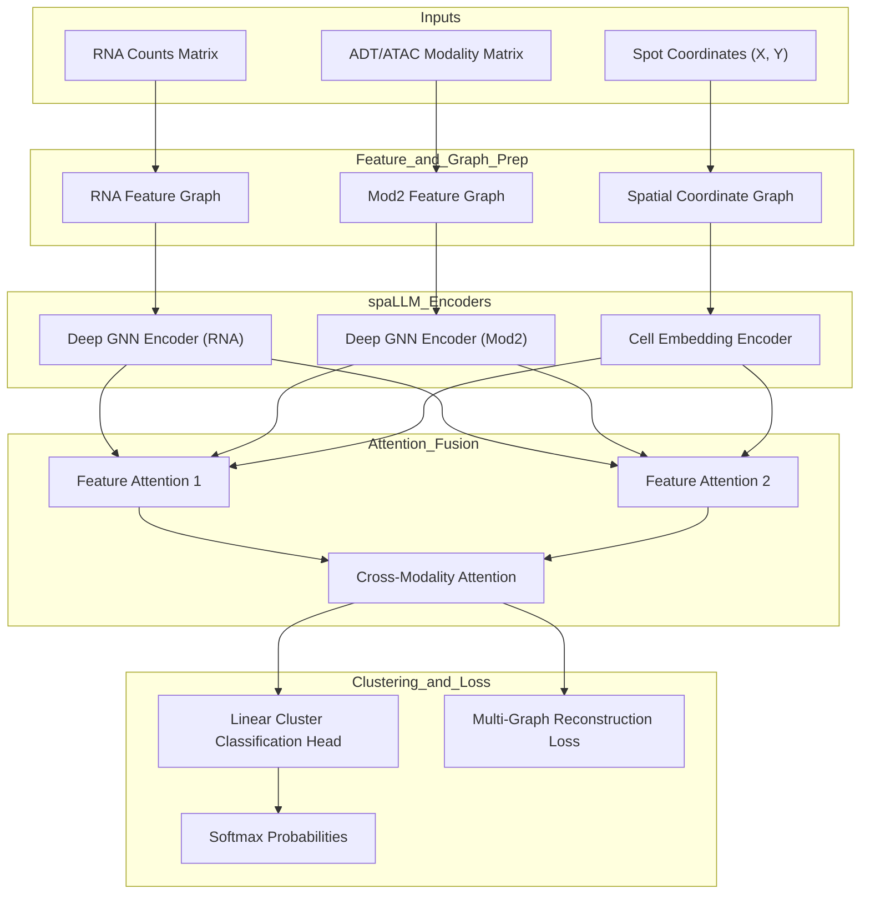
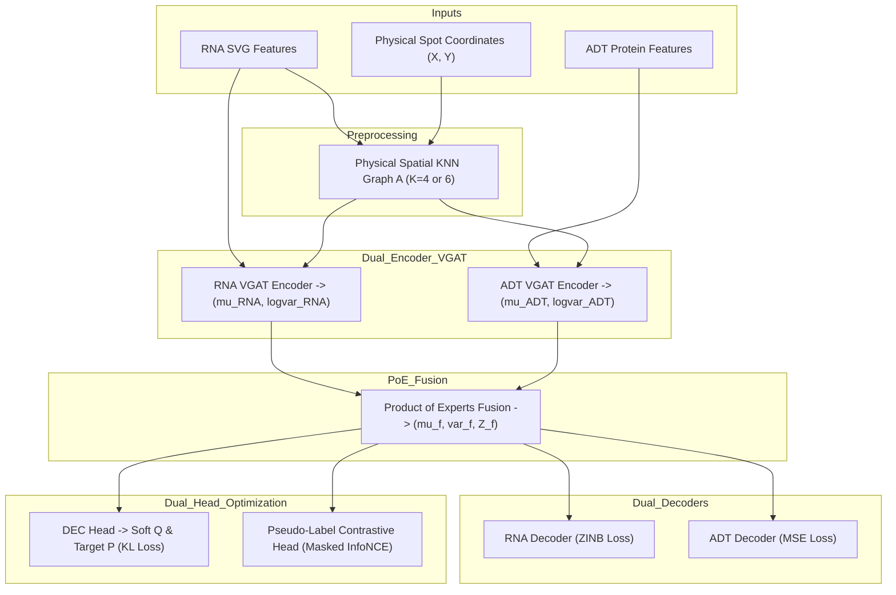

# Comprehensive Pipeline Comparison: `spaLLM Clust` vs. `VGAT-PoE-DEC`

This document provides a detailed side-by-side architectural and algorithmic comparison between **`spaLLM Clust`** ([`spallmclusterpipeline.py`](file:///d:/FYDP/GATCON/d1_test/spallmclusterpipeline.py)) and the new **`VGAT-PoE-DEC`** pipeline ([`vgat_poe_dec_pipeline.py`](file:///d:/FYDP/GATCON/d1_test/vgat_poe_dec_pipeline.py)).

---

## 1. Executive Comparison Overview

| Architectural Dimension | `spaLLM Clust` (`spallmclusterpipeline.py`) | `VGAT-PoE-DEC` (`vgat_poe_dec_pipeline.py`) |
| :--- | :--- | :--- |
| **Encoder Topology** | Modality GNN Encoders + 5 Attention Layers | Dual-Encoder Variational Graph Attention (VGAT) |
| **Multimodal Fusion** | Concatenation & Cross-Attention Layers | **Product of Experts (PoE)** Gaussian Posterior Fusion |
| **Latent Space Modeling** | Deterministic Feature Representations | **Probabilistic Variational Distribution** $(\mu_f, \sigma^2_f)$ |
| **Decoder Architecture** | Standard Linear/GNN Feature Decoders | **Modality-Specific Dual Decoders** (ZINB + MSE) |
| **RNA Loss Function** | Mean Squared Error (MSE) / L2 Loss | **Zero-Inflated Negative Binomial (ZINB)** Loss |
| **ADT / Protein Loss** | MSE / L2 Loss | **Mean Squared Error (MSE)** Loss |
| **Clustering Mechanism** | Linear Softmax Head / FACT Label Smoothing | **Deep Embedded Clustering (DEC)** ($D_{KL}(P \parallel Q)$) |
| **Contrastive Learning** | None | **Pseudo-Label Spatially-Aware Contrastive** Head ($\tau=0.95$) |
| **Training Protocol** | Single-Stage End-to-End Joint Training | **4-Phase Execution Protocol** (Warm-up $\rightarrow$ K-Means++ $\rightarrow$ Fine-tuning $\rightarrow$ Early Stop) |
| **Spatial Graph Construction**| Dual Graphs (Spatial KNN + Feature Correlation) | Unified Physical Spot Coordinate KNN Graph ($K=4$ or $6$) |
| **Spatial Early Stopping** | None (Fixed Epoch Training) | **5% Subsample Spatial Coherence** (Silhouette + Moran's I) |
| **Supported Algorithms** | spaLLM, KMeans, Leiden, mclust | DEC Native, KMeans, Leiden, mclust |
| **Benchmark Metrics** | 8 Metrics (ARI, NMI, Sil, AMI, CHI, DBI, Homo, V) | 8 Metrics (ARI, NMI, Sil, AMI, CHI, DBI, Homo, V) |

---

## 2. Structural Architecture Diagrams

### A. `spaLLM Clust` Pipeline Flow

### B. `VGAT-PoE-DEC` Pipeline Flow

---

## 3. Mathematical & Algorithmic Comparison

### 1. Multimodal Fusion Strategy

#### `spaLLM Clust`: Attention Layer Weighting
Uses stacked single-head/multi-head attention layers mapping stacked embedding vectors to scalar attention weights $\alpha$:

$$\mathbf{v} = \tanh(\mathbf{E} \mathbf{W}_{\omega}), \quad \alpha = \operatorname{Softmax}(\mathbf{v} \mathbf{u}_{\omega})$$

$$\mathbf{Z}_{\text{fused}} = \sum_{m} \alpha_m \mathbf{E}_m$$

*Limitation*: Cannot model uncertainty or modality-specific feature noise variances.

#### `VGAT-PoE-DEC`: Product of Experts (PoE) Gaussian Fusion
Combines posterior probability distributions $\mathcal{N}(\mu_{\text{RNA}}, \sigma^2_{\text{RNA}})$ and $\mathcal{N}(\mu_{\text{ADT}}, \sigma^2_{\text{ADT}})$ in a principled probabilistic framework:

$$\sigma^2_f = \left( \frac{1}{\sigma^2_{\text{RNA}}} + \frac{1}{\sigma^2_{\text{ADT}}} \right)^{-1}, \quad \mu_f = \sigma^2_f \left( \frac{\mu_{\text{RNA}}}{\sigma^2_{\text{RNA}}} + \frac{\mu_{\text{ADT}}}{\sigma^2_{\text{ADT}}} \right)$$

$$Z_f = \mu_f + \epsilon \odot \sqrt{\sigma^2_f}, \quad \epsilon \sim \mathcal{N}(0, I)$$

*Advantage*: Automatically down-weights noisy modalities with high variance ($\sigma^2$), preserving high-fidelity biological signals.

---

### 2. Reconstruction Loss & Denoising Objectives

#### `spaLLM Clust`
Applies standard Gaussian Mean Squared Error (MSE) loss uniformly to all modalities:

$$\mathcal{L}_{\text{Recon}} = \| X_{\text{RNA}} - \hat{X}_{\text{RNA}} \|^2_F + \| X_{\text{Mod2}} - \hat{X}_{\text{Mod2}} \|^2_F$$

*Limitation*: Oversimplifies RNA single-cell and spatial transcriptomics count statistics, failing to handle severe zero-inflation dropouts and count dispersion.

#### `VGAT-PoE-DEC`
Applies biologically appropriate loss formulations per modality:

$$\mathcal{L}_{Recon} = \mathcal{L}_{ZINB\_RNA} + \lambda_{ADT} \mathcal{L}_{MSE\_ADT}$$

- **Zero-Inflated Negative Binomial (ZINB)** for RNA counts ($\mu, \theta, \pi$):

$$\mathcal{L}_{ZINB} = -\sum_{i,j} \begin{cases} \log \left( \pi + (1-\pi)\left(\frac{\theta}{\theta+\mu}\right)^\theta \right) & \text{if } x_{ij} = 0 \\ \log(1-\pi) + \log \frac{\Gamma(x_{ij}+\theta)}{x_{ij}! \Gamma(\theta)} + \theta \log \frac{\theta}{\theta+\mu} + x_{ij} \log \frac{\mu}{\theta+\mu} & \text{if } x_{ij} > 0 \end{cases}$$

- **Mean Squared Error (MSE)** for continuous normalized ADT protein abundances:

$$\mathcal{L}_{MSE} = \frac{1}{N \cdot F_2} \| X_{\text{ADT}} - \hat{X}_{\text{ADT}} \|^2_F$$

---

### 3. Domain Discovery & Clustering Objectives

#### `spaLLM Clust`
Relies on a simple linear classification layer ($\mathbf{W}_{\text{cluster}} h + b$) with optional post-hoc spatial label smoothing (local majority voting).

#### `VGAT-PoE-DEC`
Integrates **Deep Embedded Clustering (DEC)** with Student's t-distribution kernel soft assignments ($Q$) and sharpened target distributions ($P$):

$$q_{ij} = \frac{\left(1 + \|(Z_f)_i - C_j\|^2\right)^{-1}}{\sum_{k=1}^K \left(1 + \|(Z_f)_i - C_k\|^2\right)^{-1}}, \quad p_{ij} = \frac{q_{ij}^2 / \sum_i q_{ij}}{\sum_k (q_{ik}^2 / \sum_i q_{ik})}$$

$$\mathcal{L}_{DEC} = D_{KL}(P \parallel Q) = \sum_{i=1}^N \sum_{j=1}^K p_{ij} \log \frac{p_{ij}}{q_{ij}}$$

In addition, it enforces **Pseudo-Label Spatially-Aware Contrastive Learning** with dynamic confidence masks at threshold $\tau = 0.95$:

$$M_{pos}(i,j) = 1 \iff \max(q_i) > \tau \land \max(q_j) > \tau \land \operatorname{argmax}(q_i) == \operatorname{argmax}(q_j)$$

$$M_{neg}(i,j) = 1 \iff \max(q_i) > \tau \land \max(q_j) > \tau \land \operatorname{argmax}(q_i) \neq \operatorname{argmax}(q_j)$$

$$\mathcal{L}_{InfoNCE\_Pseudo} = -\frac{1}{|M_{pos}|} \sum_{(i,j) \in M_{pos}} \log \frac{\exp(\operatorname{sim}(z_i, z_j)/\tau_{temp})}{\exp(\operatorname{sim}(z_i, z_j)/\tau_{temp}) + \sum_{k \in M_{neg}(i)} \exp(\operatorname{sim}(z_i, z_k)/\tau_{temp})}$$

---

## 4. Training Execution Protocols

### `spaLLM Clust` Training Workflow
1. Initialize GNN encoders and decoders.
2. Train all parameters simultaneously for a fixed number of epochs using total composite loss.
3. Apply post-hoc majority voting spatial label smoothing.

### `VGAT-PoE-DEC` 4-Phase Execution Protocol
1. **Phase 1: Reconstruction & Spatial InfoNCE Warm-Up (100 Epochs)**
   - Disable DEC Head.
   - Establish basic topological structure using $\mathcal{L}_{Recon}$ and spatial InfoNCE.
2. **Phase 2: Center Initialization**
   - Freeze network weights.
   - Extract stabilized latent embeddings $\mu_f$.
   - Execute K-Means++ algorithm to discover $K$ distinct initial centroids $C$.
3. **Phase 3: Joint Fine-Tuning**
   - Unfreeze network.
   - Optimize composite objective: $\mathcal{L}_{total} = \mathcal{L}_{Recon} + \alpha \mathcal{L}_{InfoNCE\_Pseudo} + \gamma \mathcal{L}_{DEC}$.
   - Update target distribution $P$ every 5 epochs to prevent $O(N^2)$ overhead.
4. **Phase 4: Spatial Early Stopping Subsampling**
   - Evaluate on a 5% random spot subsample every 10 epochs.
   - Calculate composite metric $M = \lambda_1 \operatorname{Silhouette} + \lambda_2 \operatorname{Moran's I}$.
   - Save model weights exclusively at peak composite metric score $M$.

---

## 5. Comparative Strengths & Key Takeaways

### Why `VGAT-PoE-DEC` Advances `spaLLM Clust`
1. **Biological Realism**: ZINB loss models single-cell zero-inflation dropouts, preventing over-smoothing of sparse transcriptomic signals.
2. **Noise Robustness**: Product of Experts (PoE) dynamically weighs modality variances, outperforming simple attention stacking when one modality is noisy.
3. **Sharper Domain Boundaries**: Combining DEC KL loss with high-confidence pseudo-label contrastive learning ($\tau = 0.95$) produces distinct domain boundaries compared to basic linear classification heads.
4. **Automated Early Stopping**: Evaluating Moran's I spatial coherence and Silhouette distinctness on a 5% subsample prevents over-fitting without heavy computational overhead.
