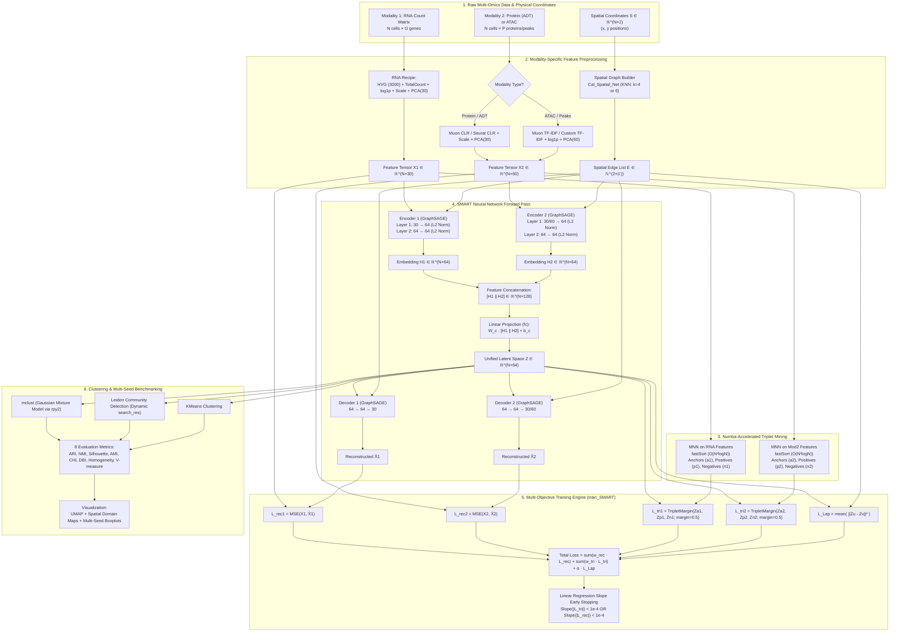
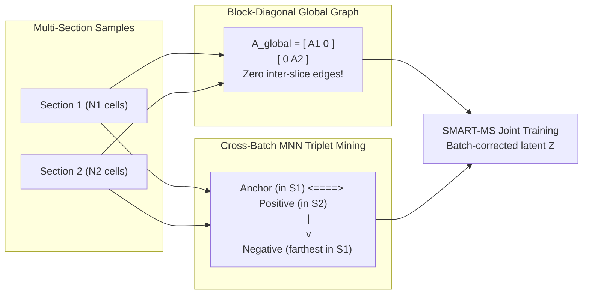

# SMART & `smartpipeline.py`: The Definitive Architecture, Mathematics, & Implementation Manual

---

## Table of Contents
1. [Executive Summary & The Spatial Multi-Omics Challenge](#1-executive-summary--the-spatial-multi-omics-challenge)
2. [High-Level Architecture & End-to-End Workflow](#2-high-level-architecture--end-to-end-workflow)
3. [Rigorous Mathematical Foundations](#3-rigorous-mathematical-foundations)
   - 3.1 [Data Representation & Dimensionality Notation](#31-data-representation--dimensionality-notation)
   - 3.2 [Spatial Neighbor Graph Construction ($K$-NN & Radius)](#32-spatial-neighbor-graph-construction-k-nn--radius)
   - 3.3 [Graph Neural Network Backbones (GraphSAGE, GCN, GAT, GCNII, GraphConv)](#33-graph-neural-network-backbones-graphsage-gcn-gat-gcnii-graphconv)
   - 3.4 [Multi-Modal Stacking & Latent Space Projection](#34-multi-modal-stacking--latent-space-projection)
   - 3.5 [Mutual Nearest Neighbors (MNN) Metric Learning & Triplet Mining](#35-mutual-nearest-neighbors-mnn-metric-learning--triplet-mining)
   - 3.6 [Multi-Task Joint Loss Function & Laplacian Regularization](#36-multi-task-joint-loss-function--laplacian-regularization)
   - 3.7 [Loss Slope Convergence & Dynamic Early Stopping](#37-loss-slope-convergence--dynamic-early-stopping)
4. [Multi-Slice Integration: SMART-MS](#4-multi-slice-integration-smart-ms)
   - 4.1 [Block-Diagonal Spatial Graph Assembly](#41-block-diagonal-spatial-graph-assembly)
   - 4.2 [Cross-Batch Mutual Nearest Neighbor Alignment (`MMN_batch`)](#42-cross-batch-mutual-nearest-neighbor-alignment-mmn_batch)
   - 4.3 [Harmony Feature Pre-alignment](#43-harmony-feature-pre-alignment)
5. [Multi-Omics Preprocessing Pipelines](#5-multi-omics-preprocessing-pipelines)
   - 5.1 [Spatial Transcriptomics (RNA-seq / Stereo-seq)](#51-spatial-transcriptomics-rna-seq--stereo-seq)
   - 5.2 [Spatial Proteomics (CITE-seq / ADT / CLR)](#52-spatial-proteomics-cite-seq--adt--clr)
   - 5.3 [Spatial Epigenomics (ATAC-seq / CUT&Tag / TF-IDF)](#53-spatial-epigenomics-atac-seq--cuttag--tf-idf)
6. [Deep Dive into `smartpipeline.py` (Line-by-Line Code Analysis)](#6-deep-dive-into-smartpipelinepy-line-by-line-code-analysis)
   - 6.1 [Section 1: Benchmark Dataset Configurations & Seeds](#61-section-1-benchmark-dataset-configurations--seeds)
   - 6.2 [Section 2: Spatial Graph Builder (`Cal_Spatial_Net`)](#62-section-2-spatial-graph-builder-cal_spatial_net)
   - 6.3 [Section 3: Numba-Accelerated MNN Mining (`fastSort` & Triplet Sampling)](#63-section-3-numba-accelerated-mnn-mining-fastsort--triplet-sampling)
   - 6.4 [Section 4: GNN Modules & Pure PyTorch Fallbacks (`SMART`, `SAGEConv`)](#64-section-4-gnn-modules--pure-pytorch-fallbacks-smart-sageconv)
   - 6.5 [Section 5: Training Engine with Early Stopping (`train_SMART`)](#65-section-5-training-engine-with-early-stopping-train_smart)
   - 6.6 [Section 6: Dimensionality Reduction, `mclust_R`, & Resolution Search](#66-section-6-dimensionality-reduction-mclust_r--resolution-search)
   - 6.7 [Section 7: CLR & TF-IDF Normalization Handlers](#67-section-7-clr--tf-idf-normalization-handlers)
   - 6.8 [Section 8: Clustering Evaluation (8 Metrics) & Visualizations](#68-section-8-clustering-evaluation-8-metrics--visualizations)
   - 6.9 [Section 9: Dynamic Multi-Platform Data Loader (`load_dataset_data`)](#69-section-9-dynamic-multi-platform-data-loader-load_dataset_data)
   - 6.10 [Section 10: End-to-End Workflow Runner (`run_smart_workflow`)](#610-section-10-end-to-end-workflow-runner-run_smart_workflow)
   - 6.11 [Section 11: Main Execution Driver & Ablation Reporting](#611-section-11-main-execution-driver--ablation-reporting)
7. [Downstream Domain Clustering & Evaluation Metrics](#7-downstream-domain-clustering--evaluation-metrics)
   - 7.1 [Clustering Algorithms (mclust vs Leiden vs KMeans)](#71-clustering-algorithms-mclust-vs-leiden-vs-kmeans)
   - 7.2 [The 8 Quantitative Evaluation Metrics Explained](#72-the-8-quantitative-evaluation-metrics-explained)
8. [Comparative Analysis: SMART vs 13 Benchmark Methods](#8-comparative-analysis-smart-vs-13-benchmark-methods)
9. [Execution Guide, Environment Setup, & Practical Tips](#9-execution-guide-environment-setup--practical-tips)

---

## 1. Executive Summary & The Spatial Multi-Omics Challenge

### What is SMART?
**SMART** (**S**patial **M**ulti-omic **A**ggregation using **gR**aph neural networks and me**T**ric learning) is an unsupervised deep learning framework designed to integrate spatial multi-omics measurements (e.g., spatial transcriptomics, spatial proteomics, and spatial epigenomics) into a unified, biologically aligned, low-dimensional representation $\mathbf{Z} \in \mathbb{R}^{N \times d}$.

```
      +-------------------------------------------------------------------------+
      |                          THE MULTI-OMICS DILEMMA                         |
      |                                                                         |
      |  Spatial RNA-seq          Spatial ADT / Protein     Spatial ATAC-seq    |
      |  (Continuous counts,      (Targeted, high count     (Extremely sparse,  |
      |   high dropouts,           density, non-negative,    binary/near-binary,|
      |   3,000-20,000 genes)      10-200 antibodies)        50,000-200,000 pks)|
      |         \                         |                         /           |
      |          \                        |                        /            |
      |           +-----------------------+-----------------------+             |
      |                                   |                                     |
      |                CHALLENGE: HETEROGENEOUS NOISE & SCALES                  |
      |           Naive concatenation fails due to modality dominance,          |
      |          sparsity mismatch, and lack of spatial microenvironment.       |
      |                                   |                                     |
      |                       SOLUTION: THE SMART FRAMEWORK                     |
      |       1. Modality-Specific GNN Encoders (preserves modal identity)      |
      |       2. Spatial Graph Convolution (models physical microenvironments)  |
      |       3. Mutual Nearest Neighbor (MNN) Triplet Metric Learning          |
      |          (enforces biological semantic clustering in latent space)      |
      |       4. Graph Laplacian Regularization (smooth spatial transitions)    |
      |       5. Cross-Modality Reconstruction Decoders (preserves information) |
      +-------------------------------------------------------------------------+
```

### Key Technical Contributions
1. **Modality-Decoupled Architecture**: Each omics modality is initially encoded by an independent Graph Neural Network (GNN), transforming disparate input dimensions $D_1, D_2, \dots, D_M$ into normalized embedding spaces of uniform dimensionality $d$ before concatenation and projection.
2. **Mutual Nearest Neighbor (MNN) Triplet Metric Learning**: Rather than relying purely on reconstruction (which frequently suffers from over-smoothing or modality collapse), SMART mines reciprocal nearest neighbors across cells as positive pairs and selects the farthest cells as negative pairs, enforcing a margin constraint via Triplet Loss.
3. **Spatial Graph Conditioning**: Cell representations are aggregated over local physical neighborhoods using $K$-Nearest Neighbor ($K$-NN) or Radius graphs constructed directly from spatial coordinates $(x, y)$.
4. **SMART-MS (Multi-Slice Extension)**: Scales to multi-section 3D volumes or technical replicates via block-diagonal spatial graph assembly (preventing inter-slice coordinate distortion) and cross-batch MNN mining (eliminating batch effects).

---

## 2. High-Level Architecture & End-to-End Workflow



---

## 3. Rigorous Mathematical Foundations

### 3.1 Data Representation & Dimensionality Notation

| Notation | Mathematical Space | Description |
| :--- | :--- | :--- |
| $N$ | $\mathbb{N}$ | Number of spatial spots or single cells in the tissue slice |
| $M$ | $\mathbb{N}$ | Total number of modalities ($M=2$ for RNA + ADT or RNA + ATAC) |
| $D_m$ | $\mathbb{N}$ | Input feature dimension of modality $m$ after preprocessing (e.g., $D_1=30, D_2=60$) |
| $\mathbf{X}^{(m)}$ | $\mathbb{R}^{N \times D_m}$ | Preprocessed feature matrix for modality $m$ |
| $\mathbf{x}_i^{(m)}$ | $\mathbb{R}^{D_m}$ | Feature vector of cell $i$ in modality $m$ (row $i$ of $\mathbf{X}^{(m)}$) |
| $\mathbf{S}$ | $\mathbb{R}^{N \times 2}$ | 2D physical spatial coordinate matrix $[\mathbf{s}_1, \dots, \mathbf{s}_N]^\top$ |
| $\mathcal{G} = (\mathcal{V}, \mathcal{E})$ | Graph | Spatial neighborhood graph; $|\mathcal{V}| = N$ |
| $\mathbf{A} \in \{0, 1\}^{N \times N}$ | Binary Matrix | Adjacency matrix of the spatial graph |
| $\mathbf{E} \in \mathbb{N}^{2 \times |\mathcal{E}|}$ | COO Tensor | Directed edge list index: row 0 is source $u$, row 1 is target $v$ |
| $\mathbf{H}^{(m)}$ | $\mathbb{R}^{N \times d}$ | Intermediate output embedding of modality encoder $f_{\text{enc}}^{(m)}$ |
| $d$ | $\mathbb{N}$ | Latent embedding dimension (default: $d = 64$) |
| $\mathbf{Z} \in \mathbb{R}^{N \times d}$ | $\mathbb{R}^{N \times d}$ | Shared, unified latent space representation |
| $\mathbf{z}_i \in \mathbb{R}^d$ | $\mathbb{R}^d$ | Latent vector of spot $i$ |
| $\widehat{\mathbf{X}}^{(m)}$ | $\mathbb{R}^{N \times D_m}$ | Reconstructed feature matrix from decoder $g_{\text{dec}}^{(m)}(\mathbf{Z}, \mathbf{E})$ |
| $\mathcal{T}^{(m)}$ | Set of 3-tuples | Set of MNN triplet indices $\{(a_k, p_k, n_k)\}$ mined from modality $m$ |
| $\alpha$ | $\mathbb{R}^+$ | Triplet loss margin hyperparameter (default: $\alpha = 0.5$) |
| $\lambda_{\text{Lap}}$ | $\mathbb{R}_{\ge 0}$ | Graph Laplacian smoothness regularization weight (default: 0.0) |

---

### 3.2 Spatial Neighbor Graph Construction ($K$-NN & Radius)

The spatial tissue graph captures the microenvironmental cellular context. Given spatial coordinates $\mathbf{s}_i = (x_i, y_i)^\top \in \mathbb{R}^2$, the Euclidean distance between spot $i$ and spot $j$ is:
$$d_{\text{spatial}}(i, j) = \|\mathbf{s}_i - \mathbf{s}_j\|_2 = \sqrt{(x_i - x_j)^2 + (y_i - y_j)^2}$$

#### 1. $K$-Nearest Neighbor ($K$-NN) Formulation
Used by default in SMART and `smartpipeline.py` ($k=4$ for mouse brain ATAC; $k=6$ for human lymph node ADT):
$$\mathbf{A}_{ij} = \begin{cases} 1, & \text{if } j \in \mathcal{N}_k(i) \text{ and } i \neq j \\ 0, & \text{otherwise} \end{cases}$$
where $\mathcal{N}_k(i)$ is the set of the $k$ nearest physical neighbors of spot $i$.

#### 2. Radius Graph Formulation
Used when cell density is variable and fixed physical distance interaction cutoff $r$ is desired:
$$\mathbf{A}_{ij} = \begin{cases} 1, & \text{if } \|\mathbf{s}_i - \mathbf{s}_j\|_2 \le r \text{ and } i \neq j \\ 0, & \text{otherwise} \end{cases}$$

The graph connectivity is extracted in Coordinate List (COO) format:
$$\mathbf{E} = \begin{bmatrix} u_1 & u_2 & \dots & u_{|\mathcal{E}|} \\ v_1 & v_2 & \dots & v_{|\mathcal{E}|} \end{bmatrix} \in \mathbb{N}^{2 \times |\mathcal{E}|}$$

---

### 3.3 Graph Neural Network Backbones (Encoders & Decoders)

SMART is modular and supports 5 GNN convolution backbones in `smart/layer.py`. `smartpipeline.py` standardizes on **GraphSAGE** with an automated native PyTorch fallback when `torch_geometric` is not installed.

#### 1. GraphSAGE Backbone (Default & Standard)
GraphSAGE computes local neighborhood aggregations and updates node representations with strict $L_2$ feature normalization to prevent latent explosion.

Let $\mathbf{h}_i^{(0)} = \mathbf{x}_i^{(m)} \in \mathbb{R}^{D_m}$ be the input feature.

**Layer 1 ($D_m \to d$):**
$$\mathbf{h}_{i, \text{raw}}^{(1)} = \mathbf{W}_1 \mathbf{h}_i^{(0)} + \mathbf{W}_2 \left( \frac{1}{|\mathcal{N}(i)|} \sum_{j \in \mathcal{N}(i)} \mathbf{h}_j^{(0)} \right) + \mathbf{b}_1$$
$$\mathbf{h}_i^{(1)} = \frac{\mathbf{h}_{i, \text{raw}}^{(1)}}{\|\mathbf{h}_{i, \text{raw}}^{(1)}\|_2} \in \mathbb{R}^d$$

**Layer 2 ($d \to d$):**
$$\mathbf{h}_{i, \text{raw}}^{(2)} = \mathbf{W}_3 \mathbf{h}_i^{(1)} + \mathbf{W}_4 \left( \frac{1}{|\mathcal{N}(i)|} \sum_{j \in \mathcal{N}(i)} \mathbf{h}_j^{(1)} \right) + \mathbf{b}_2$$
$$\mathbf{H}^{(m)} = \left[ \frac{\mathbf{h}_{i, \text{raw}}^{(2)}}{\|\mathbf{h}_{i, \text{raw}}^{(2)}\|_2} \right]_{i=1}^N \in \mathbb{R}^{N \times d}$$
where $\mathbf{W}_1, \mathbf{W}_2 \in \mathbb{R}^{d \times D_m}$ and $\mathbf{W}_3, \mathbf{W}_4 \in \mathbb{R}^{d \times d}$.

**Decoder ($d \to d \to D_m$):**
The decoder takes the shared latent representation $\mathbf{Z} \in \mathbb{R}^{N \times d}$ and reconstructs the modality feature space:
$$\mathbf{u}_i^{(1)} = \operatorname{Normalize}_{L_2} \left( \mathbf{W}_5 \mathbf{z}_i + \mathbf{W}_6 \operatorname{mean}_{j \in \mathcal{N}(i)} \mathbf{z}_j \right) \in \mathbb{R}^d$$
$$\widehat{\mathbf{x}}_i^{(m)} = \operatorname{Normalize}_{L_2} \left( \mathbf{W}_7 \mathbf{u}_i^{(1)} + \mathbf{W}_8 \operatorname{mean}_{j \in \mathcal{N}(i)} \mathbf{u}_j^{(1)} \right) \in \mathbb{R}^{D_m}$$

#### 2. Other Supported Backbones in SMART
- **GCN (Kipf & Welling)**:
  $$\mathbf{H}^{(l+1)} = \widetilde{\mathbf{D}}^{-\frac{1}{2}} \widetilde{\mathbf{A}} \widetilde{\mathbf{D}}^{-\frac{1}{2}} \mathbf{H}^{(l)} \mathbf{W}^{(l)}$$
- **GAT (Veličković et al.)**:
  Multi-head self-attention over spatial edges:
  $$\alpha_{ij} = \frac{\exp\left(\operatorname{LeakyReLU}\left(\mathbf{a}^\top [\mathbf{W} \mathbf{h}_i \,\|\, \mathbf{W} \mathbf{h}_j]\right)\right)}{\sum_{k \in \mathcal{N}(i) \cup \{i\}} \exp\left(\operatorname{LeakyReLU}\left(\mathbf{a}^\top [\mathbf{W} \mathbf{h}_i \,\|\, \mathbf{W} \mathbf{h}_k]\right)\right)}$$
- **GCNII (Chen et al.)**:
  Deep GCN with initial residual connections and identity mapping:
  $$\mathbf{H}^{(l+1)} = \left((1 - \alpha_l) \widetilde{\mathbf{P}} \mathbf{H}^{(l)} + \alpha_l \mathbf{H}^{(0)}\right) \left((1 - \beta_l) \mathbf{I} + \beta_l \mathbf{W}^{(l)}\right)$$

---

### 3.4 Multi-Modal Stacking & Latent Space Projection

Given $M$ modality encoders producing modality representations $\mathbf{H}^{(1)}, \mathbf{H}^{(2)}, \dots, \mathbf{H}^{(M)} \in \mathbb{R}^{N \times d}$:

```
H^(1) [N x d] ----+
                  |
H^(2) [N x d] ----+---> Concatenate: H_stack [N x (M · d)] ---> Linear FC ---> Shared Latent Z [N x d]
                  |                                                  |
H^(M) [N x d] ----+                                                  v
                                                           [Decoder 1] -> X̂1
                                                           [Decoder 2] -> X̂2
```

1. **Feature-Dimension Stacking**:
   $$\mathbf{H}_{\text{stack}} = \left[ \mathbf{H}^{(1)} \,\|\, \mathbf{H}^{(2)} \,\|\, \dots \,\|\, \mathbf{H}^{(M)} \right] \in \mathbb{R}^{N \times (M \cdot d)}$$

2. **Linear Unified Projection**:
   $$\mathbf{Z} = \mathbf{H}_{\text{stack}} \mathbf{W}_{\text{proj}}^\top + \mathbf{b}_{\text{proj}} \in \mathbb{R}^{N \times d}$$
   where $\mathbf{W}_{\text{proj}} \in \mathbb{R}^{d \times (M \cdot d)}$ and $\mathbf{b}_{\text{proj}} \in \mathbb{R}^d$.

*Special Case ($M=1$)*: If only a single modality is provided, $\mathbf{Z} = \mathbf{H}^{(1)} \mathbf{W}_{\text{proj}}^\top + \mathbf{b}_{\text{proj}}$ with $\mathbf{W}_{\text{proj}} \in \mathbb{R}^{d \times d}$.

---

### 3.5 Mutual Nearest Neighbors (MNN) Metric Learning & Triplet Mining

The defining innovation of SMART is combining GNN reconstruction with **Mutual Nearest Neighbor (MNN) Triplet Metric Learning**. This guides the latent space $\mathbf{Z}$ so that cells sharing biological states cluster tightly together, while dissimilar cells are actively repelled.

```
                  Anchor (a)
                 /          \
  (PULL CLOSER) /            \ (PUSH FARTHER)
               v              v
        Positive (p)        Negative (n)
     (Reciprocal MNN)     (Top 60% Farthest)
```

#### Step 1: Pairwise Distance Matrix Computation
For feature matrix $\mathbf{X} \in \mathbb{R}^{N \times D}$:
$$\mathbf{D}_{ij} = \|\mathbf{x}_i - \mathbf{x}_j\|_2 = \sqrt{\sum_{k=1}^D (x_{ik} - x_{jk})^2}$$

#### Step 2: Numba-Accelerated Parallel Row Argsort (`fastSort32` / `fastSort64`)
Computing nearest and farthest neighbors across thousands of cells requires sorting every row of $\mathbf{D} \in \mathbb{R}^{N \times N}$. A standard Python loop is prohibitively slow ($O(N^2 \log N)$ in interpreted code). SMART compiles parallel C-speed sorting loops via Numba OpenMP:
$$\mathbf{I}_{\text{sort}}[i, :] = \operatorname{argsort}(\mathbf{D}[i, :])$$

```python
@nb.njit('int32[:,::1](float32[:,::1])', parallel=True)
def fastSort32(a):
    b = np.empty(a.shape, dtype=np.int32)
    for i in nb.prange(a.shape[0]):
        b[i, :] = np.argsort(a[i, :])
    return b
```

#### Step 3: Reciprocal Positive Pair Identification
Let $\mathcal{N}_k(i)$ be the $k$-nearest neighbors of cell $i$ (excluding zero-distance duplicates).
Two cells $i$ and $j$ form a **Mutual Nearest Neighbor (MNN)** pair if and only if:
$$j \in \mathcal{N}_k(i) \quad \text{AND} \quad i \in \mathcal{N}_k(j)$$
When this bidirectional criterion holds:
- Anchor: $a = i$
- Positive: $p = j$

#### Step 4: Farthest Hard Negative Mining
Choosing random negative cells often creates trivial triplets where $\|\mathbf{z}_a - \mathbf{z}_n\|_2 \gg \|\mathbf{z}_a - \mathbf{z}_p\|_2 + \alpha$, yielding zero gradient. To provide strong training signals, SMART selects negative cells from the **top $r_{\text{far}}$ farthest distance ranks** ($r_{\text{far}} = 0.6$):
$$\mathcal{P}_{\text{neg}}(i) = \left\{ \mathbf{I}_{\text{sort}}[i, \text{rank}] \;\Big|\; \text{rank} \in \left[ N - \lfloor (N - s_i) \cdot r_{\text{far}} \rfloor, \, N - 1 \right] \right\}$$
where $s_i$ is the number of identical zero-distance spots. A negative $n$ is uniformly sampled:
$$n \sim \operatorname{Uniform}\left(\mathcal{P}_{\text{neg}}(i)\right)$$

This generates the triplet set $\mathcal{T}^{(m)} = \{(a_k, p_k, n_k)\}_{k=1}^{|\mathcal{T}^{(m)}|}$ for each modality $m$.

#### Step 5: Large-Scale Subsampling Protection
If $N > N_{\text{max}} = 20,000$, computing $\mathbf{D} \in \mathbb{R}^{N \times N}$ would require $>1.6\text{ GB}$ to dozens of gigabytes of RAM. SMART uniformly subsamples $N_{\text{max}}$ spots without replacement, mines triplets on the subsample, and maps the indices back to original cell barcodes.

---

### 3.6 Multi-Task Joint Loss Function & Laplacian Regularization

The complete optimization objective $\mathcal{L}_{\text{total}}$ consists of three terms:
$$\mathcal{L}_{\text{total}} = \mathcal{L}_{\text{rec}} + \mathcal{L}_{\text{tri}} + \mathcal{L}_{\text{Lap}}$$

#### 1. Multi-Modal Reconstruction Loss ($\mathcal{L}_{\text{rec}}$)
Measures Mean Squared Error (MSE) between preprocessed input features and reconstructed features across all $M$ modalities:
$$\mathcal{L}_{\text{rec}} = \sum_{m=1}^M w_{\text{rec}}^{(m)} \cdot \operatorname{MSE}\left(\mathbf{X}^{(m)}, \widehat{\mathbf{X}}^{(m)}\right) = \sum_{m=1}^M \frac{w_{\text{rec}}^{(m)}}{N \cdot D_m} \sum_{i=1}^N \|\mathbf{x}_i^{(m)} - \widehat{\mathbf{x}}_i^{(m)}\|_2^2$$

#### 2. Triplet Margin Metric Learning Loss ($\mathcal{L}_{\text{tri}}$)
Operates on the **shared latent embeddings** $\mathbf{Z}$:
$$\mathcal{L}_{\text{tri}} = \sum_{m=1}^M w_{\text{tri}}^{(m)} \cdot \frac{1}{|\mathcal{T}^{(m)}|} \sum_{(a, p, n) \in \mathcal{T}^{(m)}} \max\left(0, \; \|\mathbf{z}_a - \mathbf{z}_p\|_2 - \|\mathbf{z}_a - \mathbf{z}_n\|_2 + \alpha\right)$$
where margin $\alpha = 0.5$. If the distance from anchor to negative exceeds anchor to positive by at least $0.5$, loss is 0; otherwise, a linear penalty forces the network to separate them.

#### 3. Graph Laplacian Smoothness Regularization ($\mathcal{L}_{\text{Lap}}$)
Penalizes divergence between spatially adjacent cells:
$$\mathcal{L}_{\text{Lap}} = \frac{\lambda_{\text{Lap}}}{|\mathcal{E}|} \sum_{(u, v) \in \mathcal{E}} \|\mathbf{z}_u - \mathbf{z}_v\|_2^2 = \frac{2 \lambda_{\text{Lap}}}{|\mathcal{E}|} \operatorname{Tr}\left(\mathbf{Z}^\top \mathbf{L} \mathbf{Z}\right)$$
where $\mathbf{L} = \mathbf{D}_{\text{degree}} - \mathbf{A}$ is the unnormalized Graph Laplacian. In default single-slice experiments, $\lambda_{\text{Lap}} = 0.0$ (as GraphSAGE neighborhood aggregation already introduces spatial inductive bias).

#### Weight Vector Configuration
For $M=2$ modalities, `weights = [w_rec1, w_rec2, w_tri1, w_tri2] = [1.0, 1.0, 1.0, 1.0]`.

---

### 3.7 Loss Slope Convergence & Dynamic Early Stopping

Rather than training for an arbitrary fixed number of epochs or using noisy epoch-to-epoch validation loss, SMART monitors the **trend slope** of both $\mathcal{L}_{\text{tri}}$ and $\mathcal{L}_{\text{rec}}$ over a rolling window $W = \text{window\_size}$ (evaluated every 10 epochs after epoch $W$):

Let $\{L_{t-W+1}, \dots, L_t\}$ be the loss values over the last $W$ epochs.
The linear regression slope $\beta$ is computed via Ordinary Least Squares (OLS):
$$\beta = \frac{\sum_{i=0}^{W-1} (i - \bar{x}) (L_{t-W+1+i} - \bar{L})}{\sum_{i=0}^{W-1} (i - \bar{x})^2}$$

```
Loss
  |  \
  |   \   (Steep slope: actively learning)
  |    \______
  |           \_________-----------  (Slope < 1e-4: Flat trend -> EARLY STOP)
  +-------------------------------------> Epoch
```

**Stopping Rule**:
$$\text{If } \left( |\beta_{\text{tri}}| < 10^{-4} \quad \text{OR} \quad |\beta_{\text{rec}}| < 10^{-4} \right) \quad \text{and } \beta \neq 0 \implies \text{Stop Training}$$
This avoids unnecessary computation and prevents latent space over-smoothing.

---

## 4. Multi-Slice Integration: SMART-MS

When integrating $B$ serial tissue sections $S_1, S_2, \dots, S_B$, naive spatial coordinate merging creates artificial overlapping edges between independent slices. SMART-MS introduces two architectural safeguards:



### 4.1 Block-Diagonal Spatial Graph Assembly
Each tissue slice $b$ constructs its own independent spatial graph $\mathbf{A}_b \in \mathbb{R}^{N_b \times N_b}$. The global graph is assembled as a block-diagonal matrix:
$$\mathbf{A}_{\text{global}} = \begin{bmatrix}
\mathbf{A}_1 & \mathbf{0} & \dots & \mathbf{0} \\
\mathbf{0} & \mathbf{A}_2 & \dots & \mathbf{0} \\
\vdots & \vdots & \ddots & \vdots \\
\mathbf{0} & \mathbf{0} & \dots & \mathbf{A}_B
\end{bmatrix} \in \mathbb{R}^{N_{\text{total}} \times N_{\text{total}}}$$
```python
from scipy.sparse import block_diag
global_adj = block_diag([slice_adata.uns['adj'] for slice_adata in slices])
adata_all.uns['edgeList'] = np.array(np.nonzero(global_adj))
```
**Why this matters**: Spots only aggregate messages from true physical neighbors within their own slice. No cross-slice spatial distortion occurs.

### 4.2 Cross-Batch Mutual Nearest Neighbor Alignment (`MMN_batch`)
To bridge biological domains across sections without spatial edges:
1. Compute bidirectional $k$-NN between section pair $(S_a, S_b)$ in feature space.
2. A pair $(u, v)$ with $u \in S_a$ and $v \in S_b$ is a **Cross-Batch Positive Pair** if $v \in \text{NN}(u)$ and $u \in \text{NN}(v)$.
3. The **Negative Sample** $w$ is mined from the farthest $60\%$ of cells **within the anchor's own batch $S_a$**.
This aligns matching cell types across slices while preserving local cluster variance.

### 4.3 Harmony Feature Pre-alignment
Before GNN training, initial PCA representations across slices are aligned using Harmony PyTorch:
```python
harmony(adata_RNA, 'X_pca', 'batch')
```

---

## 5. Multi-Omics Preprocessing Pipelines

Each omics layer requires specialized preprocessing tailored to its distinct noise profile, count distribution, and sparsity:

```
+-----------------------------------------------------------------------------------------------+
| Modality         | Raw Data Format        | Preprocessing Recipe         | Output Matrix      |
+------------------+------------------------+------------------------------+--------------------+
| Transcriptomics  | UMI Count Matrix       | Filter genes (min_cells=10)  | X1 ∈ ℝ^(N×30)      |
| (RNA-seq)        | (N cells × G genes)    | Seurat v3 HVG (3000)         | (adata.obsm['feat'])|
|                  |                        | Total count norm (1e4) +     |                    |
|                  |                        | log1p + Scale + PCA (30)     |                    |
+------------------+------------------------+------------------------------+--------------------+
| Proteomics       | ADT Count Matrix       | Centered Log-Ratio (CLR)     | X2 ∈ ℝ^(N×30)      |
| (CITE-seq / ADT) | (N cells × P proteins) | Z-score scaling + PCA (30)   | (adata.obsm['feat'])|
+------------------+------------------------+------------------------------+--------------------+
| Epigenomics      | Peak Count Matrix      | TF-IDF transformation +      | X2 ∈ ℝ^(N×60)      |
| (ATAC-seq)       | (N cells × K peaks)    | Per-cell norm (1e4) +        | (adata.obsm['feat'])|
|                  |                        | log1p + PCA (60)             |                    |
+------------------+------------------------+------------------------------+--------------------+
```

### 5.1 Spatial Transcriptomics (RNA-seq / Stereo-seq)
```python
sc.pp.filter_genes(adata_rna, min_cells=10)
sc.pp.highly_variable_genes(adata_rna, flavor="seurat_v3", n_top_genes=3000)
sc.pp.normalize_total(adata_rna, target_sum=1e4)
sc.pp.log1p(adata_rna)
sc.pp.scale(adata_rna)
adata_rna_high = adata_rna[:, adata_rna.var['highly_variable']]
adata_rna.obsm['feat'] = pca(adata_rna_high, n_comps=30)
```

### 5.2 Spatial Proteomics (CITE-seq / ADT / CLR)
Centered Log-Ratio (CLR) normalizes antibody counts against their geometric mean across all measured proteins:
$$\operatorname{CLR}(x_{i, p}) = \ln \left( \frac{x_{i, p} + 1}{g(\mathbf{x}_i + 1)} \right), \quad g(\mathbf{x}_i) = \left( \prod_{j=1}^P x_{i, j} \right)^{\frac{1}{P}}$$
In `smartpipeline.py`, this is executed via `muon.prot.pp.clr` or the native vectorized NumPy fallback:
```python
def preprocess_protein_clr(adata_mod2):
    if MUON_AVAILABLE:
        pt.pp.clr(adata_mod2)
    else:
        def seurat_clr(x):
            s = np.sum(np.log1p(x[x > 0]))
            exp_val = np.exp(s / len(x)) if len(x) > 0 else 1.0
            return np.log1p(x / exp_val)
        data = adata_mod2.X.toarray() if issparse(adata_mod2.X) else np.array(adata_mod2.X)
        adata_mod2.X = np.apply_along_axis(seurat_clr, 1, data)
```

### 5.3 Spatial Epigenomics (ATAC-seq / CUT&Tag / TF-IDF)
Peak accessibility data is sparse and binary-skewed. Term Frequency-Inverse Document Frequency (TF-IDF) adjusts for spot-level sequencing depth (TF) and peak ubiquity across the tissue (IDF):
$$\operatorname{TF}_{ij} = \frac{C_{ij}}{\sum_k C_{ik}} \times 10^4, \quad \operatorname{IDF}_j = \ln\left(1 + \frac{N}{\sum_m \mathbb{I}(C_{mj} > 0) + 1}\right)$$
$$\operatorname{TF-IDF}_{ij} = \operatorname{TF}_{ij} \times \operatorname{IDF}_j$$
In `smartpipeline.py`:
```python
def preprocess_atac_tfidf(adata_mod2):
    if MUON_AVAILABLE:
        ac.pp.tfidf(adata_mod2, scale_factor=1e4)
    else:
        X = adata_mod2.X.toarray() if issparse(adata_mod2.X) else np.array(adata_mod2.X)
        n_cells = X.shape[0]
        tf = X / (np.sum(X, axis=1, keepdims=True) + 1e-12) * 1e4
        idf = np.log(1.0 + n_cells / (np.sum(X > 0, axis=0, keepdims=True) + 1.0))
        adata_mod2.X = tf * idf
```

---

## 6. Deep Dive into `smartpipeline.py` (Line-by-Line Code Analysis)

[`smartpipeline.py`](file:///d:/FYDP/GATCON/d1_test/smartpipeline.py) is a 1,214-line standalone script that executes the complete SMART baseline and multi-seed ablation pipeline across 6 benchmark datasets and 10 random seeds.

### 6.1 Section 1: Benchmark Dataset Configurations & Seeds
- **Lines 72–145 (`ALL_DATASETS_CONFIG`)**: Defines dataset metadata, cloud/local paths, modality candidate filenames (`adata_ATAC.h5ad`, `adata_ADT.h5ad`), annotation filenames (`anno.csv`, `annotation.csv`), $K$-NN neighbors ($k=4$ for brain, $k=6$ for lymph), PCA component counts ($30$ for RNA, $60$ for ATAC, $30$ for ADT), learning rates ($10^{-3}$ vs $5 \times 10^{-3}$), and negative sampling ratios ($0.6$).
- **Lines 149–151 (`SEEDS`)**: 10 evaluation seeds `[42, 0, 1, 7, 123, 1234, 2022, 2023, 2024, 1337]` ensuring rigorous statistical significance.

### 6.2 Section 2: Spatial Graph Builder (`Cal_Spatial_Net`)
- **Lines 165–213**:
  - Automatically resolves spatial coordinate columns (`['spatial', 'spatial_stereoseq', 'X_spatial', 'spatial_coord', ('x', 'y'), ('spatial_x', 'spatial_y')]`).
  - Calls `sklearn.neighbors.kneighbors_graph` (or `radius_neighbors_graph`).
  - Stores the sparse adjacency matrix in `adata.uns['adj']` and the COO edge list in `adata.uns['edgeList']` of shape `(2, |E|)`.

### 6.3 Section 3: Numba-Accelerated MNN Mining (`fastSort` & Triplet Sampling)
- **Lines 217–237 (`fastSort32`, `fastSort64`)**: JIT-compiled parallel argsort using `nb.prange` across rows of the pairwise distance matrix.
- **Lines 239–319 (`Mutual_Nearest_Neighbors`)**:
  - Subsamples to `max_samples=20000` if $N > 20000$ to prevent out-of-memory errors.
  - Computes `distances = pairwise_distances(X)`.
  - Determines zero-distance duplicates (`same_count`).
  - For each spot, mines its top $k$ neighbors (`nearest_neighbors_index`) and hard negatives from the farthest fraction `farthest_ratio=0.6` (`farthest_neighbors_index`).
  - Filters strictly for reciprocal mutual nearest neighbors: `i in nn_dict[j] and j in nn_dict[i]`.
  - Returns `(anchors, positives, negatives)` mapped back to original dataset indices.

### 6.4 Section 4: GNN Modules & Pure PyTorch Fallbacks (`SMART`, `SAGEConv`)
- **Lines 327–352 (`SAGEConv` fallback)**: If `torch_geometric` is not installed, implements native scatter-add GraphSAGE convolution with degree normalization and $L_2$ vector normalization:
  ```python
  out.scatter_add_(0, row.unsqueeze(1).expand(-1, self.in_channels), x[col])
  out = out / deg
  out = self.lin_l(x) + self.lin_r(out)
  if self.normalize:
      out = F.normalize(out, p=2, dim=-1)
  ```
- **Lines 354–382 (`SAGEConv_Encoder`, `SAGEConv_Decoder`)**: 2-layer GraphSAGE encoders mapping $D_m \to 64 \to 64$, and decoders mapping $64 \to 64 \to D_m$.
- **Lines 384–412 (`SMART`)**:
  - Encapsulates `nn.ModuleList` of encoders (one per modality).
  - Encapsulates linear layer `self.fc = nn.Linear((len(hidden_dims) - 1) * out_dim, out_dim)`.
  - Encapsulates `nn.ModuleList` of decoders.
  - `forward()` passes each feature through its respective encoder, concatenates them, projects to latent space $\mathbf{Z}$, and decodes back to reconstructed features $\widehat{\mathbf{X}}$.

### 6.5 Section 5: Training Engine with Early Stopping (`train_SMART`)
- **Lines 417–424 (`laplacian_regularization`)**:
  $$\mathcal{L}_{\text{Lap}} = \frac{1}{|\mathcal{E}|} \sum_{(u, v) \in \mathcal{E}} \|\mathbf{z}_u - \mathbf{z}_v\|_2^2$$
- **Lines 427–510 (`train_SMART`)**:
  - Initializes Adam optimizer with weight decay $10^{-5}$ or $10^{-6}$.
  - Computes $\mathcal{L}_{\text{tri}}$ using PyTorch `TripletMarginLoss(margin=0.5, p=2)`.
  - Computes $\mathcal{L}_{\text{rec}}$ using `F.mse_loss`.
  - Tracks loss history in `loss_list`.
  - Every 10 epochs (after `window_size=10` or `20`), computes `scipy.stats.linregress` over the sliding window for both triplet and reconstruction loss. If both slopes are flat ($< 10^{-4}$), breaks early.

### 6.6 Section 6: Dimensionality Reduction, `mclust_R`, & Resolution Search
- **Lines 515–532 (`set_seed`)**: Deterministically fixes random seeds across Python, NumPy, PyTorch CPU, and CUDA (`torch.backends.cudnn.deterministic = True`).
- **Lines 534–547 (`pca`)**: Scikit-Learn PCA handler supporting dense arrays and SciPy sparse matrices.
- **Lines 549–576 (`mclust_R`)**:
  - Bridges Python to R via `rpy2.robjects`.
  - Invokes `Mclust(data, G=num_cluster, modelNames="EEE")`.
  - Includes a fallback to Scikit-Learn `KMeans` if R or `mclust` is unavailable on the host machine.
- **Lines 578–602 (`search_res`)**:
  - Iterates over resolution values from `start=0.1` to `end=3.0` in reverse order.
  - Runs Leiden (or Louvain) community detection.
  - Automatically identifies the exact resolution parameter that produces the target ground-truth cluster count $K$.
- **Lines 604–646 (`clustering`)**: Universal wrapper for `['mclust', 'leiden', 'louvain', 'kmeans']`.

### 6.7 Section 7: CLR & TF-IDF Normalization Handlers
- **Lines 651–674**: Implements Muon-accelerated CLR (for proteins) and TF-IDF (for ATAC) with pure NumPy/SciPy fallbacks when Muon is absent.

### 6.8 Section 8: Clustering Evaluation (8 Metrics) & Visualizations
- **Lines 679–730 (`evaluate_clustering`)**: Computes 8 quantitative clustering metrics, automatically filtering out `'Exclude'`, `'unknown'`, and missing ground truth spots.
- **Lines 732–771 (`plot_smart_visualizations`)**:
  - Computes UMAP coordinates on `SMART` latent representations.
  - Generates a $4 \times 2$ subplot grid comparing Ground Truth, KMeans, Leiden, and mclust across both UMAP feature space and 2D spatial tissue coordinates.
- **Lines 773–847 (`plot_smart_summary_boxplots`)**:
  - Produces publication-quality Seaborn Box & Whiskers plots comparing all 3 clustering algorithms across all 8 metrics for all evaluated datasets.

### 6.9 Section 9: Dynamic Multi-Platform Data Loader (`load_dataset_data`)
- **Lines 852–938**:
  - Detects runtime environment (Kaggle cloud `/kaggle/input` vs Local Windows `D:/...`).
  - Implements synthetic multi-omics data fallback using `sc.datasets.pbmc3k()` for code validation when raw files are missing.
  - Reads `adata_RNA.h5ad` and searches for modality 2 candidates (`adata_ATAC.h5ad`, `adata_peaks_normalized.h5ad`, `adata_ADT.h5ad`).
  - Aligns spot barcode index intersection.
  - Reads annotation CSV files, dynamically matching annotation columns (`'cluster'`, `'manual-anno'`, `'ground_truth'`).

### 6.10 Section 10: End-to-End Workflow Runner (`run_smart_workflow`)
- **Lines 943–1115**: Coordinates data loading $\to$ RNA HVG + PCA $\to$ Modality 2 CLR/TF-IDF + PCA $\to$ Spatial graph construction $\to$ MNN triplet mining $\to$ SMART training $\to$ Latent representation extraction $\to$ mclust, Leiden, and KMeans clustering $\to$ 8-metric evaluation $\to$ visualization generation.

### 6.11 Section 11: Main Execution Driver & Ablation Reporting
- **Lines 1120–1214 (`main`)**:
  - Parses CLI arguments (`--datasets`, `--seeds`, `--epochs`, `--emb_dim`, `--device`, `--output_dir`).
  - Executes the full multi-seed ablation matrix.
  - Computes and prints Mean $\pm$ Standard Deviation summary tables across all 10 seeds.
  - Exports complete metric logs to `smart_ablation_results.csv`.
  - Generates and saves the final Box & Whiskers plots.

---

## 7. Downstream Domain Clustering & Evaluation Metrics

### 7.1 Clustering Algorithms (mclust vs Leiden vs KMeans)

| Property | `mclust` (R Package) | `leiden` (igraph) | `kmeans` (scikit-learn) |
| :--- | :--- | :--- | :--- |
| **Model Type** | Gaussian Mixture Model (GMM) with EM algorithm | Graph modularity community detection | Centroid-based partitioning |
| **Covariance Model** | `"EEE"` (Equal volume, shape, and orientation) | Non-parametric (Graph connectivity) | Spherical isotropic variance ($I \sigma^2$) |
| **Cluster Count** | Directly specified ($G = K$) | Controlled via resolution sweep (`search_res`) | Directly specified ($k = K$) |
| **Spatial Suitability** | **Gold Standard for Spatial Omics** (models elliptical cell density distributions) | Excellent for discrete graph communities | Sensitive to irregular cluster shapes and scales |

#### How `search_res` Works
Leiden does not accept an explicit target cluster count $K$. Instead, it accepts a continuous resolution parameter $\gamma \in [0.1, 3.0]$. `search_res` sweeps $\gamma$ from $3.0$ down to $0.1$ in increments of $0.01$, computes cluster count $C(\gamma)$, and returns the exact $\gamma$ where $C(\gamma) = K_{\text{target}}$.

---

### 7.2 The 8 Quantitative Evaluation Metrics Explained

Let $\mathbf{y}^* = [y_1^*, \dots, y_N^*]$ be the ground truth biological domain labels, and $\widehat{\mathbf{y}} = [\widehat{y}_1, \dots, \widehat{y}_N]$ be the predicted cluster labels.

#### 1. Adjusted Rand Index (ARI)
Measures the proportion of cell pairs correctly placed in the same or different clusters, adjusted for chance:
$$\operatorname{ARI} = \frac{\sum_{ij} \binom{n_{ij}}{2} - \left[\sum_i \binom{a_i}{2} \sum_j \binom{b_j}{2}\right] / \binom{N}{2}}{\frac{1}{2}\left[\sum_i \binom{a_i}{2} + \sum_j \binom{b_j}{2}\right] - \left[\sum_i \binom{a_i}{2} \sum_j \binom{b_j}{2}\right] / \binom{N}{2}}$$
- Range: $[-1, 1]$ ($1 = \text{perfect match}$, $0 = \text{random labeling}$).
- **Primary benchmark metric in spatial multi-omics literature.**

#### 2. Normalized Mutual Information (NMI)
Information-theoretic measure of mutual dependence normalized by cluster entropies:
$$\operatorname{NMI}(\mathbf{y}^*, \widehat{\mathbf{y}}) = \frac{2 \cdot I(\mathbf{y}^*; \widehat{\mathbf{y}})}{H(\mathbf{y}^*) + H(\widehat{\mathbf{y}})}$$
- Range: $[0, 1]$ ($1 = \text{identical cluster distribution}$).

#### 3. Adjusted Mutual Information (AMI)
Adjusts NMI for chance agreement, critical when cluster counts $K$ are large:
$$\operatorname{AMI} = \frac{I(\mathbf{y}^*; \widehat{\mathbf{y}}) - \mathbb{E}[I(\mathbf{y}^*; \widehat{\mathbf{y}})]}{\max(H(\mathbf{y}^*), H(\widehat{\mathbf{y}})) - \mathbb{E}[I(\mathbf{y}^*; \widehat{\mathbf{y}})]}$$

#### 4. Homogeneity Score
Measures whether each predicted cluster contains only cells from a single ground truth class:
$$h = 1 - \frac{H(\mathbf{y}^* \mid \widehat{\mathbf{y}})}{H(\mathbf{y}^*)}$$

#### 5. V-Measure Score
The harmonic mean of Homogeneity ($h$) and Completeness ($c$):
$$V_\beta = \frac{(1 + \beta) \cdot h \cdot c}{\beta \cdot h + c}, \quad (\beta=1)$$

#### 6. Silhouette Coefficient (Unsupervised)
Measures how similar a cell is to its own cluster compared to neighboring clusters in latent space $\mathbf{Z}$:
$$s(i) = \frac{b(i) - a(i)}{\max(a(i), b(i))}, \quad \text{Silhouette} = \frac{1}{N} \sum_{i=1}^N s(i)$$
where $a(i)$ is the mean intra-cluster distance and $b(i)$ is the mean nearest-cluster distance. Range: $[-1, 1]$.

#### 7. Calinski-Harabasz Index (CHI / Variance Ratio Criterion)
Ratio of between-cluster dispersion to within-cluster dispersion:
$$\text{CHI} = \frac{\operatorname{Tr}(\mathbf{B}_k)}{\operatorname{Tr}(\mathbf{W}_k)} \times \frac{N - K}{K - 1}$$
Higher values indicate denser, better-separated clusters.

#### 8. Davies-Bouldin Index (DBI)
Average similarity between each cluster and its most similar counterpart:
$$\text{DBI} = \frac{1}{K} \sum_{i=1}^K \max_{j \neq i} \left( \frac{\sigma_i + \sigma_j}{d(c_i, c_j)} \right)$$
**Lower values indicate superior clustering separation.**

---

## 8. Comparative Analysis: SMART vs 13 Benchmark Methods

| Method | Backbone Architecture | Modality Flexibility | Spatial Graph Aware | Triplet Metric Learning | Multi-Slice Support | Primary Limitation |
| :--- | :--- | :--- | :--- | :--- | :--- | :--- |
| **SMART (Ours)** | **GNN + Metric Learning** | **Arbitrary ($M \ge 1$)** | **Yes (KNN / Radius + Lap)** | **Yes (MNN Triplet)** | **Yes (SMART-MS)** | Requires tuning $k$ and margin |
| **SpatialGlue** | Dual Attention GNN | RNA + ADT or ATAC ($M=2$) | Yes | No | Partial | High GPU memory footprint |
| **CellCharter** | Autoencoder GNN | RNA only ($M=1$) | Yes | No | Partial | Cannot fuse multi-omics |
| **MEFISTO** | Factor Analysis + GP | Arbitrary | Yes (Gaussian Process) | No | Partial | Computationally slow on large $N$ |
| **MOFA+** | Bayesian Factor Analysis | Arbitrary | No | No | No | Ignores spatial coordinates |
| **totalVI** | Variational Autoencoder | RNA + ADT | No | No | Partial | Non-spatial |
| **MultiVI** | Variational Autoencoder | RNA + ATAC | No | No | Partial | Non-spatial |
| **scMM** | Mixture Model VAE | RNA + ATAC/ADT | No | No | No | Non-spatial |
| **SNF** | Similarity Network Fusion | Arbitrary | No | No | No | Graph fusion without deep latent space |
| **COSMOS** | Spatial Multi-Omics | RNA + Epigenomics | Yes | No | No | Constrained modality types |
| **MISO** | Deep Multi-Modal | RNA + ADT | No | No | No | Non-spatial |
| **SpaMultiVAE**| Spatial Multi-Omics VAE | RNA + Epigenomics | Yes | No | No | Rigid prior assumptions |
| **WNN (Seurat)**| Weighted Nearest Neighbor | Arbitrary | No | No | No | Non-spatial, shallow heuristic |

---

## 9. Execution Guide, Environment Setup, & Practical Tips

### 9.1 Environment Setup (CUDA 12.1 + PyTorch 2.4.1)

```bash
# 1. Create Conda environment
conda create -n smart python=3.9.23 -y
conda activate smart

# 2. Install R base 4.3.0 from conda-forge (essential for mclust via rpy2)
conda install -c conda-forge r-base=4.3.0 -y

# 3. Install core Python dependencies
pip install torch==2.4.1 --index-url https://download.pytorch.org/whl/cu121
pip install torch-scatter torch-sparse -f https://data.pyg.org/whl/torch-2.4.1+cu121.html
pip install torch-geometric==2.3.0
pip install muon==0.1.6 scanpy==1.10.2 scikit-learn==1.5.1 anndata==0.10.8 numba==0.60.0 rpy2==3.5.12 harmony-pytorch==0.1.8 matplotlib seaborn tqdm

# 4. Install R mclust package
R -e "install.packages('mclust', repos='https://cloud.r-project.org')"
```

### 9.2 Running `smartpipeline.py`

#### Complete Multi-Dataset Ablation across All 10 Seeds
```bash
python smartpipeline.py --datasets all --epochs 300 --emb_dim 64 --output_dir ./results
```

#### Running a Single Dataset (e.g., Human Lymph Node D1)
```bash
python smartpipeline.py --datasets human-lymph-node-d1 --seeds 42 0 1 --epochs 300 --output_dir ./results_d1
```

#### Running on Kaggle Cloud GPU
On Kaggle, set `ENV_MODE = "kaggle"`. The script automatically detects `/kaggle/input/datasets/sadmanbiazidarnob/multi-omics-datasets/` and exports plots and CSVs directly to `/kaggle/working`.

---

## 10. Summary Checklist & Key Takeaways

1. **Why GNN + MNN works best**: GNN message passing incorporates the physical tissue neighborhood, while MNN triplet metric learning ensures biological semantic separation in latent space.
2. **Why GraphSAGE normalization is critical**: The $L_2$ normalization in `SAGEConv` layers prevents gradient explosion during iterative message passing across thousands of nodes.
3. **Why mclust outperforms standard clustering**: Spatial domains exhibit continuous Gaussian distributions in latent space; mclust with `"EEE"` covariance captures these elliptical domain boundaries significantly better than distance-based KMeans or density-based Leiden.
4. **Why early stopping on slope prevents over-smoothing**: Monitoring linear regression loss slopes stops training precisely when representations plateau, preserving crisp spatial cluster boundaries.
