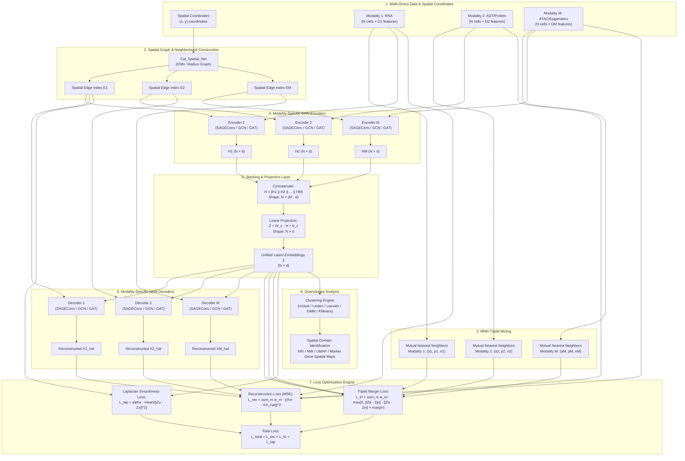
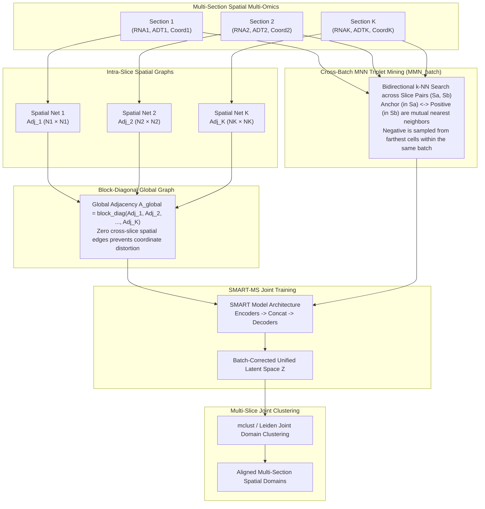

# SMART: Spatial Multi-omic Aggregation using Graph Neural Networks and Metric Learning
## Comprehensive Architecture, Mathematical Formulations, Algorithms, and Implementation Guide

---

## Table of Contents
1. [Executive Summary & Framework Overview](#1-executive-summary--framework-overview)
2. [High-Level Architecture & Workflow Diagrams](#2-high-level-architecture--workflow-diagrams)
3. [Mathematical Formulations](#3-mathematical-formulations)
   - 3.1 [Data Representation & Notation](#31-data-representation--notation)
   - 3.2 [Spatial Graph Construction](#32-spatial-graph-construction)
   - 3.3 [GNN Layer Formulations (Encoders & Decoders)](#33-gnn-layer-formulations-encoders--decoders)
   - 3.4 [Multi-Modal Stacking & Latent Space Projection](#34-multi-modal-stacking--latent-space-projection)
   - 3.5 [Mutual Nearest Neighbors (MNN) & Triplet Metric Learning](#35-mutual-nearest-neighbors-mnn--triplet-metric-learning)
   - 3.6 [Loss Functions & Joint Objective Function](#36-loss-functions--joint-objective-function)
   - 3.7 [Loss Slope Convergence & Early Stopping](#37-loss-slope-convergence--early-stopping)
4. [Deep Dive into Source Code Modules](#4-deep-dive-into-source-code-modules)
   - 4.1 [`smart/__init__.py`](#41-smart__init__py)
   - 4.2 [`smart/build_graph.py`](#42-smartbuild_graphpy)
   - 4.3 [`smart/layer.py`](#43-smartlayerpy)
   - 4.4 [`smart/model.py`](#44-smartmodelpy)
   - 4.5 [`smart/MNN.py`](#45-smartmnnpy)
   - 4.6 [`smart/train.py`](#46-smarttrainpy)
   - 4.7 [`smart/utils.py`](#47-smartutilspy)
5. [Multi-Slice Integration: SMART-MS](#5-multi-slice-integration-smart-ms)
   - 5.1 [Block-Diagonal Spatial Graph Assembly](#51-block-diagonal-spatial-graph-assembly)
   - 5.2 [Cross-Batch Mutual Nearest Neighbor Alignment (`MMN_batch`)](#52-cross-batch-mutual-nearest-neighbor-alignment-mmn_batch)
   - 5.3 [Harmony Integration on Modality Feature Spaces](#53-harmony-integration-on-modality-feature-spaces)
6. [Multi-Omics Preprocessing Pipelines](#6-multi-omics-preprocessing-pipelines)
   - 6.1 [Spatial Transcriptomics (RNA-seq / Stereo-seq)](#61-spatial-transcriptomics-rna-seq--stereo-seq)
   - 6.2 [Spatial Proteomics (CITE-seq / ADT)](#62-spatial-proteomics-cite-seq--adt)
   - 6.3 [Spatial Epigenomics (ATAC-seq / CUT&Tag)](#63-spatial-epigenomics-atac-seq--cuttag)
7. [Downstream Analysis: Domain Clustering & Benchmarking](#7-downstream-analysis-domain-clustering--benchmarking)
   - 7.1 [Clustering Algorithms (`mclust`, `leiden`, `louvain`, `gmm`, `kmeans`)](#71-clustering-algorithms-mclust-leiden-louvain-gmm-kmeans)
   - 7.2 [Evaluation Metrics (Adjusted Rand Index)](#72-evaluation-metrics-adjusted-rand-index)
   - 7.3 [Comparison with 13 Baseline Methods](#73-comparison-with-13-baseline-methods)
8. [Installation, Environment Setup, and Reproducibility](#8-installation-environment-setup-and-reproducibility)
9. [Step-by-Step Practical Usage Example](#9-step-by-step-practical-usage-example)

---

## 1. Executive Summary & Framework Overview

**SMART** (**S**patial **M**ulti-omic **A**ggregation using **gR**aph neural networks and me**T**ric learning) is a deep learning framework designed to integrate spatial multi-omics data (e.g., spatial transcriptomics, spatial proteomics, spatial epigenomics, and chromatin accessibility) into a unified, low-dimensional latent representation.

### Core Problems Addressed by SMART
1. **Heterogeneous Modality Fusion**: Different omics layers possess distinct distributions, dynamic ranges, feature sparsity, and noise profiles. SMART uses a modular encoder-decoder structure where each modality is encoded independently before aggregation.
2. **Spatial Microenvironment Modeling**: Cellular functions and cell types are constrained by spatial tissue architecture. SMART leverages spatial coordinate graphs via Graph Neural Networks (GNNs) with optional Laplacian smoothness constraints.
3. **Biological Semantic Alignment across Modalities**: Distinct omics from the same cell or neighboring cells share underlying biological cell states. SMART uses **Mutual Nearest Neighbors (MNN)** metric learning with triplet loss to ensure semantically similar cells cluster together in the latent space while pulling dissimilar cells apart.
4. **Cross-Slice Multi-Sample Alignment (SMART-MS)**: SMART extends to multiple tissue sections by constructing block-diagonal spatial graphs and mining cross-batch MNN triplets to remove technical batch effects while preserving spatial anatomical structures.

```
+---------------------------------------------------------------------------------------------------------+
|                                              SMART PIPELINE                                             |
+---------------------------------------------------------------------------------------------------------+
|  [Spatial Coordinates S]  -->  Spatial Neighbor Graph Construction (KNN / Radius) -> Edge Index E      |
|  [Omics 1: RNA (X1)]      -->  Modality 1 GNN Encoder (SAGE/GCN/GAT/GCN2)         -> Embedding H1      |
|  [Omics 2: ADT (X2)]      -->  Modality 2 GNN Encoder (SAGE/GCN/GAT/GCN2)         -> Embedding H2      |
|  [Omics M: ATAC (XM)]     -->  Modality M GNN Encoder (SAGE/GCN/GAT/GCN2)         -> Embedding HM      |
|                                                                                                         |
|  [Stacking & Linear Proj] -->  Z = W_c * [H1 || H2 || ... || HM] + b_c            -> Shared Latent Z   |
|                                                                                                         |
|  [Modality GNN Decoders]  -->  X_rec^(m) = Decoder^(m)(Z, E^(m))                   -> Rec Loss (MSE)    |
|  [MNN Triplet Mining]     -->  Anchors (a), Positives (p), Negatives (n)          -> Triplet Margin Loss|
|  [Laplacian Regularizer]  -->  Smoothness penalty across adjacent spatial nodes   -> Lap Loss          |
|                                                                                                         |
|  [Optimization Objective] -->  L_total = sum(w_rec * L_rec) + sum(w_tri * L_tri) + alpha * L_Lap        |
|  [Downstream Tasks]       -->  mclust / Leiden / Louvain Clustering -> Spatial Domain Identification    |
+---------------------------------------------------------------------------------------------------------+
```

---

## 2. High-Level Architecture & Workflow Diagrams

### 2.1 Complete SMART Architecture Flow



### 2.2 SMART-MS (Multi-Slice Integration) Architecture



---

## 3. Mathematical Formulations

### 3.1 Data Representation & Notation

Let a spatial multi-omics dataset consist of $N$ spatial spots (or single cells) profiled across $M$ distinct omics modalities.

| Symbol | Definition | Dimension / Space |
| :--- | :--- | :--- |
| $N$ | Total number of cells / spots | $\mathbb{N}$ |
| $M$ | Total number of omics modalities (e.g., $M=2$ for RNA+ADT, $M=3$ for RNA+ADT+ATAC) | $\mathbb{N}$ |
| $D_m$ | Feature dimension of modality $m$ (e.g., top 30/50 principal components or variable features) | $\mathbb{N}$ |
| $\mathbf{X}^{(m)}$ | Feature matrix for modality $m$ | $\mathbb{R}^{N \times D_m}$ |
| $\mathbf{x}_i^{(m)}$ | Feature vector of cell $i$ in modality $m$ (row $i$ of $\mathbf{X}^{(m)}$) | $\mathbb{R}^{D_m}$ |
| $\mathbf{S}$ | Spatial coordinate matrix | $\mathbb{R}^{N \times 2}$ (or $\mathbb{R}^{N \times 3}$) |
| $\mathbf{s}_i$ | Spatial coordinate vector of cell $i$ | $\mathbb{R}^2$ (or $\mathbb{R}^3$) |
| $\mathcal{G}^{(m)} = (\mathcal{V}, \mathcal{E}^{(m)})$ | Spatial graph for modality $m$ with vertices $\mathcal{V} = \{1, \dots, N\}$ and edge set $\mathcal{E}^{(m)}$ | Graph |
| $\mathbf{A}^{(m)}$ | Adjacency matrix of the spatial graph | $\{0, 1\}^{N \times N}$ |
| $\mathbf{H}^{(m)}$ | Output embedding matrix of the $m$-th modality encoder | $\mathbb{R}^{N \times d}$ |
| $d$ | Latent shared embedding dimension (default: $d = 64$) | $\mathbb{N}$ |
| $\mathbf{H}_{\text{stack}}$ | Concatenated multi-modal embeddings $[\mathbf{H}^{(1)} \,\|\, \mathbf{H}^{(2)} \,\|\, \dots \,\|\, \mathbf{H}^{(M)}]$ | $\mathbb{R}^{N \times (M \cdot d)}$ |
| $\mathbf{Z}$ | Shared latent space representation | $\mathbb{R}^{N \times d}$ |
| $\mathbf{z}_i$ | Latent embedding vector of cell $i$ (row $i$ of $\mathbf{Z}$) | $\mathbb{R}^d$ |
| $\widehat{\mathbf{X}}^{(m)}$ | Reconstructed feature matrix for modality $m$ | $\mathbb{R}^{N \times D_m}$ |
| $\mathcal{T}^{(m)}$ | Set of generated triplet index tuples $(a, p, n)$ for modality $m$ | Set of 3-tuples |
| $\alpha$ | Triplet margin hyperparameter (default: $\alpha = 0.5$) | $\mathbb{R}^+$ |
| $\lambda_{\text{Lap}}$ | Weight for graph Laplacian regularization (default: 0) | $\mathbb{R}_{\ge 0}$ |

---

### 3.2 Spatial Graph Construction

The spatial graph $\mathcal{G} = (\mathcal{V}, \mathcal{E})$ is constructed directly from cell physical coordinates $\mathbf{S} \in \mathbb{R}^{N \times 2}$. SMART provides two graph construction strategies implemented in `smart.build_graph.Cal_Spatial_Net`:

#### 1. $K$-Nearest Neighbor (KNN) Graph
For spot $i$, Euclidean distances to all other spots $j$ are calculated:
$$d_{\text{spatial}}(i, j) = \|\mathbf{s}_i - \mathbf{s}_j\|_2 = \sqrt{(x_i - x_j)^2 + (y_i - y_j)^2}$$

The edge set $\mathcal{E}_{\text{KNN}}$ is defined by connecting spot $i$ to its $k$ closest neighbors:
$$\mathbf{A}_{ij} = \begin{cases} 1, & \text{if } j \in \mathcal{N}_k(i) \text{ and } i \neq j \\ 0, & \text{otherwise} \end{cases}$$
where $\mathcal{N}_k(i)$ is the set of $k$ nearest spatial neighbors of spot $i$.

#### 2. Radius-Neighbor Graph
For a predefined spatial interaction cutoff distance $r$:
$$\mathbf{A}_{ij} = \begin{cases} 1, & \text{if } \|\mathbf{s}_i - \mathbf{s}_j\|_2 \le r \text{ and } i \neq j \\ 0, & \text{otherwise} \end{cases}$$

The graph connectivity is exported in **Coordinate List (COO)** format:
$$\mathbf{E} = \begin{bmatrix} u_1 & u_2 & \dots & u_{|\mathcal{E}|} \\ v_1 & v_2 & \dots & v_{|\mathcal{E}|} \end{bmatrix} \in \mathbb{N}^{2 \times |\mathcal{E}|}$$
where $(u_k, v_k) \in \mathcal{E}$ indicates a directed edge from node $u_k$ to node $v_k$.

---

### 3.3 GNN Layer Formulations (Encoders & Decoders)

SMART is architecture-agnostic and provides 5 distinct GNN encoder-decoder pairs in `smart.layer`. Each encoder consists of a 2-layer GNN mapping $D_m \to d \to d$, and each decoder consists of a 2-layer GNN mapping $d \to d \to D_m$.

#### 1. GraphSAGE (Default Backbone: `SAGEConv_Encoder` / `SAGEConv_Decoder`)
GraphSAGE computes neighborhood aggregations and updates node representations with $L_2$ feature normalization.

**Layer 1 (Input $D_m \to d$):**
$$\mathbf{h}_{i}^{(1)} = \mathbf{W}_1 \cdot \mathbf{x}_i^{(m)} + \mathbf{W}_2 \cdot \operatorname{mean}_{j \in \mathcal{N}(i)} \mathbf{x}_j^{(m)}$$
$$\mathbf{h}_{i}^{(1)} \leftarrow \frac{\mathbf{h}_{i}^{(1)}}{\|\mathbf{h}_{i}^{(1)}\|_2}$$

**Layer 2 ($d \to d$):**
$$\mathbf{h}_{i}^{(2)} = \mathbf{W}_3 \cdot \mathbf{h}_{i}^{(1)} + \mathbf{W}_4 \cdot \operatorname{mean}_{j \in \mathcal{N}(i)} \mathbf{h}_{j}^{(1)}$$
$$\mathbf{h}_{i}^{(2)} \leftarrow \frac{\mathbf{h}_{i}^{(2)}}{\|\mathbf{h}_{i}^{(2)}\|_2}$$
where $\mathbf{W}_1, \mathbf{W}_2 \in \mathbb{R}^{d \times D_m}$ and $\mathbf{W}_3, \mathbf{W}_4 \in \mathbb{R}^{d \times d}$.

#### 2. Graph Convolutional Network (`GCNConv_Encoder` / `GCNConv_Decoder`)
Based on the Kipf & Welling symmetric normalized graph Laplacian:
$$\mathbf{H}^{(l+1)} = \widetilde{\mathbf{D}}^{-\frac{1}{2}} \widetilde{\mathbf{A}} \widetilde{\mathbf{D}}^{-\frac{1}{2}} \mathbf{H}^{(l)} \mathbf{W}^{(l)}$$
where $\widetilde{\mathbf{A}} = \mathbf{A} + \mathbf{I}_N$ is the adjacency matrix with added self-loops, and $\widetilde{\mathbf{D}}_{ii} = \sum_j \widetilde{\mathbf{A}}_{ij}$ is the diagonal degree matrix.

For an individual node $i$:
$$\mathbf{h}_i^{(l+1)} = \sum_{j \in \mathcal{N}(i) \cup \{i\}} \frac{1}{\sqrt{\widetilde{d}_i \widetilde{d}_j}} \mathbf{W}^{(l)} \mathbf{h}_j^{(l)}$$

#### 3. Graph Attention Network (`GATConv_Encoder` / `GATConv_Decoder`)
Uses self-attention over spatial neighborhoods with $K=2$ attention heads:
$$\alpha_{ij} = \frac{\exp\left(\operatorname{LeakyReLU}\left(\mathbf{a}^\top [\mathbf{W} \mathbf{h}_i \,\|\, \mathbf{W} \mathbf{h}_j]\right)\right)}{\sum_{k \in \mathcal{N}(i) \cup \{i\}} \exp\left(\operatorname{LeakyReLU}\left(\mathbf{a}^\top [\mathbf{W} \mathbf{h}_i \,\|\, \mathbf{W} \mathbf{h}_k]\right)\right)}$$
$$\mathbf{h}_i^{(l+1)} = \frac{1}{K} \sum_{k=1}^K \sum_{j \in \mathcal{N}(i) \cup \{i\}} \alpha_{ij}^k \mathbf{W}^k \mathbf{h}_j^{(l)}$$

#### 4. GCNII (`GCN2Conv_Encoder` / `GCN2Conv_Decoder`)
Deep GCN with initial residual connections and identity mapping to alleviate over-smoothing:
$$\mathbf{H}^{(l+1)} = \left((1 - \alpha_l) \widetilde{\mathbf{P}} \mathbf{H}^{(l)} + \alpha_l \mathbf{H}^{(0)}\right) \left((1 - \beta_l) \mathbf{I} + \beta_l \mathbf{W}^{(l)}\right)$$
where $\widetilde{\mathbf{P}} = \widetilde{\mathbf{D}}^{-\frac{1}{2}} \widetilde{\mathbf{A}} \widetilde{\mathbf{D}}^{-\frac{1}{2}}$ is the normalized transition matrix, $\mathbf{H}^{(0)}$ is the initial feature projection, $\alpha_l$ controls residual feature retention, and $\beta_l$ controls identity regularization.

#### 5. Higher-Order Graph Convolution (`GraphConv_Encoder` / `GraphConv_Decoder`)
Based on the Morris et al. Weisfeiler-Lehman graph neural operator:
$$\mathbf{h}_i^{(l+1)} = \mathbf{W}_1^{(l)} \mathbf{h}_i^{(l)} + \sum_{j \in \mathcal{N}(i)} e_{j,i} \mathbf{W}_2^{(l)} \mathbf{h}_j^{(l)}$$

---

### 3.4 Multi-Modal Stacking & Latent Space Projection

Given $M$ separate modal encoders $f_{\text{enc}}^{(1)}, f_{\text{enc}}^{(2)}, \dots, f_{\text{enc}}^{(M)}$:
$$\mathbf{H}^{(m)} = f_{\text{enc}}^{(m)}\left(\mathbf{X}^{(m)}, \mathbf{E}^{(m)}\right) \in \mathbb{R}^{N \times d}, \quad \forall m \in \{1, \dots, M\}$$

SMART concatenates all modal representations along the feature dimension:
$$\mathbf{H}_{\text{stack}} = \left[ \mathbf{H}^{(1)} \,\|\, \mathbf{H}^{(2)} \,\|\, \dots \,\|\, \mathbf{H}^{(M)} \right] \in \mathbb{R}^{N \times (M \cdot d)}$$

The concatenated tensor is linearly projected into the shared latent space $\mathbb{R}^{N \times d}$:
$$\mathbf{Z} = \mathbf{H}_{\text{stack}} \mathbf{W}_{\text{proj}}^\top + \mathbf{b}_{\text{proj}}$$
where $\mathbf{W}_{\text{proj}} \in \mathbb{R}^{d \times (M \cdot d)}$ and $\mathbf{b}_{\text{proj}} \in \mathbb{R}^d$.

*Special Case ($M=1$)*: If only a single modality is provided, $\mathbf{Z} = \mathbf{H}^{(1)} \mathbf{W}_{\text{proj}}^\top + \mathbf{b}_{\text{proj}}$ with $\mathbf{W}_{\text{proj}} \in \mathbb{R}^{d \times d}$.

From the unified latent space $\mathbf{Z}$, modality-specific decoders $g_{\text{dec}}^{(1)}, \dots, g_{\text{dec}}^{(M)}$ reconstruct the original feature space:
$$\widehat{\mathbf{X}}^{(m)} = g_{\text{dec}}^{(m)}\left(\mathbf{Z}, \mathbf{E}^{(m)}\right) \in \mathbb{R}^{N \times D_m}, \quad \forall m \in \{1, \dots, M\}$$

---

### 3.5 Mutual Nearest Neighbors (MNN) & Triplet Metric Learning

To align biological states across spots while maintaining intra-cluster tightness and inter-cluster separation, SMART constructs **triplet constraints** $(a, p, n)$ via Mutual Nearest Neighbor (MNN) matching.

```
       Anchor (a)
      /          \
     / (pull)     \ (push)
    v              v
Positive (p)     Negative (n)
 (Mutual NN)    (Farthest Spot)
```

#### Step 1: Pairwise Distance Matrix Computation
For modality feature matrix $\mathbf{X} \in \mathbb{R}^{N \times D}$:
$$\mathbf{D}_{ij} = \|\mathbf{x}_i - \mathbf{x}_j\|_2 = \sqrt{\sum_{k=1}^D (x_{ik} - x_{jk})^2}$$

#### Step 2: Numba-Accelerated Parallel Argsort (`fastSort32` / `fastSort64`)
To compute neighbors across thousands of spots in $O(N^2 \log N)$ time, parallelized row-wise argsort is compiled with Numba:
$$\mathbf{I}_{\text{sort}}[i, :] = \operatorname{argsort}(\mathbf{D}[i, :])$$

#### Step 3: Positive Pair (MNN) Identification
Let $\mathcal{N}_{\text{top-}k}(i) = \{\mathbf{I}_{\text{sort}}[i, 1], \dots, \mathbf{I}_{\text{sort}}[i, k]\}$ be the $k$-nearest neighbors of cell $i$ (excluding self-distance $\mathbf{D}_{ii} = 0$).

Two cells $i$ and $j$ form a **Mutual Nearest Neighbor (MNN) Pair** if and only if:
$$j \in \mathcal{N}_{\text{top-}k}(i) \quad \text{AND} \quad i \in \mathcal{N}_{\text{top-}k}(j)$$
When this condition holds, $i$ serves as the **Anchor** ($a = i$) and $j$ serves as the **Positive** sample ($p = j$).

#### Step 4: Farthest Negative Mining
Rather than selecting arbitrary random negative samples (which often generate zero loss), SMART mines hard negative samples from the **farthest fraction** of cells.

Let $r_{\text{far}} \in (0, 1]$ (default: $r_{\text{far}} = 0.5$ or $0.6$). The negative search pool for anchor $i$ consists of indices in the top $r_{\text{far}}$ furthest distance ranks:
$$\mathcal{P}_{\text{neg}}(i) = \left\{ \mathbf{I}_{\text{sort}}[i, \text{rank}] \;\Big|\; \text{rank} \in \left[ N - \lfloor (N - s_i) \cdot r_{\text{far}} \rfloor, \, N-1 \right] \right\}$$
where $s_i$ is the count of duplicate identical zero-distance spots.

A negative spot $n$ is randomly sampled from $\mathcal{P}_{\text{neg}}(i)$:
$$n \sim \operatorname{Uniform}\left(\mathcal{P}_{\text{neg}}(i)\right)$$

This yields the complete triplet set $\mathcal{T}^{(m)} = \{(a_k, p_k, n_k)\}_{k=1}^{|\mathcal{T}^{(m)}|}$ for each modality $m$.

#### Step 5: Large-Scale Subsampling
If the number of spots $N > N_{\text{max}}$ (default: $N_{\text{max}} = 20,000$), SMART uniformly subsamples $N_{\text{max}}$ cells without replacement to compute the pairwise distance matrix in memory, scaling to millions of cells.

---

### 3.6 Loss Functions & Joint Objective Function

SMART's training objective $\mathcal{L}_{\text{total}}$ consists of three complementary loss components:

$$\mathcal{L}_{\text{total}} = \mathcal{L}_{\text{rec}} + \mathcal{L}_{\text{tri}} + \mathcal{L}_{\text{Lap}}$$

#### 1. Multi-Modal Reconstruction Loss ($\mathcal{L}_{\text{rec}}$)
Measures Mean Squared Error (MSE) between original input features and reconstructed features:
$$\mathcal{L}_{\text{rec}} = \sum_{m=1}^M w_{\text{rec}}^{(m)} \cdot \operatorname{MSE}\left(\mathbf{X}^{(m)}, \widehat{\mathbf{X}}^{(m)}\right) = \sum_{m=1}^M \frac{w_{\text{rec}}^{(m)}}{N \cdot D_m} \sum_{i=1}^N \|\mathbf{x}_i^{(m)} - \widehat{\mathbf{x}}_i^{(m)}\|_2^2$$
where $w_{\text{rec}}^{(m)} = \text{weights}[m-1]$ is the weight assigned to modality $m$.

#### 2. Triplet Margin Metric Learning Loss ($\mathcal{L}_{\text{tri}}$)
Penalizes the latent representations $\mathbf{Z}$ when the distance between anchor and positive is not smaller than the distance between anchor and negative by at least margin $\alpha$:
$$\mathcal{L}_{\text{tri}} = \sum_{m=1}^M w_{\text{tri}}^{(m)} \cdot \frac{1}{|\mathcal{T}^{(m)}|} \sum_{(a, p, n) \in \mathcal{T}^{(m)}} \max\left(0, \; \|\mathbf{z}_a - \mathbf{z}_p\|_2 - \|\mathbf{z}_a - \mathbf{z}_n\|_2 + \alpha\right)$$
where $w_{\text{tri}}^{(m)} = \text{weights}[M + m - 1]$ and $\alpha = 0.5$.

#### 3. Graph Laplacian Smoothness Regularization ($\mathcal{L}_{\text{Lap}}$)
Enforces spatial continuity by penalizing embedding divergence between spatially adjacent nodes:
$$\mathcal{L}_{\text{Lap}} = \lambda_{\text{Lap}} \cdot \frac{1}{|\mathcal{E}|} \sum_{(u, v) \in \mathcal{E}} \|\mathbf{z}_u - \mathbf{z}_v\|_2^2$$

In matrix form:
$$\mathcal{L}_{\text{Lap}} = \frac{2 \lambda_{\text{Lap}}}{|\mathcal{E}|} \operatorname{Tr}\left(\mathbf{Z}^\top \mathbf{L} \mathbf{Z}\right)$$
where $\mathbf{L} = \mathbf{D} - \mathbf{A}$ is the unnormalized Graph Laplacian matrix.

#### Full Parameter Weight Vector
For $M$ modalities, the user supplies a `weights` array of length $2M$:
$$\mathbf{w} = \left[ \underbrace{w_{\text{rec}}^{(1)}, w_{\text{rec}}^{(2)}, \dots, w_{\text{rec}}^{(M)}}_{\text{Reconstruction Weights}}, \; \underbrace{w_{\text{tri}}^{(1)}, w_{\text{tri}}^{(2)}, \dots, w_{\text{tri}}^{(M)}}_{\text{Triplet Metric Weights}} \right]$$
Example for 3 modalities (RNA + ADT + ATAC): $\mathbf{w} = [1, 1, 1, 1, 1, 1]$.

---

### 3.7 Loss Slope Convergence & Early Stopping

To prevent overfitting and reduce unnecessary training epochs, SMART evaluates the convergence slope of both the triplet loss $\mathcal{L}_{\text{tri}}$ and reconstruction loss $\mathcal{L}_{\text{rec}}$ over a moving window of size $W = \text{window\_size}$ (evaluated every 10 epochs after epoch $W$):

Let $\{L_{t-W+1}, \dots, L_t\}$ be the loss trajectory over the last $W$ epochs, and let $\mathbf{x} = [0, 1, \dots, W-1]$.
The linear regression slope $\beta$ is computed via ordinary least squares:
$$\beta = \frac{\sum_{i=0}^{W-1} (i - \bar{x}) (L_{t-W+1+i} - \bar{L})}{\sum_{i=0}^{W-1} (i - \bar{x})^2}$$

Early stopping triggers when:
$$\left(|\beta_{\text{tri}}| < \text{slope\_threshold} \quad \text{OR} \quad |\beta_{\text{rec}}| < \text{slope\_threshold}\right) \quad \text{with } \beta \neq 0$$
Default hyperparameters: $W = 20$, $\text{slope\_threshold} = 10^{-4}$.

---

## 4. Deep Dive into Source Code Modules

```
smart/
├── __init__.py        # Package version and namespace definitions
├── build_graph.py     # KNN and Radius spatial neighborhood graph construction
├── layer.py           # 5 GNN Encoder & Decoder architectures (SAGE, GCN, GCN2, GAT, GraphConv)
├── model.py           # SMART modular stacking multi-modal neural network
├── MNN.py             # Numba fastSort, single-slice MNN & multi-slice MMN_batch
├── train.py           # train_SMART & train_SMART_MS training loops with early stopping
└── utils.py           # Clustering (mclust/Leiden/Louvain), Harmony, PCA, resolution search
```

---

### 4.1 `smart/__init__.py`

```python
"""
SMART: Spatial multi-omic aggregation using graph neural networks and metric learning
"""
__version__ = "0.1.1"
import smart.build_graph
import smart.layer
import smart.MNN
import smart.model
import smart.train
import smart.utils
```
- **Purpose**: Package entrypoint defining `__version__ = "0.1.1"` and exposing all 6 submodules.

---

### 4.2 `smart/build_graph.py`

#### Function: `Cal_Spatial_Net(adata, radius=None, n_neighbors=None, model='KNN', verbose=True, include_self=False)`

- **Inputs**:
  - `adata`: `anndata.AnnData` containing spatial coordinates in `adata.obsm['spatial']`.
  - `radius`: `float`, cutoff radius when `model='Radius'`.
  - `n_neighbors`: `int`, number of neighbors when `model='KNN'`.
  - `model`: `{'KNN', 'Radius'}` (default: `'KNN'`).
  - `verbose`: `bool`, prints total edge count and average degree.
  - `include_self`: `bool`, whether to add self-loops in adjacency matrix.
- **Outputs / Mutations**:
  - `adata.uns['adj']`: `scipy.sparse.csr_matrix` of shape $(N, N)$ storing connectivity.
  - `adata.uns['edgeList']`: `numpy.ndarray` of shape $(2, |\mathcal{E}|)$ containing COO edge index.
- **Algorithm Flow**:
  1. Extracts spatial coordinate matrix $\mathbf{S} = \text{adata.obsm['spatial']}$.
  2. If `model == 'KNN'`, calls `sklearn.neighbors.kneighbors_graph(spatial, n_neighbors=n_neighbors, mode='connectivity', include_self=include_self)`.
  3. If `model == 'Radius'`, calls `sklearn.neighbors.radius_neighbors_graph(spatial, radius=radius, mode='connectivity', include_self=include_self)`.
  4. Finds non-zero entries via `np.nonzero(adata.uns['adj'])` and packages into `np.array([edgeList[0], edgeList[1]])`.

---

### 4.3 `smart/layer.py`

Contains PyTorch geometric encoder and decoder module classes:

| Class | Base Conv | Forward Signature | Description |
| :--- | :--- | :--- | :--- |
| `SAGEConv_Encoder` | `SAGEConv` | `(x, edge_index)` $\to \mathbf{H}$ | 2-layer GraphSAGE with `normalize=True` ($D \to d \to d$) |
| `SAGEConv_Decoder` | `SAGEConv` | `(z, edge_index)` $\to \widehat{\mathbf{X}}$ | 2-layer GraphSAGE decoder ($d \to d \to D$) |
| `GCNConv_Encoder` | `GCNConv` | `(x, edge_index)` $\to \mathbf{H}$ | 2-layer GCN with `normalize=True` |
| `GCNConv_Decoder` | `GCNConv` | `(z, edge_index)` $\to \widehat{\mathbf{X}}$ | 2-layer GCN decoder |
| `GCN2Conv_Encoder` | `GCN2Conv` | `(x, edge_index)` $\to \mathbf{H}$ | 2-layer GCNII with initial residual connection |
| `GCN2Conv_Decoder` | `GCN2Conv` | `(z, edge_index)` $\to \widehat{\mathbf{X}}$ | 2-layer GCNII decoder |
| `GATConv_Encoder` | `GATConv` | `(x, edge_index)` $\to \mathbf{H}$ | 2-layer GAT (`heads=2, concat=False`) |
| `GATConv_Decoder` | `GATConv` | `(z, edge_index)` $\to \widehat{\mathbf{X}}$ | 2-layer GAT decoder |
| `GraphConv_Encoder` | `GraphConv` | `(x, edge_index)` $\to \mathbf{H}$ | 2-layer Higher-Order GraphConv |
| `GraphConv_Decoder` | `GraphConv` | `(z, edge_index)` $\to \widehat{\mathbf{X}}$ | 2-layer Higher-Order GraphConv decoder |

---

### 4.4 `smart/model.py`

#### Class: `SMART(hidden_dims, device, Conv_Encoder=SAGEConv_Encoder, Conv_Decoder=SAGEConv_Decoder)`

- **Constructor `__init__`**:
  ```python
  def __init__(self, hidden_dims, device, Conv_Encoder=SAGEConv_Encoder, Conv_Decoder=SAGEConv_Decoder):
      super(SMART, self).__init__()
      out_dim = hidden_dims[-1]
      self.encoders = nn.ModuleList([Conv_Encoder(in_dim, out_dim).to(device) for in_dim in hidden_dims[:-1]])
      self.fc = nn.Linear((len(hidden_dims) - 1) * out_dim, out_dim)
      self.decoders = nn.ModuleList([Conv_Decoder(out_dim, in_dim).to(device) for in_dim in hidden_dims[:-1]])
  ```
- **Forward Pass `forward(features, edge_indexs)`**:
  ```python
  def forward(self, features, edge_indexs):
      x = [encoder(feature, edge_index) for encoder, feature, edge_index in zip(self.encoders, features, edge_indexs)]
      if len(x) == 1:
          z = self.fc(x[0])
      else:
          z = self.fc(torch.cat(x, dim=1))
      x_rec = [decoder(z, edge_index) for decoder, feature, edge_index in zip(self.decoders, features, edge_indexs)]
      return z, x_rec
  ```

---

### 4.5 `smart/MNN.py`

#### 1. Numba Fast Sorting Functions
```python
@nb.njit('int32[:,::1](float32[:,::1])', parallel=True)
def fastSort32(a):
    b = np.empty(a.shape, dtype=np.int32)
    for i in nb.prange(a.shape[0]):
        b[i, :] = np.argsort(a[i, :])
    return b

@nb.njit('int32[:,::1](float64[:,::1])', parallel=True)
def fastSort64(a):
    b = np.empty(a.shape, dtype=np.int32)
    for i in nb.prange(a.shape[0]):
        b[i, :] = np.argsort(a[i, :])
    return b
```
- Uses OpenMP parallel loops (`nb.prange`) across distance matrix rows, speeding up argsort by $>10\times$.

#### 2. `Mutual_Nearest_Neighbors(adata, key=None, n_nearest_neighbors=1, farthest_ratio=0.5, max_samples=20000)`
- **Workflow**:
  1. Subsamples to `max_samples` if $N > 20000$.
  2. Computes `distances = pairwise_distances(X)`.
  3. Sorts rows with `fastSort32` / `fastSort64`.
  4. Collects $k$ nearest neighbors: `nearest_neighbors_index.append(sorted_neighbors_index[i, j:j+n_nearest_neighbors])`.
  5. Collects farthest negative candidates from rank range $[- (l-j) \cdot r_{\text{far}}, \, 0)$.
  6. Filters reciprocal pairs: $i \in \text{nn\_dict}[j] \land j \in \text{nn\_dict}[i]$.
  7. Returns `(anchors, positives, negatives)` index lists.

#### 3. `MMN_batch(X, batches, far_frac=0.6, top_k=2, random_state=None, verbose=True)`
- Cross-batch MNN triplet generator for SMART-MS (see [Section 5.2](#52-cross-batch-mutual-nearest-neighbor-alignment-mmn_batch)).

---

### 4.6 `smart/train.py`

#### 1. `laplacian_regularization(x, edge_index)`
```python
def laplacian_regularization(x, edge_index):
    row, col = edge_index
    diff = x[row] - x[col]
    loss = (diff ** 2).sum(dim=1).mean()
    return loss
```

#### 2. `train_SMART(...)` / `train_SMART_MS(...)`
- **Training Step Loop**:
  ```python
  # 1. Forward Pass
  z, x_rec = model(features, edges)

  # 2. Triplet Loss
  triplet_loss_fn = torch.nn.TripletMarginLoss(margin=margin, p=2, reduction='mean')
  tri_loss = 0
  for i, (anchors, positives, negatives) in enumerate(triplet_samples_list):
      anchor_arr = z[anchors]
      positive_arr = z[positives]
      negative_arr = z[negatives]
      tri_output = triplet_loss_fn(anchor_arr, positive_arr, negative_arr)
      w = weights[len(weights) // 2 + i]
      tri_loss += w * tri_output

  # 3. Reconstruction Loss
  rec_loss = 0
  for i, (feature, x_r) in enumerate(zip(features, x_rec)):
      rec_output = F.mse_loss(feature, x_r)
      w = weights[i]
      rec_loss += w * rec_output

  # 4. Total Loss & Laplacian
  loss = rec_loss + tri_loss
  if laplacian_alpha != 0:
      loss += laplacian_alpha * laplacian_regularization(z, edges[0])

  # 5. Early Stopping Check (every 10 epochs after window_size)
  if epoch > window_size and epoch % 10 == 0:
      x_axis = np.arange(window_size)
      res1 = stats.linregress(x_axis, [i[1] for i in loss_list[-window_size:]])
      res2 = stats.linregress(x_axis, [i[2] for i in loss_list[-window_size:]])
      if abs(res1.slope) < slope or abs(res2.slope) < slope:
          if res1.slope != 0 and res2.slope != 0:
              print("Early stopping: flat trend detected.")
              break

  # 6. Backward & Optimizer Step
  loss.backward()
  optimizer.step()
  ```

---

### 4.7 `smart/utils.py`

#### 1. `set_seed(seed=2024)`
Enforces determinism across Python `random`, `np.random`, PyTorch CPU & CUDA backends, and sets `cudnn.deterministic = True`.

#### 2. `harmony(adata, feature_labels, batch_labels, use_gpu=True)`
Executes maximum diversity batch correction with Harmony PyTorch:
$$\text{bc\_latent} = \operatorname{harmonize}(\mathbf{X}_{\text{pca}}, \text{df\_batches}, \text{batch\_key}="batch", \theta=10, \text{max\_iter}=20)$$
Stores result in `adata.obsm[f"{feature_labels}_harmony"]`.

#### 3. `pca(adata, use_reps=None, n_comps=10)`
Performs Principal Component Analysis via `sklearn.decomposition.PCA`, supporting both dense NumPy arrays and SciPy sparse matrices (`csr_matrix` / `csc_matrix`).

#### 4. `mclust_R(adata, num_cluster, modelNames="EEE", used_obsm="emb_pca", random_seed=2020)`
Interfaces directly with the R `mclust` Gaussian Mixture Model library via `rpy2.robjects`. Executes:
$$\text{Mclust}(\mathbf{X}, G=\text{num\_cluster}, \text{modelNames}="EEE")$$
Stores categorical cluster assignments in `adata.obs['mclust']`.

#### 5. `clustering(adata, n_clusters=7, key="emb", add_key="SMART", method="SMART", ...)`
Universal clustering wrapper supporting `['mclust', 'leiden', 'louvain', 'gmm', 'kmeans']`.

#### 6. `search_res(adata, n_clusters, method="leiden", use_rep="emb", start=0.1, end=3.0, increment=0.01)`
Automated grid sweep to discover the exact graph resolution parameter yielding target cluster count $K$.

#### 7. `getcolordict(adata, my_cluster, true_cluster, colordict)`
Greedy assignment algorithm to map predicted cluster labels to ground truth cluster colors for consistent visualization.

---

## 5. Multi-Slice Integration: SMART-MS

When integrating $B$ serial tissue sections $S_1, S_2, \dots, S_B$, naive concatenation of spatial coordinates causes artificial spatial overlap between independent tissue slices. SMART-MS resolves this through two core mechanisms:

### 5.1 Block-Diagonal Spatial Graph Assembly

For each individual slice $b \in \{1, \dots, B\}$, an independent spatial graph $\mathbf{A}_b \in \mathbb{R}^{N_b \times N_b}$ is built from local coordinates. The global adjacency matrix $\mathbf{A}_{\text{global}} \in \mathbb{R}^{N_{\text{total}} \times N_{\text{total}}}$ is constructed via block-diagonal stacking:

$$\mathbf{A}_{\text{global}} = \begin{bmatrix}
\mathbf{A}_1 & \mathbf{0} & \dots & \mathbf{0} \\
\mathbf{0} & \mathbf{A}_2 & \dots & \mathbf{0} \\
\vdots & \vdots & \ddots & \vdots \\
\mathbf{0} & \mathbf{0} & \dots & \mathbf{A}_B
\end{bmatrix}$$

```python
from scipy.sparse import block_diag
rna_adj = block_diag([i.uns["adj"] for i in rna_adatas.values()])
adt_adj = block_diag([i.uns["adj"] for i in adt_adatas.values()])
adata_RNA.uns['edgeList'] = np.array(np.nonzero(rna_adj))
adata_ADT.uns['edgeList'] = np.array(np.nonzero(adt_adj))
```
- **Benefit**: Spots only aggregate spatial messages from true physical neighbors within their own tissue section.

---

### 5.2 Cross-Batch Mutual Nearest Neighbor Alignment (`MMN_batch`)

To align cell states across sections, `smart.MNN.MMN_batch` identifies cross-slice positive anchors and same-slice negative samples:

For every unique section pair $(S_a, S_b)$:
1. **$k$-NN Search $S_a \to S_b$**:
   $$\text{NN}_{a \to b}(u) = \operatorname{kNN}(\mathbf{x}_u, \mathbf{X}_{S_b}, k=\text{top\_k})$$
2. **$k$-NN Search $S_b \to S_a$**:
   $$\text{NN}_{b \to a}(v) = \operatorname{kNN}(\mathbf{x}_v, \mathbf{X}_{S_a}, k=\text{top\_k})$$
3. **Cross-Batch MNN Set**:
   $$\mathcal{M}_{a,b} = \left\{(u, v) \mid u \in S_a, v \in S_b, \; v \in \text{NN}_{a \to b}(u) \land u \in \text{NN}_{b \to a}(v)\right\}$$
4. **Same-Batch Negative Mining**:
   For anchor $u \in S_a$, compute Euclidean distance to all other spots in section $S_a$:
   $$d(u, w) = \|\mathbf{x}_u - \mathbf{x}_w\|_2, \quad \forall w \in S_a \setminus \{u\}$$
   Sample negative $n$ from the top $\text{far\_frac}$ ($60\%$) farthest spots in $S_a$.

```
Section A (Batch 1)                  Section B (Batch 2)
  [Anchor u] <=====================> [Positive v]  (Cross-Batch MNN Pair)
      |
      | (push apart)
      v
  [Negative w] (Farthest cell within Section A)
```

---

### 5.3 Harmony Integration on Modality Feature Spaces

Before GNN training, initial PCA features across batches are pre-aligned using Harmony to prevent modality-level technical scale differences from distorting MNN identification:
```python
harmony(adata_RNA, 'X_pca', "batch")
harmony(adata_ADT, 'X_pca', "batch")
```

---

## 6. Multi-Omics Preprocessing Pipelines

SMART provides tailored preprocessing recipes for all major single-cell spatial multi-omics technologies:

```
+------------------+-----------------------+------------------------+-------------------------+
| Modality         | Raw Data Format       | Normalization Method   | Feature Extraction      |
+------------------+-----------------------+------------------------+-------------------------+
| Transcriptomics  | UMI Count Matrix      | Total count norm +     | Highly Variable Genes   |
| (RNA-seq)        | (Spots × Genes)       | log1p transformation   | (HVG, 3000-5000) + PCA  |
+------------------+-----------------------+------------------------+-------------------------+
| Proteomics       | Antibody Derived Tags | Centered Log-Ratio     | Z-score Scaling +       |
| (ADT / CITE-seq) | (Spots × Antibodies)  | (CLR) transformation   | PCA (30-50 comps)       |
+------------------+-----------------------+------------------------+-------------------------+
| Epigenomics      | Peak / Gene Activity  | TF-IDF +               | LSI / PCA               |
| (ATAC-seq)       | (Spots × Peaks)       | log1p transformation   | (30-50 comps)           |
+------------------+-----------------------+------------------------+-------------------------+
```

### 6.1 Spatial Transcriptomics (RNA-seq / Stereo-seq)
```python
sc.pp.filter_genes(adata_RNA, min_cells=10)
sc.pp.highly_variable_genes(adata_RNA, flavor="seurat_v3", n_top_genes=3000)
sc.pp.normalize_total(adata_RNA, target_sum=1e4)
sc.pp.log1p(adata_RNA)
sc.pp.scale(adata_RNA)
adata_RNA_high = adata_RNA[:, adata_RNA.var['highly_variable']]
adata_RNA.obsm['feat'] = pca(adata_RNA_high, n_comps=30)
```

### 6.2 Spatial Proteomics (CITE-seq / ADT)
Centered Log-Ratio (CLR) normalization on protein counts:
$$\operatorname{CLR}(\mathbf{x}) = \left[ \ln\left(\frac{x_1}{g(\mathbf{x})}\right), \ln\left(\frac{x_2}{g(\mathbf{x})}\right), \dots, \ln\left(\frac{x_P}{g(\mathbf{x})}\right) \right], \quad g(\mathbf{x}) = \left(\prod_{j=1}^P x_j\right)^{\frac{1}{P}}$$
```python
from muon import prot as pt
pt.pp.clr(adata_ADT)
sc.pp.scale(adata_ADT)
adata_ADT.obsm['feat'] = pca(adata_ADT, n_comps=30)
```

### 6.3 Spatial Epigenomics (ATAC-seq / CUT&Tag)
Term Frequency-Inverse Document Frequency (TF-IDF) transformation:
$$\operatorname{TF-IDF}_{ij} = \frac{C_{ij}}{\sum_k C_{ik}} \times \ln\left(1 + \frac{N}{\sum_m \mathbb{I}(C_{mj} > 0)}\right)$$
```python
from muon import atac as ac
ac.pp.tfidf(adata_ATAC, scale_factor=1e4)
sc.pp.normalize_per_cell(adata_ATAC, counts_per_cell_after=1e4)
sc.pp.log1p(adata_ATAC)
adata_ATAC.obsm['feat'] = pca(adata_ATAC, n_comps=30)
```

---

## 7. Downstream Analysis: Domain Clustering & Benchmarking

### 7.1 Clustering Algorithms

Once the unified representation $\mathbf{Z} \in \mathbb{R}^{N \times d}$ is extracted (`adata.obsm["SMART"] = model(x, edges)[0].cpu().detach().numpy()`), spatial domains are identified using `smart.utils.clustering`:

```python
# mclust Gaussian Mixture Model (Default & Recommended)
clustering(adata, key='SMART', add_key='SMART', n_clusters=7, method='mclust', use_pca=True)

# Leiden Community Detection
clustering(adata, key='SMART', add_key='SMART', n_clusters=7, method='leiden', use_pca=True)

# Louvain Community Detection
clustering(adata, key='SMART', add_key='SMART', n_clusters=7, method='louvain', use_pca=True)
```

### 7.2 Evaluation Metrics: Adjusted Rand Index (ARI)

To benchmark clustering performance against ground truth tissue annotations $\mathbf{y}^*$ and predicted clusters $\mathbf{y}$:

$$\operatorname{ARI} = \frac{\sum_{ij} \binom{n_{ij}}{2} - \left[\sum_i \binom{a_i}{2} \sum_j \binom{b_j}{2}\right] / \binom{N}{2}}{\frac{1}{2}\left[\sum_i \binom{a_i}{2} + \sum_j \binom{b_j}{2}\right] - \left[\sum_i \binom{a_i}{2} \sum_j \binom{b_j}{2}\right] / \binom{N}{2}}$$
where $n_{ij}$ is the number of overlap spots between true class $i$ and predicted cluster $j$, $a_i = \sum_j n_{ij}$, and $b_j = \sum_i n_{ij}$.
- $\text{ARI} = 1$: Perfect clustering match.
- $\text{ARI} \le 0$: Random assignment.

---

### 7.3 Comparison with 13 Baseline Methods

The `benchmarks/` directory in the repository provides full benchmarking pipelines against 13 state-of-the-art multi-omics methods:

| Method | Method Type | Modality Flexibility | Spatial Graph Aware | Triplet Metric Learning | Multi-Slice Support |
| :--- | :--- | :--- | :--- | :--- | :--- |
| **SMART (Ours)** | **GNN + Metric Learning** | **Arbitrary ($M \ge 1$)** | **Yes (GNN + Laplacian)** | **Yes (MNN Triplet)** | **Yes (SMART-MS)** |
| **CellCharter** | GNN Autoencoder | RNA only | Yes | No | Partial |
| **COSMOS** | Spatial Multi-Omics | RNA + Epigenomics | Yes | No | No |
| **MEFISTO** | Factor Analysis + GP | Arbitrary | Yes (Gaussian Process) | No | Partial |
| **MISO** | Deep Multi-Modal | RNA + Protein | No | No | No |
| **MOFA+** | Multi-Omics Factor Analysis | Arbitrary | No | No | No |
| **MultiVI** | Deep VAE | RNA + ATAC | No | No | Partial |
| **scMM** | Mixture Model VAE | RNA + ATAC/Protein | No | No | No |
| **SNF** | Similarity Network Fusion | Arbitrary | No | No | No |
| **SpatialGlue** | Dual Attention GNN | RNA + Protein/ATAC | Yes | No | Partial |
| **SpaMultiVAE** | Spatial Multi-Omics VAE | RNA + Epigenomics | Yes | No | No |
| **totalVI** | Deep VAE | RNA + Protein | No | No | Partial |
| **WNN (Seurat v4)**| Weighted Nearest Neighbor | Arbitrary | No | No | No |

---

## 8. Installation, Environment Setup, and Reproducibility

### 8.1 Conda Environment Setup

```bash
# 1. Create Python 3.9 conda environment
conda create -n smart python=3.9.23 -y
conda activate smart

# 2. Install R base 4.3.0 from conda-forge (required for mclust)
conda install -c conda-forge r-base=4.3.0 -y

# 3. Install core dependencies from requirements.txt
pip install -r requirements.txt
```

### 8.2 PyG Companion Package Installation (CUDA 12.1 + PyTorch 2.4.1)

```bash
pip install torch-scatter -f https://data.pyg.org/whl/torch-2.4.1+cu121.html
pip install torch-sparse -f https://data.pyg.org/whl/torch-2.4.1+cu121.html
pip install torch-geometric==2.3.0
```

### 8.3 R `mclust` Package Installation

```bash
R -e "install.packages('mclust', repos='https://cloud.r-project.org')"
```

### 8.4 Install SMART Package

```bash
pip install bio-SMART
```

---

## 9. Step-by-Step Practical Usage Example

Below is a complete, self-contained Python script to train SMART on a 2-modality spatial dataset (RNA + Protein):

```python
import os
import torch
import scanpy as sc
from muon import prot as pt
from sklearn.metrics import adjusted_rand_score

# 1. Import SMART modules
from smart.utils import set_seed, pca, clustering
from smart.build_graph import Cal_Spatial_Net
from smart.MNN import Mutual_Nearest_Neighbors
from smart.train import train_SMART

# Set random seeds for strict reproducibility
set_seed(2024)
device = torch.device('cuda:0' if torch.cuda.is_available() else 'cpu')

# Set R_HOME for rpy2 mclust
# os.environ['R_HOME'] = '/path/to/conda/envs/smart/lib/R'

# 2. Load Multi-Omics Data
adata_rna = sc.read_h5ad("data/adata_RNA.h5ad")
adata_adt = sc.read_h5ad("data/adata_ADT.h5ad")
adata_rna.var_names_make_unique()
adata_adt.var_names_make_unique()

# 3. Preprocess RNA Modality
sc.pp.filter_genes(adata_rna, min_cells=10)
sc.pp.highly_variable_genes(adata_rna, flavor="seurat_v3", n_top_genes=3000)
sc.pp.normalize_total(adata_rna, target_sum=1e4)
sc.pp.log1p(adata_rna)
sc.pp.scale(adata_rna)
adata_rna_high = adata_rna[:, adata_rna.var['highly_variable']]
adata_rna.obsm['feat'] = pca(adata_rna_high, n_comps=30)

# 4. Preprocess Protein Modality
adata_adt = adata_adt[adata_rna.obs_names].copy()
pt.pp.clr(adata_adt)
sc.pp.scale(adata_adt)
adata_adt.obsm['feat'] = pca(adata_adt, n_comps=30)

# 5. Build Spatial Neighbor Graphs (KNN, k=4)
Cal_Spatial_Net(adata_rna, model="KNN", n_neighbors=4)
Cal_Spatial_Net(adata_adt, model="KNN", n_neighbors=4)

# 6. Extract Tensors and Mine MNN Triplets
adata_list = [adata_rna, adata_adt]
features = [torch.FloatTensor(adata.obsm["feat"]).to(device) for adata in adata_list]
edges = [torch.LongTensor(adata.uns["edgeList"]).to(device) for adata in adata_list]
triplets = [Mutual_Nearest_Neighbors(adata, key="feat", n_nearest_neighbors=3, farthest_ratio=0.6) for adata in adata_list]

# 7. Train SMART Model
# weights: [rec_RNA, rec_ADT, tri_RNA, tri_ADT]
model = train_SMART(
    features=features,
    edges=edges,
    triplet_samples_list=triplets,
    weights=[1.0, 1.0, 1.0, 1.0],
    emb_dim=64,
    n_epochs=300,
    lr=1e-3,
    weight_decay=1e-6,
    device=device,
    window_size=10,
    slope=1e-4,
    margin=0.5,
    laplacian_alpha=0.0
)

# 8. Extract Latent Embeddings
with torch.no_grad():
    model.eval()
    latent_z, _ = model(features, edges)
    adata_rna.obsm["SMART"] = latent_z.cpu().numpy()

# 9. Spatial Domain Clustering
clustering(adata_rna, key='SMART', add_key='SMART', n_clusters=7, method='mclust', use_pca=True)

# 10. Quantitative Benchmark
if 'ground_truth' in adata_rna.obs:
    ari = adjusted_rand_score(adata_rna.obs['ground_truth'], adata_rna.obs['SMART'])
    print(f"Clustering Performance (Adjusted Rand Index): {ari:.4f}")

# 11. Visualize Spatial Domains
sc.pl.spatial(adata_rna, color='SMART', spot_size=30, title="SMART Spatial Domains")
```

---

## 10. Summary and Architectural Key Takeaways

1. **Modality Agnostic**: SMART decouples modality input dimension $D_m$ from latent dimension $d$. Any number of omics ($M \ge 1$) can be plugged in without changing the core framework.
2. **Metric Learning Regularization**: By pairing reciprocal MNN anchors with distant negative samples, SMART constructs a biologically organized latent space that separates distinct cell states while preserving neighborhood relationships.
3. **Spatial Awareness**: The GNN encoders and Graph Laplacian penalty ensure that spatial proximity directly guides cell representation learning.
4. **Multi-Slice Scalability (SMART-MS)**: Block-diagonal spatial graphs prevent spatial coordinate leakage across tissue sections, while cross-batch MNN triplets eliminate technical batch effects across biological replicates.


---

## 11. Requirements.txt

muon==0.1.6 
scanpy==1.10.2 
scikit-learn==1.5.1 
anndata==0.10.8 
matplotlib==3.9.2 
tqdm==4.66.5 
numba==0.60.0 
rpy2==3.5.12 
torch==2.4.1 
torch_geometric==2.3.0
harmony-pytorch==0.1.8
scikit-misc==0.3.1