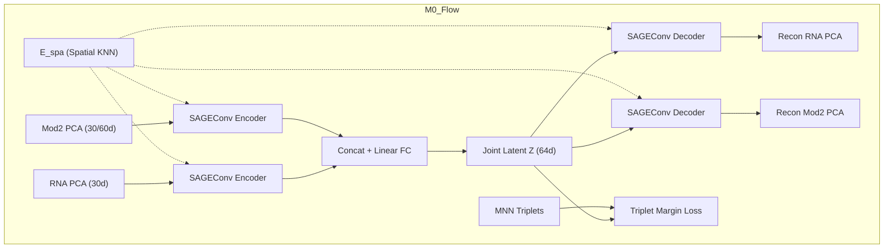
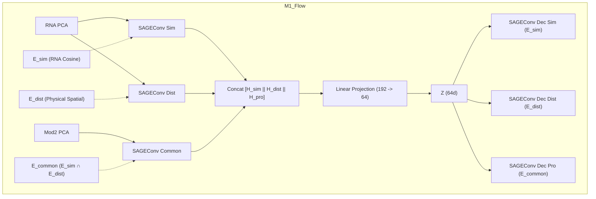
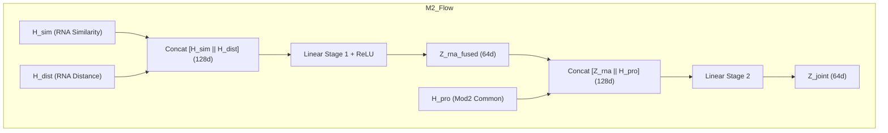
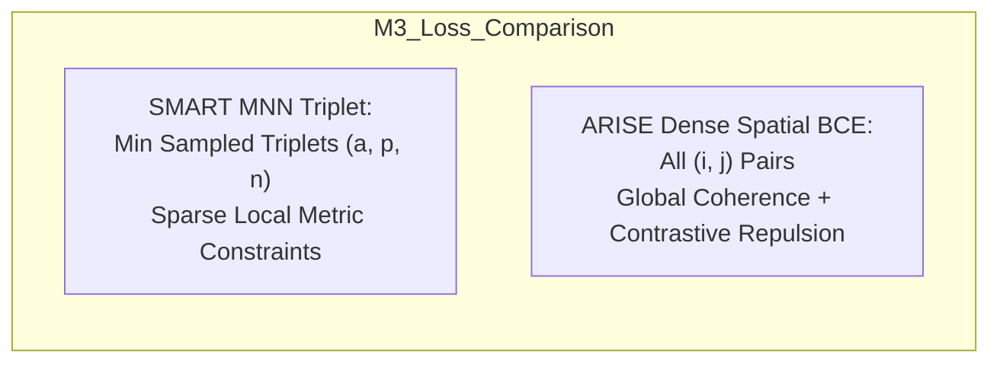

# Progressive Architecture Evolution: From SMART to ARISE

This document presents a principled, step-by-step architectural roadmap for evolving **SMART** ([`smartpipeline.py`](file:///d:/FYDP/GATCON/d1_test/smartpipeline.py)) into **ARISE** ([`arise_kaggle_10_seed_pipeline_v2.py`](file:///d:/FYDP/GATCON/d1_test/arise_kaggle_10_seed_pipeline_v2.py)) by progressively incorporating ARISE's core modular innovations.

---

## 1. Modular Anatomy: SMART vs. ARISE

To systematically bridge the gap, we first decompose both architectures into five orthogonal modular axes:

```
+------------------+----------------------------------+----------------------------------+
| Modular Axis     | Base: SMART                      | Target: ARISE                    |
+------------------+----------------------------------+----------------------------------+
| 1. Graph Topology| Single Spatial KNN (E_spa)       | Dual Graph (E_sim, E_dist) +     |
|                  |                                  | Common Intersection (E_common)   |
| 2. GNN Backbone  | SAGEConv (mean agg + L2 norm)    | GCNConv (spectral Kipf-Welling)  |
| 3. Latent Fusion | 1-Stage Late Concat + Linear FC  | 2-Stage Hierarchical MLP Fusion  |
| 4. Regularization| MNN Triplet Margin Metric Loss   | Dense Spatial Contrastive BCE    |
| 5. Recon Target  | Low-Dim PCA Space (30/60 PCs)    | Raw Expression Space (3000 HVGs) |
+------------------+----------------------------------+----------------------------------+
```

---

## 2. Progression Roadmap: The 5-Model Ladder

Rather than changing everything at once, we define **5 progressive models** that isolate each inductive bias and test distinct biological/computational hypotheses:


---

## 3. Detailed Model Specifications & Implementations

---

### Model 0: The Baseline (SMART)
* **Goal**: Establish the reference baseline.
* **Architecture**:
  - Input: PCA features $\mathbf{X}_{RNA}^{pca} \in \mathbb{R}^{N \times 30}$, $\mathbf{X}_{Mod2}^{pca} \in \mathbb{R}^{N \times 30/60}$.
  - Graph: Single spatial KNN coordinate graph $\mathcal{E}_{spa}$.
  - Encoders: 2-layer `SAGEConv` with $L_2$ normalization per modality.
  - Fusion: Concatenation $[\mathbf{H}_{RNA} \,\|\, \mathbf{H}_{Mod2}]$ projected via linear layer to $\mathbf{Z} \in \mathbb{R}^{N \times 64}$.
  - Decoders: 2-layer `SAGEConv` reconstructing PCA features.
  - Loss: $\mathcal{L} = \mathcal{L}_{recon}(PCA) + \mathcal{L}_{triplet}(MNN)$.



---

### Model 1: Dual-Graph SMART (`SMART-DG`)
* **Core Innovation**: Introduce ARISE's **topological duality** into SMART's GraphSAGE backbone.
* **Scientific Hypothesis**: In heterogeneous tissues (e.g., germinal centers, brain nuclei), physical distance alone blurs transcriptional boundaries. Decoupling expression similarity from spatial proximity provides richer relational cues.
* **Architectural Modifications**:
  1. Construct three graphs:
     - $\mathcal{E}_{sim}$: Feature cosine KNN ($K=15$) on RNA.
     - $\mathcal{E}_{dist}$: Physical Euclidean KNN ($K=15$) on coordinates.
     - $\mathcal{E}_{common} = \mathcal{E}_{sim} \cap \mathcal{E}_{dist}$: Overlapping edges.
  2. RNA stream splits into two SAGEConv encoders:
     $$\mathbf{H}_{sim} = \text{SAGEConv}_{sim}(\mathbf{X}_{RNA}^{pca}, \mathcal{E}_{sim})$$
     $$\mathbf{H}_{dist} = \text{SAGEConv}_{dist}(\mathbf{X}_{RNA}^{pca}, \mathcal{E}_{dist})$$
  3. Modality 2 stream encodes along the intersection graph:
     $$\mathbf{H}_{pro} = \text{SAGEConv}_{pro}(\mathbf{X}_{Mod2}^{pca}, \mathcal{E}_{common})$$
  4. Concatenation fusion:
     $$\mathbf{Z} = \mathbf{W}_{fc} [\mathbf{H}_{sim} \,\|\, \mathbf{H}_{dist} \,\|\, \mathbf{H}_{pro}] + \mathbf{b}_{fc}$$
  5. Decoders reconstruct PCA components using their respective graphs.



#### PyTorch Architecture Sketch for Model 1
```python
class SMART_DualGraph(nn.Module):
    def __init__(self, in_rna=30, in_mod2=30, out_dim=64):
        super().__init__()
        self.enc_rna_sim = SAGEConv_Encoder(in_rna, out_dim)
        self.enc_rna_dist = SAGEConv_Encoder(in_rna, out_dim)
        self.enc_mod2 = SAGEConv_Encoder(in_mod2, out_dim)
        self.fc_fusion = nn.Linear(3 * out_dim, out_dim)

        self.dec_sim = SAGEConv_Decoder(out_dim, in_rna)
        self.dec_dist = SAGEConv_Decoder(out_dim, in_rna)
        self.dec_mod2 = SAGEConv_Decoder(out_dim, in_mod2)

    def forward(self, x_rna, x_mod2, e_sim, e_dist, e_common):
        h_sim = self.enc_rna_sim(x_rna, e_sim)
        h_dist = self.enc_rna_dist(x_rna, e_dist)
        h_pro = self.enc_mod2(x_mod2, e_common)

        z = self.fc_fusion(torch.cat([h_sim, h_dist, h_pro], dim=1))

        rec_sim = self.dec_sim(z, e_sim)
        rec_dist = self.dec_dist(z, e_dist)
        rec_mod2 = self.dec_mod2(z, e_common)
        return z, (rec_sim, rec_dist, rec_mod2)
```

---

### Model 2: Hierarchical Fusion SMART (`SMART-Hierarchical`)
* **Core Innovation**: Replace naive 3-way concatenation with ARISE's **2-stage hierarchical fusion**.
* **Scientific Hypothesis**: RNA spatial variation and RNA expression variation belong to the same biological modality. Reconciling them *first* before integrating with epigenomics/proteomics prevents the secondary modality from being overshadowed.
* **Architectural Modifications**:
  1. **Stage 1 (Intra-RNA Fusion)**:
     $$\mathbf{Z}_{rna\_fused} = \text{ReLU}\left(\mathbf{W}_{f1} [\mathbf{H}_{sim} \,\|\, \mathbf{H}_{dist}] + \mathbf{b}_{f1}\right), \quad \mathbf{Z}_{rna\_fused} \in \mathbb{R}^{N \times 64}$$
  2. **Stage 2 (Cross-Omics Fusion)**:
     $$\mathbf{Z}_{joint} = \mathbf{W}_{f2} [\mathbf{Z}_{rna\_fused} \,\|\, \mathbf{H}_{pro}] + \mathbf{b}_{f2}, \quad \mathbf{Z}_{joint} \in \mathbb{R}^{N \times 64}$$
  3. Decoders branch symmetrically from both intermediate and final latent states:
     - $\mathbf{H}_{sim}$ decodes to RNA similarity PCA.
     - $\mathbf{H}_{dist}$ decodes to RNA distance PCA.
     - $\mathbf{H}_{pro}$ decodes to Mod2 PCA.
     - $\mathbf{Z}_{joint}$ decodes to the concatenated multi-omics PCA space.



---

### Model 3: Contrastive Regularized SMART (`SMART-Contrast`)
* **Core Innovation**: Replace SMART's sparse MNN triplet loss with ARISE's **dense global spatial contrastive cross-entropy loss** ($\mathcal{L}_{spatial}$).
* **Scientific Hypothesis**: MNN triplet mining requires expensive pairwise sorting ($O(N^2 \log N)$) and samples only a subset of triplets. A global contrastive loss operates on all spot pairs simultaneously via matrix multiplication, enforcing uniform spatial coherence.
* **Mathematical Formulation**:
  1. Remove $\mathcal{L}_{triplet}$.
  2. Compute pairwise normalized cosine similarities on intermediate $\mathbf{Z}_{rna\_fused}$:
     $$\mathbf{C}_{ij} = \frac{\mathbf{z}_i \cdot \mathbf{z}_j}{\|\mathbf{z}_i\|_2 \|\mathbf{z}_j\|_2} \quad (i \neq j)$$
  3. Transform to probabilities: $\mathbf{S}_{ij} = \sigma(\mathbf{C}_{ij})$.
  4. Compute Binary Cross-Entropy against the binary distance adjacency $\mathbf{A}^{dist} \in \{0, 1\}^{N \times N}$:
     $$\mathcal{L}_{spatial} = -\frac{1}{2 N^2} \sum_{i,j=1}^N \left[ \mathbf{A}_{ij}^{dist} \log(\mathbf{S}_{ij} + \epsilon) + (1 - \mathbf{A}_{ij}^{dist}) \log(1 - \mathbf{S}_{ij} + \epsilon) \right]$$
  5. Multi-task loss:
     $$\mathcal{L}_{total} = \beta \cdot \mathcal{L}_{recon}(PCA) + \gamma \cdot \mathcal{L}_{spatial} + \delta \cdot \mathcal{L}_{L1/L2}$$



---

### Model 4: High-Dimensional Direct Reconstruction SMART (`SMART-HighDim`)
* **Core Innovation**: Move the reconstruction target from low-dimensional PCA space ($30$ components) to **raw high-dimensional feature space** ($3000$ HVGs for RNA, $q$ features for ADT/ATAC), replacing SAGE decoders with shared-hidden MLP decoders.
* **Scientific Hypothesis**: PCA compresses out fine-grained, rare marker genes that define localized cell sub-states. Decoding directly to $3000$ genes forces the GNN bottleneck to encode gene-level biology.
* **Architectural Modifications**:
  1. Encoders continue taking PCA features (or high-dim features) with `SAGEConv`.
  2. Decoders switch from SAGEConv to Feed-Forward Multi-Head Decoders:
     $$\text{Dec}_{shared}(\mathbf{z}) = \text{ReLU}(\mathbf{W}_{d1} \mathbf{z} + \mathbf{b}_{d1}), \quad \text{dim} = 512$$
     $$\hat{\mathbf{X}}_{RNA}^{HVG} = \mathbf{W}_{r\_rna} \text{Dec}_{shared}(\mathbf{z}) + \mathbf{b}_{r\_rna}, \quad \text{dim} = 3000$$
     $$\hat{\mathbf{X}}_{Mod2} = \mathbf{W}_{r\_mod} \text{Dec}_{shared}(\mathbf{z}) + \mathbf{b}_{r\_mod}, \quad \text{dim} = q$$
     $$\hat{\mathbf{X}}_{joint} = \mathbf{W}_{r\_joint} \text{Dec}_{shared}(\mathbf{Z}_{joint}) + \mathbf{b}_{r\_joint}, \quad \text{dim} = 3000 + q$$
  3. Total reconstruction loss mirrors ARISE:
     $$\mathcal{L}_{recon} = \text{MSE}(\mathbf{X}_{joint}, \hat{\mathbf{X}}_{joint}) + \text{MSE}(\mathbf{X}_{RNA}, \hat{\mathbf{X}}_{sim}) + \text{MSE}(\mathbf{X}_{RNA}, \hat{\mathbf{X}}_{dist}) + \text{MSE}(\mathbf{X}_{Mod2}, \hat{\mathbf{X}}_{pro})$$

---

### Model 5: Full Transition to ARISE
* **Core Innovation**: Replace `SAGEConv` with spectral `GCNConv`, feed full $3000$ HVGs directly into encoders, and adopt silhouette-based checkpoint tracking.
* **Result**: Completes the progressive ladder, matching the exact ARISE specification in [`arise_kaggle_10_seed_pipeline_v2.py`](file:///d:/FYDP/GATCON/d1_test/arise_kaggle_10_seed_pipeline_v2.py).

---

## 4. Comprehensive Architectural Evolution Matrix

| Feature / Module | **M0: Base SMART** | **M1: SMART-DG** | **M2: SMART-Hier** | **M3: SMART-Contrast** | **M4: SMART-HighDim** | **M5: ARISE** |
| :--- | :--- | :--- | :--- | :--- | :--- | :--- |
| **Input Modality 1** | PCA (30d) | PCA (30d) | PCA (30d) | PCA (30d) | PCA or 3000 HVGs | 3000 HVGs |
| **Input Modality 2** | PCA (30/60d) | PCA (30/60d) | PCA (30/60d) | PCA (30/60d) | Raw/CLR ADT/ATAC | Raw/CLR ADT/ATAC |
| **Graph System** | $\mathcal{E}_{spa}$ only | $\mathcal{E}_{sim}, \mathcal{E}_{dist}, \mathcal{E}_{com}$ | $\mathcal{E}_{sim}, \mathcal{E}_{dist}, \mathcal{E}_{com}$ | $\mathcal{E}_{sim}, \mathcal{E}_{dist}, \mathcal{E}_{com}$ | $\mathcal{E}_{sim}, \mathcal{E}_{dist}, \mathcal{E}_{com}$ | $\mathcal{E}_{sim}, \mathcal{E}_{dist}, \mathcal{E}_{com}$ |
| **Convolution Layer** | SAGEConv (L2-norm)| SAGEConv (L2-norm)| SAGEConv (L2-norm)| SAGEConv (L2-norm)| SAGEConv (L2-norm)| GCNConv (Spectral) |
| **Fusion Mechanism** | 1-Stage Concat FC | 1-Stage Concat FC | 2-Stage Hierarchical | 2-Stage Hierarchical | 2-Stage Hierarchical | 2-Stage Hierarchical |
| **Contrastive Loss** | MNN Triplet Loss | MNN Triplet Loss | MNN Triplet Loss | Global Dense BCE | Global Dense BCE | Global Dense BCE |
| **Decoder Type** | SAGEConv Decoders | SAGEConv Decoders | SAGEConv Decoders | SAGEConv Decoders | Multi-Head MLP Dec | Multi-Head MLP Dec |
| **Reconstruction Target**| PCA space (30/60) | PCA space (30/60) | PCA space (30/60) | PCA space (30/60) | Raw Expression | Raw Expression |
| **Training Duration** | Dynamic Early Stop| Dynamic Early Stop| Dynamic Early Stop| Dynamic Early Stop| 350 Epochs | 350 Epochs |
| **Model Selection** | Final Epoch State | Final Epoch State | Final Epoch State | Peak Silhouette | Peak Silhouette | Peak Silhouette |

---

## 5. Implementation Strategy: Clean Modular Codebase

To build and experiment with these models without code duplication, we propose a unified configurable class: `HybridModularPipeline`:

```python
class ModularMultiOmicsGNN(nn.Module):
    """
    A unified architecture supporting all models from M0 to M5 via configuration flags.
    """
    def __init__(
        self,
        in_rna_dim: int,
        in_mod2_dim: int,
        out_dim: int = 64,
        hidden_dim: int = 512,
        conv_type: str = "sage",          # "sage" (SMART) or "gcn" (ARISE)
        graph_mode: str = "dual",         # "single" (SMART) or "dual" (ARISE)
        fusion_mode: str = "hierarchical", # "concat" (SMART) or "hierarchical" (ARISE)
        decoder_type: str = "mlp",        # "gnn" (SMART) or "mlp" (ARISE)
        raw_recon: bool = True            # False (PCA) or True (Gene/Protein)
    ):
        super().__init__()
        self.conv_type = conv_type
        self.graph_mode = graph_mode
        self.fusion_mode = fusion_mode
        self.decoder_type = decoder_type
        self.raw_recon = raw_recon

        ConvLayer = SAGEConv if conv_type == "sage" else GCNConv

        # 1. Encoders
        if graph_mode == "single":
            self.enc_rna = nn.Sequential(ConvLayer(in_rna_dim, hidden_dim), ConvLayer(hidden_dim, out_dim))
            self.enc_mod2 = nn.Sequential(ConvLayer(in_mod2_dim, hidden_dim), ConvLayer(hidden_dim, out_dim))
        else:
            self.enc_rna_sim = nn.Sequential(ConvLayer(in_rna_dim, hidden_dim), ConvLayer(hidden_dim, out_dim))
            self.enc_rna_dist = nn.Sequential(ConvLayer(in_rna_dim, hidden_dim), ConvLayer(hidden_dim, out_dim))
            self.enc_mod2 = ConvLayer(in_mod2_dim, out_dim)

        # 2. Fusion
        if fusion_mode == "concat":
            total_cat = (3 if graph_mode == "dual" else 2) * out_dim
            self.fusion_layer = nn.Linear(total_cat, out_dim)
        else:
            self.fusion_stage1 = nn.Linear(2 * out_dim, out_dim)
            self.fusion_stage2 = nn.Linear(2 * out_dim, out_dim)

        # 3. Decoders
        if decoder_type == "mlp":
            self.deconv_shared = nn.Sequential(nn.Linear(out_dim, hidden_dim), nn.ReLU())
            self.deconv_rna = nn.Linear(hidden_dim, in_rna_dim)
            self.deconv_mod2 = nn.Linear(hidden_dim, in_mod2_dim)
            self.deconv_joint = nn.Linear(hidden_dim, in_rna_dim + in_mod2_dim)
```

---

## 6. Experimental Validation & Hypothesis Testing

### Which Datasets Test Which Hypothesis?

1. **Mouse Brain (E11, E13, E15, E18 - RNA + ATAC)**:
   - *Test for M1 & M2 (Dual Graphs & Hierarchical Fusion)*:
   - Mouse brain embryonic development exhibits continuous spatial gradients alongside distinct laminar layers.
   - *Expectation*: M1 and M2 will show significant ARI gains over M0 because the dual graph prevents ATAC chromatin accessibility from diluting fine transcriptional boundaries in the cortex.

2. **Human Lymph Node (A1 & D1 - RNA + ADT Protein)**:
   - *Test for M3 & M4 (Dense Spatial Contrastive & Raw High-Dim Recon)*:
   - Lymph nodes contain dense germinal centers where protein expression (B-cell markers like CD19, CD20) is sharply confined to compact spatial clusters.
   - *Expectation*: M3's dense spatial contrastive loss will enforce cleaner separation between mantle zones and germinal center dark/light zones compared to M0's MNN triplets.

### Recommended Evaluation Metrics Suite
For each model (M0 through M5) run across 10 random seeds on all 6 datasets:
- **Clustering Metrics**: ARI, NMI, AMI, Homogeneity, V-Measure.
- **Topological & Spatial Metrics**: Silhouette Score (embedding space), Moran's I (spatial autocorrelation of clusters), Geary's C.
- **Computational Profile**: Peak GPU VRAM (MB), Wall-clock training time per seed (seconds), Number of trainable parameters.

---

## 7. Conclusion: Which Hybrid is Most Worth Exploring?

Among the 5 intermediate models, **Model 3 (`SMART-Contrast`: Dual-Graph + 2-Stage Hierarchical Fusion + Dense Contrastive Loss with PCA Inputs)** and **Model 4 (`SMART-HighDim`)** represent the "sweet spots":
- They combine **ARISE's superior topological modeling and contrastive regularization** with **SMART's robust GraphSAGE convolution and stable PCA preprocessing**.
- This hybrid mitigates ARISE's major drawback (slow $O(N^2)$ silhouette tracking over 350 full epochs on 3000 genes) while resolving SMART's major limitation (reliance on a single spatial graph that blurs transcriptional boundaries).
