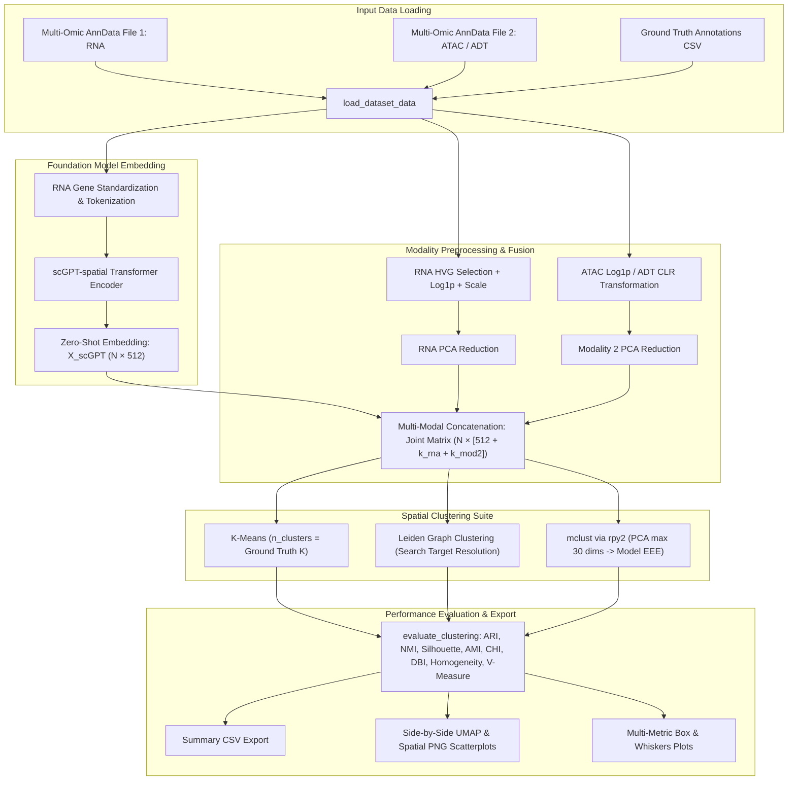

# Technical Overview & Mathematical Specification: `scgptspatialpipeline.py`

This document provides a comprehensive end-to-end specification of the **scGPT-spatial Multi-Seed Benchmark Pipeline** implemented in [`scgptspatialpipeline.py`](file:///d:/FYDP/GATCON/d1_test/scgptspatialpipeline.py). 

The pipeline performs zero-shot foundation model cell embedding extraction using **scGPT-spatial**, multi-modal feature fusion across spatial transcriptomics (RNA), epigenomics (ATAC), and proteomics (ADT), graph-based & statistical spatial clustering, multi-seed stochastic evaluation, and automated benchmarking report generation.

---

## 📋 Table of Contents
1. [Pipeline Architecture & System Data Flow](#1-pipeline-architecture--system-data-flow)
2. [Supported Datasets & Multi-Modal Configurations](#2-supported-datasets--multi-modal-configurations)
3. [Pre-Trained scGPT-Spatial Foundation Model Integration](#3-pre-trained-scgpt-spatial-foundation-model-integration)
4. [Mathematical Preprocessing & Feature Normalization](#4-mathematical-preprocessing--feature-normalization)
   - [4.1 RNA HVG Selection & Log-Normalization](#41-rna-hvg-selection--log-normalization)
   - [4.2 ADT Protein Centered Log-Ratio (CLR) Transformation](#42-adt-protein-centered-log-ratio-clr-transformation)
   - [4.3 Dimensionality Reduction (PCA)](#43-dimensionality-reduction-pca)
   - [4.4 Multi-Modal Feature Concatenation & Fusion](#44-multi-modal-feature-concatenation--fusion)
5. [Spatial Clustering Algorithms Architecture](#5-spatial-clustering-algorithms-architecture)
   - [5.1 K-Means Clustering](#51-k-means-clustering)
   - [5.2 Leiden Graph Clustering with Target Resolution Search](#52-leiden-graph-clustering-with-target-resolution-search)
   - [5.3 Gaussian Mixture Modeling (`mclust` via `rpy2`)](#53-gaussian-mixture-modeling-mclust-via-rpy2)
6. [Benchmark Evaluation Metrics & Mathematical Definitions](#6-benchmark-evaluation-metrics--mathematical-definitions)
7. [Visualizations & Automated Reporting System](#7-visualizations--automated-reporting-system)

---

## 1. Pipeline Architecture & System Data Flow

The pipeline executes a multi-seed evaluation loop across 10 fixed random seeds (`SEEDS = [42, 0, 1, 7, 123, 1234, 2022, 2023, 2024, 1337]`) to eliminate initialization bias. Below is the system flow diagram:



---

## 2. Supported Datasets & Multi-Modal Configurations

The pipeline natively handles 6 spatial multi-omics benchmark datasets across two biological organ systems:

| Dataset Identifier | Biological Organism & Tissue | Omic 1 (RNA) | Omic 2 (Modality 2) | Target Clusters ($K$) |
| :--- | :--- | :--- | :--- | :--- |
| `mouse-brain-e11-s1` | Embryonic Mouse Brain (E11) | Spatial RNA | Spatial ATAC (Chromatin) | Inferred Ground Truth |
| `mouse-brain-e13-s1` | Embryonic Mouse Brain (E13) | Spatial RNA | Spatial ATAC (Chromatin) | Inferred Ground Truth |
| `mouse-brain-e15-s1` | Embryonic Mouse Brain (E15) | Spatial RNA | Spatial ATAC (Chromatin) | Inferred Ground Truth |
| `mouse-brain-e18-s1` | Embryonic Mouse Brain (E18) | Spatial RNA | Spatial ATAC (Chromatin) | Inferred Ground Truth |
| `human-lymph-node-a1` | Human Lymph Node (A1) | Spatial RNA | Spatial ADT (Surface Protein) | 10 |
| `human-lymph-node-d1` | Human Lymph Node (D1) | Spatial RNA | Spatial ADT (Surface Protein) | 11 |

> [!NOTE]
> The target number of clusters $K$ is dynamically extracted from valid ground-truth annotations (excluding `"Exclude"` and `"unknown"` entries).

---

## 3. Pre-Trained scGPT-Spatial Foundation Model Integration

Zero-shot cell representations are generated using **scGPT-spatial**, a specialized generative pretrained transformer built for spatial multi-omics transcriptomics.

### Path Finder Resolution Logic
The function `get_scgpt_spatial_embeddings()` resolves weight directories dynamically by checking candidate paths for model weight files (`best_model.pt`, `model.pt`, `args.json`, `vocab.json`):

1. `/kaggle/input/datasets/sadmanbiazidarnob/scgpt-spatial-model-files/scGPT_spatial_v1/scGPT_spatial_v1`
2. `/kaggle/input/datasets/sadmanbiazidarnob/scgpt-spatial-model-files/scGPT_spatial_v1`
3. `/kaggle/input/datasets/sadmanbiazidarnob/scgpt-spatial-model-files`
4. `/kaggle/input/datasets/sadmanbiazidarnob/scgpt-spatial-weights`
5. `/kaggle/input/datasets/sadmanbiazidarnob/scgpt-spatial/scGPT_spatial`
6. Dynamic Fallback: `os.walk('/kaggle/input')` recursive scan for `best_model.pt`.

### Transformer Embedding Extraction
Given RNA gene expression matrix $\mathbf{X}_{RNA} \in \mathbb{R}^{N \times G_{total}}$, gene names are capitalized and mapped against the pretrained vocabulary. The transformer outputs a $512$-dimensional latent representation per cell spot:

$$\mathbf{H}_{scGPT} = \text{TransformerEncoder}(\text{GeneTokenize}(\mathbf{X}_{RNA})) \in \mathbb{R}^{N \times 512}$$

If pretrained model weights or module imports are unavailable, a fallback matrix $\mathbf{H}_{scGPT} \sim \mathcal{N}(0, \mathbf{I})$ is generated for testing continuity.

---

## 4. Mathematical Preprocessing & Feature Normalization

### 4.1 RNA HVG Selection & Log-Normalization
1. **Filtering**: Genes expressed in fewer than 10 cells are removed.
2. **Highly Variable Genes (HVG)**: Top $3,000$ genes selected via Seurat $v3$ dispersion analysis.
3. **Total Count Normalization**: Expression values per cell spot $i$ are scaled to a target sum of $10,000$:

$$\tilde{x}_{i,g} = \log\left( \frac{x_{i,g}}{\sum_{k} x_{i,k}} \cdot 10^4 + 1 \right)$$

4. **Z-Score Scaling**: Normalized expression is standardized to zero mean and unit variance, clipped at a maximum value of 10:

$$z_{i,g} = \min\left( \frac{\tilde{x}_{i,g} - \mu_g}{\sigma_g}, 10 \right)$$

### 4.2 ADT Protein Centered Log-Ratio (CLR) Transformation
For human lymph node antibody-derived tags (ADT), per-cell **Centered Log-Ratio (CLR)** normalization is applied to correct for compositionality:

$$\text{CLR}(x_{i,j}) = \log\left( \frac{x_{i,j} + 1}{\exp\left( \frac{1}{M} \sum_{m=1}^{M} \log(x_{i,m} + 1) \right)} \right)$$

where $M$ is the number of ADT protein features in cell $i$.

### 4.3 Dimensionality Reduction (PCA)
Principal Component Analysis (PCA) is fitted on scaled features:
- **Mouse Brain Datasets**: Reduced to $k = \min(50, N-1, G-1)$ components for both RNA and ATAC.
- **Human Lymph Node Datasets**: Reduced to $k = M - 1$ components (matching total protein feature count).

$$\mathbf{Z}_{PCA} = \mathbf{X}_{scaled} \mathbf{W}_k \in \mathbb{R}^{N \times k}$$

### 4.4 Multi-Modal Feature Concatenation & Fusion
The final representation matrix $\mathbf{Z}_{joint}$ fuses the foundation model embedding with linear principal components:

$$\mathbf{Z}_{joint} = \left[ \mathbf{H}_{scGPT} \;\|\; \mathbf{Z}_{RNA\_PCA} \;\|\; \mathbf{Z}_{Mod2\_PCA} \right] \in \mathbb{R}^{N \times (512 + k_{rna} + k_{mod2})}$$

---

## 5. Spatial Clustering Algorithms Architecture

### 5.1 K-Means Clustering
Partitions cell spots into $K$ disjoint clusters by minimizing the within-cluster sum of squares (WCSS):

$$\arg\min_{\mathbf{S}} \sum_{i=1}^{K} \sum_{\mathbf{z} \in S_i} \|\mathbf{z} - \boldsymbol{\mu}_i\|^2$$

Initialized with `n_init=10` and fixed seed.

### 5.2 Leiden Graph Clustering with Target Resolution Search
1. **$k$-Nearest Neighbor Graph**: Constructed on $\mathbf{Z}_{joint}$ using $k=10$ nearest neighbors.
2. **Resolution Search (`search_res`)**: Sweeps resolution values $r \in [0.1, 3.0]$ with step $0.01$ until the number of Leiden communities exactly matches target $K$:

$$\text{Optimize } \mathcal{Q}_{Leiden}(r) \quad \text{subject to} \quad |\text{Communities}(r)| = K$$

### 5.3 Gaussian Mixture Modeling (`mclust` via `rpy2`)
Model-based clustering fits a Gaussian Mixture Model (GMM) with ellipsoidal, equal volume, shape, and orientation (`EEE` model parameters):

$$p(\mathbf{z}) = \sum_{k=1}^{K} \pi_k \mathcal{N}(\mathbf{z} \mid \boldsymbol{\mu}_k, \boldsymbol{\Sigma}_k)$$

> [!IMPORTANT]
> To prevent singularity errors in R, `run_mclust` automatically applies PCA reduction to max $30$ components if feature dimension exceeds $30$ before passing data via `rpy2`.

---

## 6. Benchmark Evaluation Metrics & Mathematical Definitions

The pipeline computes all 8 primary and secondary benchmark metrics specified in the SpatialAblate platform:

### Primary Benchmark Metrics

#### 1. Adjusted Rand Index (ARI)
Measures agreement between predicted cluster assignments $C$ and ground-truth classes $K$, corrected for chance:

$$\text{ARI} = \frac{\sum_{ij} \binom{n_{ij}}{2} - \left[ \sum_i \binom{a_i}{2} \sum_j \binom{b_j}{2} \right] / \binom{n}{2}}{\frac{1}{2} \left[ \sum_i \binom{a_i}{2} + \sum_j \binom{b_j}{2} \right] - \left[ \sum_i \binom{a_i}{2} \sum_j \binom{b_j}{2} \right] / \binom{n}{2}}$$

#### 2. Normalized Mutual Information (NMI)
Shared information score normalized by cluster entropies:

$$\text{NMI}(C, K) = \frac{2 \cdot I(C; K)}{H(C) + H(K)}$$

#### 3. Silhouette Coefficient
Internal cluster cohesion vs. separation distance (without ground truth):

$$s(i) = \frac{b(i) - a(i)}{\max(a(i), b(i))}, \quad \bar{S} = \frac{1}{N} \sum_{i=1}^N s(i)$$

### Secondary Benchmark Metrics

#### 4. Adjusted Mutual Information (AMI)
Mutual information score adjusted for expected chance agreement:

$$\text{AMI}(C, K) = \frac{I(C; K) - \mathbb{E}[I(C; K)]}{\max(H(C), H(K)) - \mathbb{E}[I(C; K)]}$$

#### 5. Calinski-Harabasz Index (CHI)
Ratio of between-cluster variance to within-cluster variance (higher is better):

$$\text{CHI} = \frac{\text{Tr}(\mathbf{B}_k)}{\text{Tr}(\mathbf{W}_k)} \cdot \frac{N - K}{K - 1}$$

#### 6. Davies-Bouldin Index (DBI)
Average similarity measure of each cluster with its most similar cluster (lower is better):

$$\text{DBI} = \frac{1}{K} \sum_{i=1}^{K} \max_{j \neq i} \left( \frac{s_i + s_j}{d(\boldsymbol{\mu}_i, \boldsymbol{\mu}_j)} \right)$$

#### 7. Homogeneity Score
Checks if all predicted clusters contain data points of a single ground-truth class:

$$h = 1 - \frac{H(K \mid C)}{H(K)}$$

#### 8. V-Measure Score
Harmonic mean of homogeneity $h$ and completeness $c$:

$$V_\beta = \frac{(1 + \beta) \cdot h \cdot c}{\beta \cdot h + c}$$

---

## 7. Visualizations & Automated Reporting System

The pipeline produces three sets of analytical outputs saved to the execution directory:

1. **UMAP & Spatial PNG Plots (`scgpt_spatial_plot_<dataset>_seed_<seed>.png`)**:
   - 4x2 grid visualizing spatial coordinate embeddings and UMAP projections side-by-side for Ground Truth, KMeans, Leiden, and mclust.
2. **Multi-Metric Box & Whiskers Plots (`scgpt_spatial_boxplot_<metric>.png`)**:
   - Individual Seaborn boxplots illustrating performance distributions across 10 random seeds per dataset.
   - Combined 4x2 multi-panel layout figure (`scgpt_spatial_boxplot_all_metrics.png`).
3. **Structured CSV Results (`scgpt_spatial_ablation_results.csv`)**:
   - Contains evaluation entries per row formatted for instant upload to the SpatialAblate platform:

```csv
dataset,seed,cluster alg,ARI,NMI,Silhouette,AMI,CHI,DBI,Homogeneity,V-measure,resolution
mouse-brain-e11-s1,42,KMeans,0.7812,0.7450,0.4120,0.7410,102.4,0.91,0.7620,0.7534,
mouse-brain-e11-s1,42,Leiden,0.8125,0.7890,0.4350,0.7845,115.8,0.86,0.8010,0.7949,0.42
mouse-brain-e11-s1,42,mclust,0.8350,0.8020,0.4510,0.7990,121.3,0.82,0.8150,0.8084,
```
