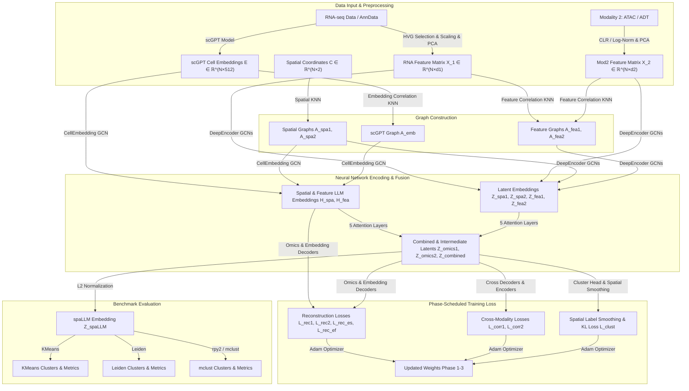
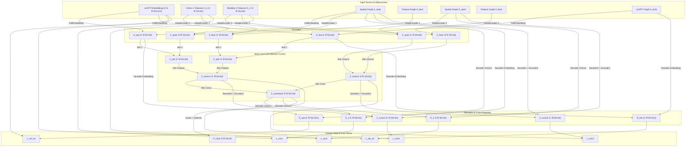

# spaLLM Clust Pipeline: Technical & Mathematical Reference Manual

This document provides a comprehensive end-to-end technical explanation, architectural breakdown, mathematical foundation, and implementation specification of [`spallmclusterpipeline.py`](file:///d:/FYDP/GATCON/d1_test/spallmclusterpipeline.py).

---

## 1. Executive Summary & Architecture Overview

**spaLLM Clust** is a multi-modal spatial transcriptomics and epigenomics/proteomics integration framework. It combines:
1. **Pretrained Single-Cell LLM Embeddings** (scGPT) for zero-shot semantic representation of transcriptomic cell states.
2. **Dual-Modality Graph Neural Networks (GCNs)** for learning topology-aware feature representations across space and feature expression networks.
3. **Multi-Level Attention Fusion Mechanisms** to dynamically weight spatial, feature-space, and cross-modality signals.
4. **FACT-Style Spatial Clustering Loss** with **Spatial Label Smoothing** to jointly optimize representation learning and spatial domain segmentation.
5. **Tri-Algorithm Benchmarking** (KMeans, Leiden, and R `mclust`) across multi-dataset and multi-seed ablation studies.



---

## 2. Dataset Configuration & Multi-Seed Protocol

The pipeline supports automated path resolution for local and Kaggle cloud environments across 6 benchmark datasets spanning 2 tissue types and 3 modality combinations:

| Dataset Identifier | Tissue Type | Modality 1 | Modality 2 | Target Ground Truth Annotations |
| :--- | :--- | :--- | :--- | :--- |
| `mouse-brain-e11-s1` | Mouse Embryonic Brain (E11) | Spatial RNA | Spatial ATAC | Embryonic Brain Regions |
| `mouse-brain-e13-s1` | Mouse Embryonic Brain (E13) | Spatial RNA | Spatial ATAC | Embryonic Brain Regions |
| `mouse-brain-e15-s1` | Mouse Embryonic Brain (E15) | Spatial RNA | Spatial ATAC | Embryonic Brain Regions |
| `mouse-brain-e18-s1` | Mouse Embryonic Brain (E18) | Spatial RNA | Spatial ATAC | Embryonic Brain Regions |
| `human-lymph-node-a1` | Human Lymph Node (A1) | Spatial RNA | Spatial ADT (Protein) | Lymph Node Functional Zones |
| `human-lymph-node-d1` | Human Lymph Node (D1) | Spatial RNA | Spatial ADT (Protein) | Lymph Node Functional Zones |

### Ablation Seed Generation
To eliminate stochastic bias, a master random number generator seeds 10 independent pipeline iterations:
```python
MASTER_SEED = 42
rng = np.random.default_rng(MASTER_SEED)
SEEDS = rng.integers(low=1, high=2**31 - 1, size=10).tolist()
```

---

## 3. Preprocessing & Embedding Generation Pipeline

### 3.1 Pretrained Foundation Model Embedding (scGPT)
For RNA expression data $\mathbf{X}_{raw} \in \mathbb{R}^{N \times G_{total}}$, zero-shot cell embeddings are extracted using the pre-trained generative transformer `scGPT`:
$$\mathbf{E} = \text{embed\_data}(\mathbf{X}_{raw}, \text{model}=\text{scGPT\_human}) \in \mathbb{R}^{N \times 512}$$
If the pretrained weights are unavailable, the system falls back to a standard normal initialization $\mathbf{E} \sim \mathcal{N}(0, 1)$.

### 3.2 Feature Preprocessing & Normalization
1. **RNA Normalization**:
   - Highly Variable Genes (HVG) selection using Seurat v3 ($G = 3000$).
   - Total count normalization to target sum $10^4$:
     $$\mathbf{X}_{norm, ij} = \frac{\mathbf{X}_{ij}}{\sum_{k} \mathbf{X}_{ik}} \times 10^4$$
   - Log-transformation: $\mathbf{X}_{log} = \log(1 + \mathbf{X}_{norm})$.
   - Z-score scaling across cells followed by PCA dimensionality reduction to $d_1$ components ($d_1 = 50$ for ATAC datasets; $d_1 = N_{ADT} - 1$ for ADT datasets).
   $$\mathbf{X}^{(1)} = \text{PCA}(\text{Scale}(\mathbf{X}_{log}), \text{n\_comps}=d_1) \in \mathbb{R}^{N \times d_1}$$

2. **Protein / ADT Normalization (CLR Normalization)**:
   Centered Log-Ratio (CLR) normalization is applied per cell across $D$ proteins:
   $$\text{CLR}(x_{i,j}) = \log\left( 1 + \frac{x_{i,j}}{\exp\left( \frac{1}{D} \sum_{k=1}^D \log(1 + x_{i,k}) \right)} \right)$$
   followed by Z-score scaling and PCA to $d_2 = N_{ADT} - 1$ components:
   $$\mathbf{X}^{(2)} = \text{PCA}(\text{Scale}(\text{CLR}(\mathbf{X}_{ADT})), \text{n\_comps}=d_2) \in \mathbb{R}^{N \times d_2}$$

3. **Epigenome / ATAC Normalization**:
   Total count normalization ($10^4$), $\log(1+x)$ transformation, scaling, and PCA reduction to $d_2 = \min(50, N-1, G_{ATAC}-1)$ components:
   $$\mathbf{X}^{(2)} = \text{PCA}(\text{Scale}(\log(1 + \text{Normalize}(\mathbf{X}_{ATAC}))), \text{n\_comps}=d_2) \in \mathbb{R}^{N \times d_2}$$

---

## 4. Graph Construction & Preprocessing

The pipeline constructs 5 distinct graph structures to capture spatial proximity and expression similarities:

### 4.1 Graph Formulations
1. **Spatial Graphs ($\mathbf{A}_{spa1}, \mathbf{A}_{spa2}$)**:
   Built from 2D spatial coordinates $\mathbf{C} \in \mathbb{R}^{N \times 2}$ using k-Nearest Neighbors ($k=3$ for Visium/10x, $k=6$ for epigenome-transcriptome):
   $$A_{spa, ij} = \begin{cases} 1 & \text{if spot } j \in k\text{-NN}(\mathbf{C}_i) \\ 0 & \text{otherwise} \end{cases}$$

2. **Feature Graphs ($\mathbf{A}_{fea1}, \mathbf{A}_{fea2}$)**:
   Built from feature matrices $\mathbf{X}^{(1)}$ and $\mathbf{X}^{(2)}$ using $k=20$ nearest neighbors with Pearson correlation distance:
   $$d_{corr}(\mathbf{x}_i, \mathbf{x}_j) = 1 - \frac{(\mathbf{x}_i - \bar{\mathbf{x}}_i) \cdot (\mathbf{x}_j - \bar{\mathbf{x}}_j)}{\|\mathbf{x}_i - \bar{\mathbf{x}}_i\|_2 \|\mathbf{x}_j - \bar{\mathbf{x}}_j\|_2}$$

3. **scGPT Embedding Graph ($\mathbf{A}_{emb}$)**:
   Constructed on the foundation embeddings $\mathbf{E} \in \mathbb{R}^{N \times 512}$ with $k=20$ nearest neighbors under correlation metric.

### 4.2 Symmetric Normalization
All adjacency matrices are symmetrized ($\mathbf{A}_{sym} = \mathbf{A} + \mathbf{A}^T$, binary thresholded at 1) and converted into normalized Graph Convolutional matrices with self-loops:
$$\widetilde{\mathbf{A}} = \mathbf{D}^{-1/2} (\mathbf{A}_{sym} + \mathbf{I}_N) \mathbf{D}^{-1/2}$$
where $\mathbf{D}$ is the diagonal degree matrix with $D_{ii} = \sum_{j} (A_{sym, ij} + I_{ij})$.

---

## 5. Neural Network Architecture Specification

The core neural network [`EncodingNetwork`](file:///d:/FYDP/GATCON/d1_test/spallmclusterpipeline.py#L172-L238) integrates GNN encoders, linear cell embedding decoders, multi-level self-attention layers, and a spatial clustering projection head.



### 5.1 DeepEncoder (3-Layer Graph Convolutional Network)
Each modality uses a 3-layer GCN encoder defined in [`DeepEncoder`](file:///d:/FYDP/GATCON/d1_test/spallmclusterpipeline.py#L120-L145):
$$\mathbf{H}^{(1)} = \text{ReLU}\left( \text{Dropout}\left( \widetilde{\mathbf{A}} \, \mathbf{X} \, \mathbf{W}_1, p \right) \right), \quad \mathbf{W}_1 \in \mathbb{R}^{d_{in} \times 2d_{out}}$$
$$\mathbf{H}^{(2)} = \text{ReLU}\left( \text{Dropout}\left( \widetilde{\mathbf{A}} \, \mathbf{H}^{(1)} \, \mathbf{W}_2, p \right) \right), \quad \mathbf{W}_2 \in \mathbb{R}^{2d_{out} \times 2d_{out}}$$
$$\mathbf{Z} = \widetilde{\mathbf{A}} \, \mathbf{H}^{(2)} \, \mathbf{W}_3, \quad \mathbf{W}_3 \in \mathbb{R}^{2d_{out} \times d_{out}}$$
where $d_{out} = 64$. Weights are initialized using Xavier uniform initialization.

### 5.2 CellEmbedding Layer
Maps high-dimensional scGPT embeddings to 64-dimensional latent space through spatial and feature graph convolution:
$$\mathbf{H}_{spa} = \widetilde{\mathbf{A}}_{spa1} (\mathbf{E} \mathbf{W}_{emb}) \in \mathbb{R}^{N \times 64}$$
$$\mathbf{H}_{fea} = \widetilde{\mathbf{A}}_{emb} (\mathbf{E} \mathbf{W}_{emb}) \in \mathbb{R}^{N \times 64}$$
where $\mathbf{W}_{emb} \in \mathbb{R}^{512 \times 64}$.

### 5.3 Multi-Level Self-Attention Fusion Module
The [`AttentionLayer`](file:///d:/FYDP/GATCON/d1_test/spallmclusterpipeline.py#L156-L170) dynamically fuses pairs of latent embeddings $\{\mathbf{Z}_1, \mathbf{Z}_2\} \subset \mathbb{R}^{N \times 64}$:
1. **Stacking**: $\mathbf{M} = [\mathbf{Z}_1, \mathbf{Z}_2] \in \mathbb{R}^{N \times 2 \times 64}$.
2. **Non-linear Projection**: $\mathbf{V} = \tanh(\mathbf{M} \mathbf{W}_\omega) \in \mathbb{R}^{N \times 2 \times 64}$, where $\mathbf{W}_\omega \in \mathbb{R}^{64 \times 64}$.
3. **Attention Score Computation**: $\mathbf{S} = \mathbf{V} \mathbf{u}_\omega \in \mathbb{R}^{N \times 2 \times 1}$, where $\mathbf{u}_\omega \in \mathbb{R}^{64 \times 1}$.
4. **Softmax Normalization**:
   $$\alpha_{i, m} = \frac{\exp(S_{i, m} + 10^{-6})}{\sum_{m'=1}^2 \exp(S_{i, m'} + 10^{-6})}, \quad m \in \{1, 2\}$$
5. **Weighted Sum Fusion**:
   $$\mathbf{Z}_{fused, i} = \alpha_{i, 1} \mathbf{Z}_{1, i} + \alpha_{i, 2} \mathbf{Z}_{2, i}$$

#### Attention Fusion Hierarchy:
- **Level 1 (RNA Spatial Fusion)**: $\mathbf{Z}_{att1} = \text{Attn}_1(\mathbf{H}_{spa}, \mathbf{Z}_{spa1})$
- **Level 2 (RNA Feature Fusion)**: $\mathbf{Z}_{att2} = \text{Attn}_2(\mathbf{H}_{fea}, \mathbf{Z}_{fea1})$
- **Level 3 (RNA Multi-Graph Fusion)**: $\mathbf{Z}_{omics1} = \text{Attn}_{feature}(\mathbf{Z}_{att1}, \mathbf{Z}_{att2})$
- **Level 4 (Modality 2 Fusion)**: $\mathbf{Z}_{omics2} = \text{Attn}_{omics2}(\mathbf{Z}_{spa2}, \mathbf{Z}_{fea2})$
- **Level 5 (Cross-Modality Final Fusion)**: $\mathbf{Z}_{combined} = \text{Attn}_{cross}(\mathbf{Z}_{omics1}, \mathbf{Z}_{omics2}) \in \mathbb{R}^{N \times 64}$

### 5.4 Cross-Modality Decoders & Reconstructions
The decoders reconstruct input features and map representations cross-modalities:
1. **Feature Reconstructions**:
   $$\widehat{\mathbf{X}}^{(1)} = \text{Decoder}_1(\mathbf{Z}_{combined}, \widetilde{\mathbf{A}}_{spa1}) \in \mathbb{R}^{N \times d_1}$$
   $$\widehat{\mathbf{X}}^{(2)} = \text{Decoder}_2(\mathbf{Z}_{combined}, \widetilde{\mathbf{A}}_{spa2}) \in \mathbb{R}^{N \times d_2}$$
   $$\widehat{\mathbf{E}}_{spa} = \text{Decoder}_{emb}(\mathbf{H}_{spa}, \widetilde{\mathbf{A}}_{spa1}) \in \mathbb{R}^{N \times 512}$$
   $$\widehat{\mathbf{E}}_{fea} = \text{Decoder}_{emb}(\mathbf{H}_{fea}, \widetilde{\mathbf{A}}_{emb}) \in \mathbb{R}^{N \times 512}$$

2. **Cross-Modality Latent Mapping**:
   $$\mathbf{Z}_{cross1} = \text{Encoder}_2(\text{Decoder}_2(\mathbf{Z}_{omics1}, \widetilde{\mathbf{A}}_{spa2}), \widetilde{\mathbf{A}}_{spa2}) \in \mathbb{R}^{N \times 64}$$
   $$\mathbf{Z}_{cross2} = \text{Encoder}_1(\text{Decoder}_1(\mathbf{Z}_{omics2}, \widetilde{\mathbf{A}}_{spa1}), \widetilde{\mathbf{A}}_{spa1}) \in \mathbb{R}^{N \times 64}$$

---

## 6. Optimization, Phase-Based Training Schedule & Loss Functions

### 6.1 Multi-Objective Loss Functions
The network is optimized using a weighted multi-term objective:

1. **Reconstruction Losses**:
   $$\mathcal{L}_{rec1} = \frac{1}{N \cdot d_1} \|\mathbf{X}^{(1)} - \widehat{\mathbf{X}}^{(1)}\|_F^2, \quad \mathcal{L}_{rec2} = \frac{1}{N \cdot d_2} \|\mathbf{X}^{(2)} - \widehat{\mathbf{X}}^{(2)}\|_F^2$$
   $$\mathcal{L}_{rec\_es} = \frac{1}{N \cdot 512} \|\mathbf{E} - \widehat{\mathbf{E}}_{spa}\|_F^2, \quad \mathcal{L}_{rec\_ef} = \frac{1}{N \cdot 512} \|\mathbf{E} - \widehat{\mathbf{E}}_{fea}\|_F^2$$

2. **Cross-Modality Correspondence Losses**:
   $$\mathcal{L}_{corr1} = \frac{1}{N \cdot 64} \|\mathbf{Z}_{omics1} - \mathbf{Z}_{cross1}\|_F^2, \quad \mathcal{L}_{corr2} = \frac{1}{N \cdot 64} \|\mathbf{Z}_{omics2} - \mathbf{Z}_{cross2}\|_F^2$$

3. **Base Representation Loss ($\mathcal{L}_{spaLLM}$)**:
   $$\mathcal{L}_{spaLLM} = w_0 \mathcal{L}_{rec1} + w_1 \mathcal{L}_{rec2} + w_2 \mathcal{L}_{corr1} + w_3 \mathcal{L}_{corr2} + w_4 \mathcal{L}_{rec\_es} + w_5 \mathcal{L}_{rec\_ef}$$
   *(Default weights for 10x spatial transcriptomics: $[5, 5, 1, 10, 10, 10]$)*.

4. **FACT-Style Spatial Clustering Loss ($\mathcal{L}_{clust}$)**:
   - **Cluster Logits & Probabilities**:
     $$\mathbf{P}_{clust} = \text{softmax}(\mathbf{Z}_{combined} \mathbf{W}_{clust}) \in \mathbb{R}^{N \times K}, \quad \mathbf{W}_{clust} \in \mathbb{R}^{64 \times K}$$
   - **Spatial Label Smoothing**:
     Every `update_interval` ($20$ epochs), pseudo-labels $y^{raw} \in \{1, \dots, K\}^N$ are computed by running `mclust` (or KMeans fallback) on the L2-normalized combined representation $\mathbf{Z}_{norm} = \frac{\mathbf{Z}_{combined}}{\|\mathbf{Z}_{combined}\|_2}$.
     Spatial smoothing is performed over graph neighborhood $\mathcal{N}_i = \{j \mid \mathbf{A}_{spa, ij} > 0, j \neq i\}$:
     $$y_i^{smooth} = \begin{cases} \text{mode}(\{y_j^{raw}\}_{j \in \mathcal{N}_i}) & \text{if } \text{count}(\text{mode}) \ge \frac{|\mathcal{N}_i|}{2} \\ y_i^{raw} & \text{otherwise} \end{cases}$$
     Smoothed pseudo-labels are converted to one-hot targets $\mathbf{Q} \in \{0, 1\}^{N \times K}$.
   - **Kullback-Leibler (KL) Divergence Loss**:
     $$\mathcal{L}_{clust} = \text{KL}(\mathbf{Q} \parallel \mathbf{P}_{clust}) = \frac{1}{N} \sum_{i=1}^N \sum_{k=1}^K Q_{ik} \log \left( \frac{Q_{ik}}{\max(P_{clust, ik}, 10^{-8})} \right)$$

5. **Total Integrated Objective**:
   $$\mathcal{L}_{total} = \mathcal{L}_{spaLLM} + \lambda_{clust} \cdot \mathcal{L}_{clust} \quad (\lambda_{clust} = 2.0)$$

### 6.2 Three-Phase Training Schedule
The 800-epoch training schedule progresses through 3 distinct optimization phases:

```mermaid
flowchart LR
    subgraph Phase1["Phase 1: Warm-up (Epochs 0 – 319)"]
        direction TB
        P1_1["Loss: L_spaLLM (Base Reconstruction & Correspondence)"]
        P1_2["Encoders: Active (requires_grad = True)"]
        P1_3["Clustering Loss: Deactivated (L_clust = 0)"]
    end

    subgraph Phase2["Phase 2: Spatial Alignment (Epochs 320 – 479)"]
        direction TB
        P2_1["Loss: L_total = L_spaLLM + λ_clust * L_clust"]
        P2_2["Encoders: Frozen (requires_grad = False)"]
        P2_3["Pseudo-Labels: mclust + Spatial Label Smoothing (every 20 epochs)"]
    end

    subgraph Phase3["Phase 3: Joint Fine-Tuning (Epochs 480 – 799)"]
        direction TB
        P3_1["Loss: L_total = L_spaLLM + λ_clust * L_clust"]
        P3_2["Encoders: Unfrozen (requires_grad = True)"]
        P3_3["Optimization: Full End-to-End Joint Training"]
    end

    Phase1 -->|Epoch 320| Phase2
    Phase2 -->|Epoch 480| Phase3
```



- **Phase 1 ($0 \le \text{epoch} < 0.4 T_{total}$, Epochs 0–319)**:
  - Base representation learning.
  - Encoder gradients active (`requires_grad = True`).
  - Spatial clustering loss deactivated ($\mathcal{L}_{total} = \mathcal{L}_{spaLLM}$).
- **Phase 2 ($0.4 T_{total} \le \text{epoch} < 0.6 T_{total}$, Epochs 320–479)**:
  - Encoder parameter freeze (`encoder_omics1` & `encoder_omics2` set to `requires_grad = False`).
  - Spatial pseudo-label generation and Spatial Label Smoothing activated every 20 epochs.
  - Cluster head and attention layers trained under $\mathcal{L}_{total}$.
- **Phase 3 ($0.6 T_{total} \le \text{epoch} < T_{total}$, Epochs 480–799)**:
  - Encoders unfrozen (`requires_grad = True`).
  - Full end-to-end joint optimization across all loss terms ($\mathcal{L}_{total}$).

### 6.3 Data Augmentation
To prevent overfitting, a Gaussian noise perturbation is injected into input features with 50% probability at each training iteration:
$$\mathbf{X}_{noisy}^{(1)} = \mathbf{X}^{(1)} + \mathcal{N}(0, 0.1 \cdot \mathbf{I})$$
$$\mathbf{E}_{noisy} = \mathbf{E} + \mathcal{N}(0, 0.01 \cdot \mathbf{I})$$

---

## 7. Spatial Clustering & Evaluation Framework

### 7.1 Tri-Algorithm Clustering Benchmarking
Following network training, the final L2-normalized embedding $\mathbf{Z}_{spaLLM} = \frac{\mathbf{Z}_{combined}}{\|\mathbf{Z}_{combined}\|_2}$ is benchmarked using 3 distinct clustering paradigms:

1. **KMeans**: Direct spherical partition into $K$ clusters with 10 random restarts (`n_init=10`).
2. **Leiden**: Graph community detection. A binary search (`search_res`) scans resolutions $\rho \in [0.1, 3.0]$ with step $0.01$ to identify the precise resolution producing exactly $K$ clusters.
3. **mclust (R Integration via `rpy2`)**: Model-based Gaussian Mixture Modeling (GMM). If features exceed 30 dimensions, PCA reduces $\mathbf{Z}_{spaLLM}$ to 30 components. R `Mclust` executes with parameter model `"EEE"` (equal volume, shape, and orientation covariance structure).

### 7.2 Quantitative Metrics Formulas

Let $Y = \{y_1, \dots, y_N\}$ be ground truth labels and $C = \{c_1, \dots, c_N\}$ be predicted cluster assignments across valid spots.

1. **Adjusted Rand Index (ARI)**:
   $$\text{ARI} = \frac{\sum_{ij} \binom{n_{ij}}{2} - \left[ \sum_i \binom{a_i}{2} \sum_j \binom{b_j}{2} \right] / \binom{n}{2}}{\frac{1}{2} \left[ \sum_i \binom{a_i}{2} + \sum_j \binom{b_j}{2} \right] - \left[ \sum_i \binom{a_i}{2} \sum_j \binom{b_j}{2} \right] / \binom{n}{2}}$$
   where $n_{ij}$ is the contingency table count, $a_i = \sum_j n_{ij}$, and $b_j = \sum_i n_{ij}$.

2. **Normalized Mutual Information (NMI)**:
   $$\text{NMI}(Y, C) = \frac{2 \cdot I(Y; C)}{H(Y) + H(C)}$$
   where $I(Y; C)$ is Mutual Information, and $H(\cdot)$ is Shannon Entropy.

3. **Adjusted Mutual Information (AMI)**:
   $$\text{AMI}(Y, C) = \frac{I(Y; C) - \mathbb{E}[I(Y; C)]}{\max(H(Y), H(C)) - \mathbb{E}[I(Y; C)]}$$

4. **Homogeneity ($h$) & V-Measure ($V_{\beta}$)**:
   $$h = 1 - \frac{H(Y \mid C)}{H(Y)}, \quad V_1 = \frac{2 \cdot h \cdot c}{h + c}$$
   where $c = 1 - \frac{H(C \mid Y)}{H(C)}$ is Completeness.

5. **Silhouette Coefficient ($S$)**:
   $$S_i = \frac{b(i) - a(i)}{\max(a(i), b(i))}$$
   where $a(i)$ is mean intra-cluster distance, and $b(i)$ is mean nearest-cluster distance.

---

## 8. Output Visualizations & CSV Exports

The execution generates publication-ready visualizations and statistical tables saved to disk:
1. **Spatial Cluster Map (`spallm_clust_plot_{dataset}_seed_{seed}.png`)**: 4-panel scatter plot displaying Ground Truth annotations alongside KMeans, Leiden, and mclust predictions over 2D spatial coordinates.
2. **Loss Curve Plot (`spallm_clust_loss_{dataset}_seed_{seed}.png`)**: Epoch-wise convergence history.
3. **Summary Boxplots (`spallm_clust_boxplot_all_metrics.png`)**: Multi-panel Seaborn box-and-whisker plots comparing ARI, NMI, AMI, Homogeneity, V-measure, and Silhouette across datasets and algorithms.
4. **CSV Export (`spallm_clust_ablation_results.csv`)**: Detailed result table recording dataset name, seed, algorithm, and all quantitative metrics across 10 random seed runs.

---

## 9. Key Function & Class Reference

| Module / Symbol | Line Range | Purpose & Description |
| :--- | :--- | :--- |
| [`DeepEncoder`](file:///d:/FYDP/GATCON/d1_test/spallmclusterpipeline.py#L120-L145) | L120–145 | 3-layer GCN encoder with dropout, ReLU activation, and Xavier weight initialization. |
| [`CellEmbedding`](file:///d:/FYDP/GATCON/d1_test/spallmclusterpipeline.py#L146-L155) | L146–155 | Graph convolutional projection mapping 512-dim scGPT embeddings to 64 dimensions. |
| [`AttentionLayer`](file:///d:/FYDP/GATCON/d1_test/spallmclusterpipeline.py#L156-L170) | L156–170 | Softmax-weighted self-attention layer for dynamic embedding fusion. |
| [`EncodingNetwork`](file:///d:/FYDP/GATCON/d1_test/spallmclusterpipeline.py#L172-L238) | L172–238 | Master PyTorch module combining encoders, decoders, attention fusion, and cluster head. |
| [`spatial_label_smoothing`](file:///d:/FYDP/GATCON/d1_test/spallmclusterpipeline.py#L250-L275) | L250–275 | Spatial neighborhood majority voting algorithm for pseudo-label refinement. |
| [`run_mclust`](file:///d:/FYDP/GATCON/d1_test/spallmclusterpipeline.py#L377-L421) | L377–421 | Python wrapper executing R `mclust` via `rpy2` with PCA pre-reduction and KMeans fallback. |
| [`Train_spaLLM`](file:///d:/FYDP/GATCON/d1_test/spallmclusterpipeline.py#L619-L796) | L619–796 | Orchestrator class managing model initialization, noise injection, loss computation, and phase-scheduled training. |
| [`run_spallm_clust_workflow`](file:///d:/FYDP/GATCON/d1_test/spallmclusterpipeline.py#L810-L1033) | L810–1033 | Execution worker loading data, executing scGPT embedding, training model, clustering, and evaluating metrics. |
| [`main`](file:///d:/FYDP/GATCON/d1_test/spallmclusterpipeline.py#L1038-L1098) | L1038–1098 | Top-level entry point executing multi-dataset, multi-seed ablation loops and exporting CSV/boxplot summaries. |

